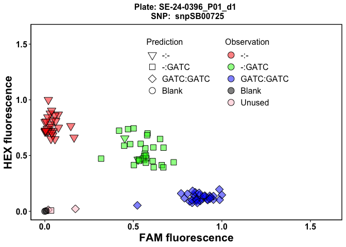
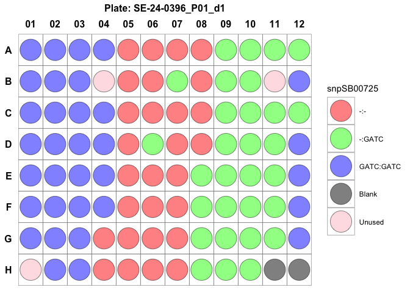

<!-- README.md is generated from README.Rmd. Please edit that file -->

# panGenomeBreedr 

<!-- badges: start -->
<!-- badges: end -->

`panGenomeBreedr` (panGB) is conceptualized to be a unified platform for
pangenome-enabled breeding that follows standardized conventions for
natural or casual variant analysis using pangenomes, marker design, and
marker QC hypothesis testing. It seeks to simplify using pangenome
resources to support plant breeding decisions during cultivar
development.

In its current development version, `panGB` provides customizable
functions for KASP marker QC visualization to test hypotheses on marker
validation and effectiveness. `panGB` will host a user-friendly shiny
application to enable non-R users to access its functionalities outside
R.

LGC Genomics’ current visualization tool is platform-specific— the SNP
Viewer program runs only on Windows, thus preventing Mac and other
platform customers from utilizing it. The SNP Viewer program does not
incorporate standardized conventions for visualizing the prediction of
positive controls. This makes it difficult for users to validate markers
conclusively using the existing tool. `panGB` provides
platform-independent functionalities to users to perform hypothesis
testing on KASP marker QC and validation.

Submit bug reports and feature suggestions, or track changes on the
[issues page](https://github.com/awkena/panGenomeBreedr/issues).

# Table of contents

- [Requirements](#requirements)
- [Recommended packages](#recommended-packages)
- [Installation](#installation)
- [Usage](#usage)
  - [Example](#example)
- [Troubleshooting](#troubleshooting)
- [Authors and contributors](#authors-and-contributors)
- [License](#license)
- [Support and Feedback](##support-and-feedback)

## Requirements

To run this package locally on a machine, the following R packages are
required:

- [ggplot2](https://ggplot2.tidyverse.org): Elegant Graphics for Data
  Analysis.

- [gridExtra](https://cran.r-project.org/web/packages/gridExtra/index.html):
  Miscellaneous Functions for “Grid” Graphics.

- [utils](https://www.rdocumentation.org/packages/utils/versions/3.6.2):
  The R Utils Package.

## Recommended packages

- [Rtools](https://cran.r-project.org/bin/windows/Rtools/rtools43/rtools.ht%20ml):
  Needed for package development and building from GitHub on Windows
  PCs.

- [rmarkdown](https://CRAN.R-project.org/package=rmarkdown): When
  installed, display of the project’s README.md help will be rendered
  with R Markdown.

## Installation

You can install the development version of panGenomeBreedr from
[GitHub](https://github.com/awkena/panGenomeBreedr) with:

``` r
# install.packages("devtools")
devtools::install_github("awkena/panGenomeBreedr")
```

## Usage

`panGB` offers customizable functions for KASP marker hypothesis testing
visualizations. These functions allow users to easily perform the
following tasks:  
- Import raw or polished KASP genotyping results files (.csv) into R.

- Process imported data and assign FAM and HEX fluorescence colors for
  multiple plates.

- Visualize marker QC using FAM and HEX fluorescence scores for each
  sample.

- Validate the effectiveness of trait-predictive or background markers
  using positive controls.

- Visualize plate design and randomization.

### Example

The following example demonstrates how to use the customizable functions
in `panGB` to perform hypothesis testing for KASP marker QC and
validation.

The `read_kasp_csv()` function allows users to import raw or polished
KASP genotyping file (.csv) into R. The function requires the path of
the raw file and the row tags for the different components of data in
the raw file as arguments.

By default, a typical unedited raw KASP data file uses the following row
tags for genotyping data: `Statistics`, `DNA`, `SNPs`, `Scaling`,
`Data`.

The raw file is imported as a list object in R. Thus, all components in
the imported data can be extracted using the row tag ID as shown in the
code snippet below:

``` r
# Import raw KASP genotyping file (.csv) using the read_kasp_csv() function
library(panGenomeBreedr)

# Set path to the directory where your data is located
# path1 <-  "inst/extdata/Genotyping_141.010_01.csv"
path1 <-  system.file("extdata", "Genotyping_141.010_01.csv",
                       package = "panGenomeBreedr",
                      mustWork = TRUE)

# Import raw data file
file1 <- read_kasp_csv(file = path1, 
                       row_tags = c("Statistics", "DNA", "SNPs", "Scaling", "Data"),
                       data_type = 'raw')

# Get KASP genotyping data for plotting
kasp_dat <- file1$Data
```

The next step after importing data is to assign FAM and HEX fluorescence
colors to samples based on their observed genotype calls. This step is
accomplished using the `kasp_color()` function in `panGB` as shown in
the code snippet below:

``` r
# Assign KASP fluorescence colors using the kasp_color() function
library(panGenomeBreedr)

dat1 <- kasp_color(x = kasp_dat,
                    subset = 'MasterPlate',
                    sep = ':',
                    geno_call = 'Call',
                    uncallable = 'Uncallable',
                    unused = '?',
                    blank = 'NTC')
#> Marker in Plate SE-24-0392_P01_d2 failed! 
#>  Check genotype calls.
#> 
#> Marker in Plate SE-24-0392_P01_d1 failed! 
#>  Check genotype calls.
#> 
#> Marker in Plate SE-24-0395_P01_d2 failed! 
#>  Check genotype calls.
#> 
#> Marker in Plate SE-24-0395_P01_d1 failed! 
#>  Check genotype calls.
#> 
#> Marker in Plate SE-24-0397_P01_d2 failed! 
#>  Check genotype calls.
#> 
#> Marker in Plate SE-24-0397_P01_d1 failed! 
#>  Check genotype calls.
#> 
```

The `kasp_color()` function requires the KASP genotype call file as a
data frame and can do bulk processing if there are multiple master
plates. The default values for the arguments in the `kasp_color()`
function are based on KASP annotations.

The `kasp_color()` function returns a list object with the processed
data for each master plate as the components.

After assigning the FAM and HEX colors to samples per plate, the next
step is generate a cluster plot using the FAM and HEX scores for
samples. The `kasp_qc_ggplot()` function in `panGB` can be used to make
the cluster plots for each master plate and KASP marker as shown below:

``` r
# KASP QC plot for Plate 12
library(panGenomeBreedr)
kasp_qc_ggplot(x = dat1[12],
                    pdf = FALSE,
                    Group_id = 'Group',
                    scale = TRUE,
                    expand_axis = 0.6,
                    alpha = 0.5,
                    legend.pos.x = 0.6,
                    legend.pos.y = 0.75)
#> $`SE-24-0396_P01_d1`
```

<div class="figure">


<p class="caption">
Fig. 1. Cluster plot for Plate 12 with an overlay of predictions for
positive controls.
</p>

</div>

Users can set the `pdf = TRUE` argument to save plots as a PDF file in a
directory outside R. The `kasp_qc_ggplot()` function can generate
cluster plots for multiple plates simultaneously.

To visualize predictions for positive controls to validate KASP markers,
the column name containing expected genotype calls must be provided and
passed to the function using the `Group_id = 'Group'` argument as shown
in the code snippet above. If this information is not available, set the
argument `Group_id = NULL`.

Users can visualize the observed genotype calls in a plate design format
using the `plot_plate()` function as depicted in the code snippet below:

``` r
plot_plate(dat1[12], pdf = FALSE)
#> $`SE-24-0396_P01_d1`
```

<div class="figure">


<p class="caption">
Fig. 2. Observed genotype calls for samples in Plate 12 in a plate
design format.
</p>

</div>

## Troubleshooting

If the app does not run as expected, check the following:

- Was the package properly installed?

- Were any warnings or error messages returned during package
  installation?

- Do you have the required dependencies installed?

- Are all packages up to date?

# Authors and contributors

- [Alexander Wireko Kena](https://www.github.com/awkena)

- [Cruet Burgos](https://www.morrislab.org/people/clara-cruet-burgos)

- [Samuel Abebrese](https://www.morrislab.org/people)

- [Geoffrey Preston
  Morris](https://www.morrislab.org/people/geoff-morris)

# License

[GNU GPLv3](https://choosealicense.com/licenses/gpl-3.0/)

# Support and Feedback

For support and submission of feedback, email the maintainer **Alexander
Kena, PhD** at <alex.kena24@gmail.com>
