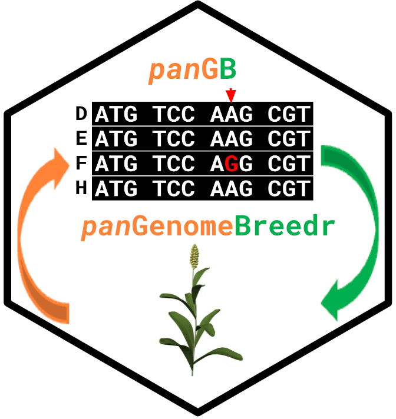
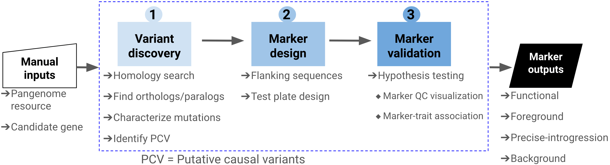
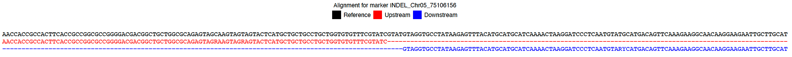
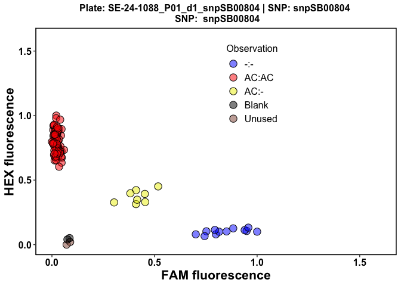
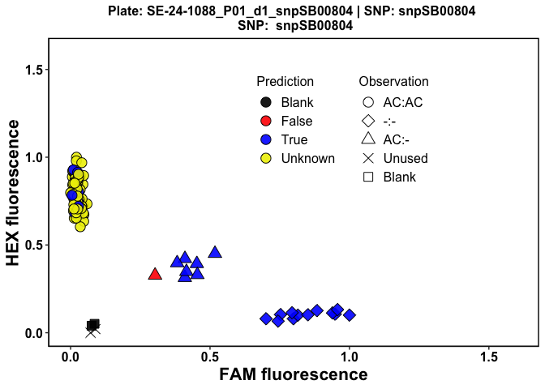
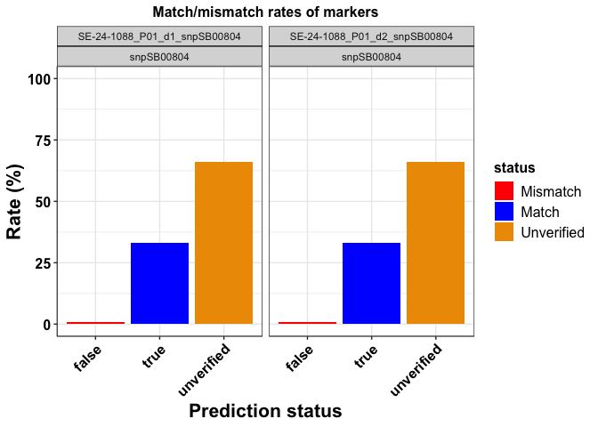
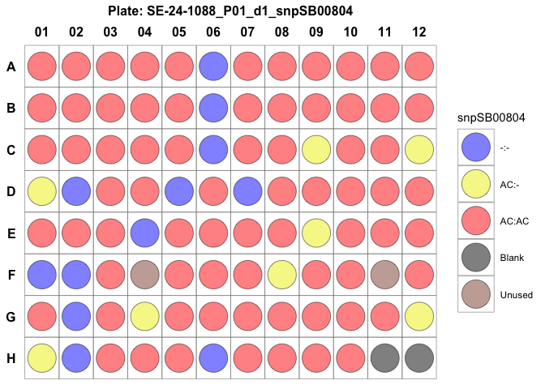
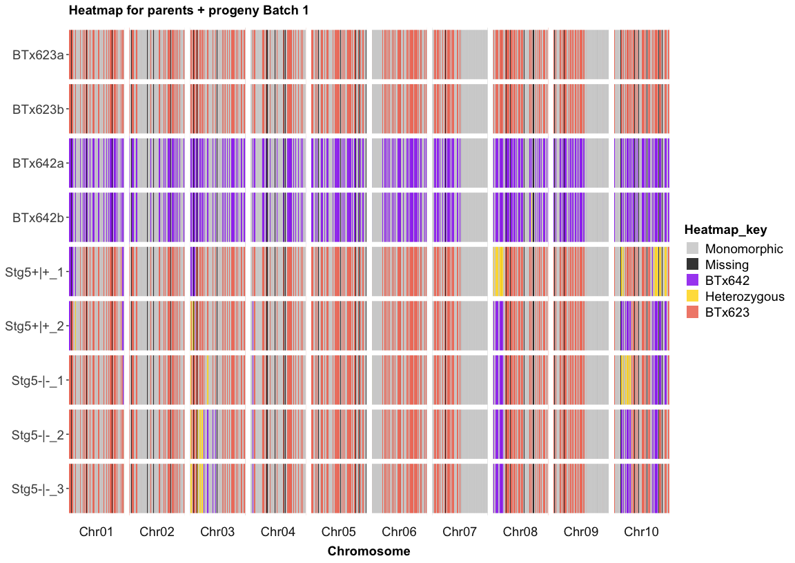
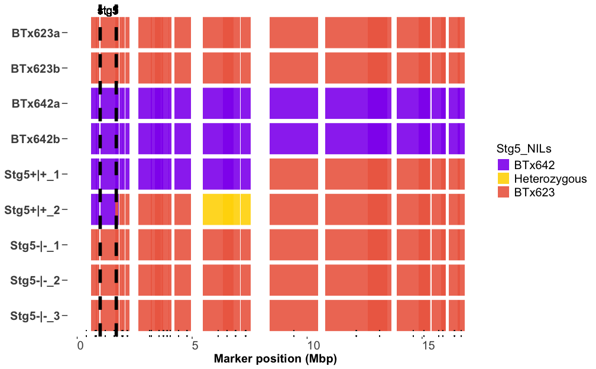
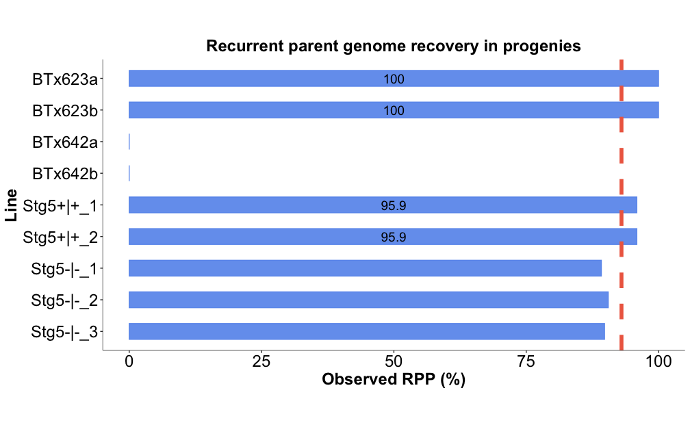

<!-- README.md is generated from README.Rmd. Please edit that file -->

# panGenomeBreedr 

<!-- badges: start -->
<!-- badges: end -->

`panGenomeBreedr` (`panGB`) is conceptualized to be a unified, crop
agnostic platform for pangenome-enabled breeding that follows
standardized conventions for natural or casual variant analysis using
pangenomes, marker design, and marker QC hypothesis testing (Figure 1).
It seeks to simplify and enhance the use of pangenome resources in
cultivar development.

|  |
|:--:|
| *Fig. 1. Imagined workflow for the `panGenomeBreedr` package for pangenome-enabled breeding. To develop trait-predictive, functional markers, the program takes manual inputs of candidate gene(s) and available pangenome resources for any crop. The program utilizes the input information to perform homology searches to identify orthologs/paralogs. The program, then, characterizes mutations within the input candidate gene to identify high-impact or putative causal variants (PCV). Identifying PCVs allows the program to design functional trait-predictive markers. The program implements the validation of designed markers in a hypothesis-driven manner. The program can equally design other types of markers such as precision-introgression markers and background markers.* |

In its current development version, `panGB` provides customizable
functions for **KASP marker design and validation** (Steps 2 and 3 in
Figure 1).

`panGB` will host a user-friendly shiny application to enable non-R
users to access its functionalities outside R.

LGC Genomics’ current visualization tool is platform-specific — the SNP
Viewer program runs only on Windows, thus preventing Mac and other
non-Windows platform customers from utilizing it. The SNP Viewer program
does not incorporate standardized conventions for visualizing the
prediction of positive controls to fully validate a marker. This makes
it difficult for users to validate markers conclusively using the
existing tool. `panGB` provides platform-independent functionalities to
users to perform hypothesis testing on KASP marker QC and validation.

Submit bug reports and feature suggestions, or track changes on the
[issues page](https://github.com/awkena/panGenomeBreedr/issues).

# Table of contents

- [Requirements](#requirements)
- [Recommended packages](#recommended-packages)  
- [Installation](#installation)
- [Usage](#usage)
- [Examples](#examples)
  - [KASP Marker Design](#kasp-marker-design)
  - [KASP Marker Validation](#kasp-marker-validation)
- [Other Breeder-Centered Functionalities in
  panGB](#other-breeder-centered-functionalities-in-pangb)
  - [Creating Heatmaps with `panGB`](#creating-heatmaps-with-pangb)
  - [Trait Introgression Hypothesis
    Testing](#trait-introgression-hypothesis-testing)
  - [Decision Support for Marker-Assisted Backcrossing in
    `panGB`](#decision-support-for-marker-assisted-backcrossing-in-pangb)
  - [Weighted RPP computation in
    panGB](#weighted-rpp-computation-in-pangb)
- [Troubleshooting](#troubleshooting)
- [Authors and contributors](#authors-and-contributors)
- [License](#license)
- [Support and Feedback](##support-and-feedback)

## Requirements

To run this package locally on a machine, the following R packages are
required:

- [ggplot2](https://ggplot2.tidyverse.org): Elegant Graphics for Data
  Analysis.

- [gridExtra](https://cran.r-project.org/web/packages/gridExtra/index.html):
  Miscellaneous Functions for “Grid” Graphics.

- [utils](https://www.rdocumentation.org/packages/utils/versions/3.6.2):
  The R Utils Package.

- [stats](https://www.rdocumentation.org/packages/stats/versions/3.6.2)

- [reshape2](https://cran.r-project.org/web/packages/reshape2/index.html)

- [VariantAnnotation](https://bioconductor.org/packages/release/bioc/html/VariantAnnotation.html)

- [Biostrings](https://bioconductor.org/packages/release/bioc/html/Biostrings.html)

- [GenomicRanges](https://bioconductor.org/packages/release/bioc/html/GenomicRanges.html)

- [IRanges](https://bioconductor.org/packages/release/bioc/html/IRanges.html)

- [msa](https://bioconductor.org/packages/release/bioc/html/msa.html)

## Recommended packages

- [Rtools](https://cran.r-project.org/bin/windows/Rtools/rtools43/rtools.html):
  Needed for package development and installation from GitHub on Windows
  PCs.

- [rmarkdown](https://CRAN.R-project.org/package=rmarkdown): When
  installed, display of the project’s README.md will be rendered with R
  Markdown.

## Installation

First, ensure all existing packages are up to date.

You can install the development version of `panGenomeBreedr` from
[GitHub](https://github.com/awkena/panGenomeBreedr) with:

``` r
if (!require("pak")) install.packages("pak")

pak::pkg_install("awkena/panGenomeBreedr")
```

### Installing Bioconductor dependency packages

`panGB` depends on a list of Bioconductor packages that may not be
installed automatically alongside `panGB`. To manually install these
packages, use the code snippet below:

``` r
# Install and load required Bioconductor packages
if (!require("BiocManager", quietly = TRUE)) install.packages("BiocManager")

  BiocManager::install(c("VariantAnnotation",
                         "Biostrings",
                         "GenomicRanges",
                         "IRanges",
                         "msa"))
```

# Usage

Currently, `panGB` has functionality for KASP marker design based on
causal variants and QC visualizations for marker validation.

## Examples

Here, we provide examples on how to use `panGB` to design a KASP marker
based on a causal variant, as well as marker validation for any KASP
marker.

### KASP Marker Design

The `kasp_marker_design()` function provides a simplified approach to
designing a KASP marker based on identified causal variants.

The user needs two important input data to run the
`kasp_marker_design()`: the whole genome or specific chromosome sequence
of the focused crop and a vcf file containing variant calls from
putative causal variant analytical pipeline.

The vcf file must contain the Chromosome ID, Position, locus ID, REF and
ALT alleles, as well as the genotype data for samples, as shown below in
Table 1:

<table>
<caption>
Table 1: An example vcf file for marker design.
</caption>
<thead>
<tr>
<th style="text-align:left;">
CHROM
</th>
<th style="text-align:right;">
POS
</th>
<th style="text-align:left;">
ID
</th>
<th style="text-align:left;">
REF
</th>
<th style="text-align:left;">
ALT
</th>
<th style="text-align:left;">
IDMM
</th>
<th style="text-align:left;">
ISGC
</th>
<th style="text-align:left;">
ISGK
</th>
<th style="text-align:left;">
ISHC
</th>
<th style="text-align:left;">
ISHJ
</th>
</tr>
</thead>
<tbody>
<tr>
<td style="text-align:left;">
Chr02
</td>
<td style="text-align:right;">
69197088
</td>
<td style="text-align:left;">
SNP_Chr02_69197088
</td>
<td style="text-align:left;">
G
</td>
<td style="text-align:left;">
A
</td>
<td style="text-align:left;">
0\|0
</td>
<td style="text-align:left;">
0\|0
</td>
<td style="text-align:left;">
0\|0
</td>
<td style="text-align:left;">
0\|0
</td>
<td style="text-align:left;">
0\|0
</td>
</tr>
<tr>
<td style="text-align:left;">
Chr02
</td>
<td style="text-align:right;">
69197120
</td>
<td style="text-align:left;">
SNP_Chr02_69197120
</td>
<td style="text-align:left;">
G
</td>
<td style="text-align:left;">
C
</td>
<td style="text-align:left;">
0\|0
</td>
<td style="text-align:left;">
0\|0
</td>
<td style="text-align:left;">
0\|0
</td>
<td style="text-align:left;">
0\|0
</td>
<td style="text-align:left;">
0\|0
</td>
</tr>
<tr>
<td style="text-align:left;">
Chr02
</td>
<td style="text-align:right;">
69197131
</td>
<td style="text-align:left;">
SNP_Chr02_69197131
</td>
<td style="text-align:left;">
G
</td>
<td style="text-align:left;">
T
</td>
<td style="text-align:left;">
0\|0
</td>
<td style="text-align:left;">
0\|0
</td>
<td style="text-align:left;">
0\|0
</td>
<td style="text-align:left;">
0\|0
</td>
<td style="text-align:left;">
0\|0
</td>
</tr>
<tr>
<td style="text-align:left;">
Chr02
</td>
<td style="text-align:right;">
69197209
</td>
<td style="text-align:left;">
SNP_Chr02_69197209
</td>
<td style="text-align:left;">
G
</td>
<td style="text-align:left;">
T
</td>
<td style="text-align:left;">
0\|0
</td>
<td style="text-align:left;">
0\|0
</td>
<td style="text-align:left;">
0\|0
</td>
<td style="text-align:left;">
0\|0
</td>
<td style="text-align:left;">
0\|0
</td>
</tr>
<tr>
<td style="text-align:left;">
Chr02
</td>
<td style="text-align:right;">
69197294
</td>
<td style="text-align:left;">
SNP_Chr02_69197294
</td>
<td style="text-align:left;">
G
</td>
<td style="text-align:left;">
A
</td>
<td style="text-align:left;">
0\|0
</td>
<td style="text-align:left;">
0\|0
</td>
<td style="text-align:left;">
0\|0
</td>
<td style="text-align:left;">
0\|0
</td>
<td style="text-align:left;">
0\|0
</td>
</tr>
</tbody>
</table>

``` r

# Example to design a KASP marker on a substitution variant
# Set path to alignment output folder 
library(panGenomeBreedr)
path <- tempdir() # (default directory for saving alignment outputs)

# Path to import sorghum genome sequence for Chromosome 2
path1 <- "https://raw.githubusercontent.com/awkena/panGB/main/Chr02.fa.gz"

# Path to import vcf file for variant calls on Chromosome 2
path2 <-  system.file("extdata", "Sobic.002G302700_SNP_snpeff.vcf",
                      package = "panGenomeBreedr",
                     mustWork = TRUE)

# KASP marker design for variant ID: SNP_Chr02_69200443 in vcf file
ma1 <- kasp_marker_design(vcf_file = path2,
                           genome_file = path1,
                           marker_ID = "SNP_Chr02_69200443",
                           chr = "Chr02",
                           plot_draw = TRUE,
                           plot_file = path,
                           vcf_geno_code = c('1|1', '0|1', '0|0', '.|.'),
                           region_name = "ma1",
                           maf = 0.05)
#> using Gonnet

# View marker alignment output from temp folder
path3 <- file.path(path, list.files(path = path, "alignment_"))
system(paste0('open "', path3, '"')) # Open PDF file from R

on.exit(unlink(path)) # Clear the temp directory on exit
```

In the `kasp_marker_design()` function call above, the user must specify
the path to the genome sequence and vcf files using the `genome_file`
and `vcf_file` arguments, respectively. The user must specify the ID for
the variant in the vcf file using the `marker_ID` argument.

To save memory and enhance the computational speed, the `chr` argument
can be specified to access only the chromosome sequence of the chosen
variant from the genome sequence.

The `vcf_geno_code` argument is used to specify the genotype coding in
the vcf file – either phased (1\|1) or unphased (1/1) coding.

The `plot_draw = TRUE` argument indicates the return of the alignment of
the 100 bp upstream and downstream sequences to the imported reference
genome as PDF file (Figure 2).

The `plot_file` argument specifies the path to the directory where the
alignment should be saved – default is a temporary directory.

|  |
|:--:|
| *Fig. 2. Alignment of the 100 bp upstream and downstream sequences to the reference genome used for KASP marker design.* |

The required sequence for submission to Intertek for the designed KASP
marker is shown in Table 2.

<table>
<caption>
Table 2: Intertek required sequence for a KASP marker.
</caption>
<thead>
<tr>
<th style="text-align:left;">
SNP_Name
</th>
<th style="text-align:left;">
SNP
</th>
<th style="text-align:left;">
Marker_Name
</th>
<th style="text-align:left;">
Chromosome
</th>
<th style="text-align:right;">
Chromosome_Position
</th>
<th style="text-align:left;">
Sequence
</th>
<th style="text-align:left;">
ReferenceAllele
</th>
<th style="text-align:left;">
AlternativeAllele
</th>
</tr>
</thead>
<tbody>
<tr>
<td style="text-align:left;">
SNP_Chr02_69200443
</td>
<td style="text-align:left;">
Substitution
</td>
<td style="text-align:left;">
ma1
</td>
<td style="text-align:left;">
Chr02
</td>
<td style="text-align:right;">
69200443
</td>
<td style="text-align:left;">
TAGTTTGATGTTTGCCTTACAATTTGATTTGATGGCAATACCTTTTCCATTTTATCAGCATCTACACCATTTTATATCTTTGGATTAGATTTTTTTTWAA\[A/T\]AAAAAAGTAATATGTTTGTTATGTGCTTTACTCAACAAGATCTACATTTTAAATTAGCTACTTTTTACCATCTTATTTGTTTGTTGTGTGTTTTATTCAA
</td>
<td style="text-align:left;">
A
</td>
<td style="text-align:left;">
T
</td>
</tr>
</tbody>
</table>

### KASP Marker Validation

The following example demonstrates how to use the customizable functions
in `panGB` to perform hypothesis testing of allelic discrimination for
KASP marker QC and validation.

`panGB` offers customizable functions for KASP marker validation through
hypothesis testing. These functions allow users to easily perform the
following tasks:  
- Import raw or polished KASP genotyping results files (.csv) into R.

- Process imported data and assign FAM and HEX fluorescence colors for
  multiple plates.

- Visualize marker QC using FAM and HEX fluorescence scores for each
  sample.

- Validate the effectiveness of trait-predictive or background markers
  using positive controls.

- Visualize plate design and randomization.

### Reading Raw KASP Full Results Files (.csv)

The `read_kasp_csv()` function allows users to import raw or polished
KASP genotyping full results file (.csv) into R. The function requires
the path of the raw file and the row tags for the different components
of data in the raw file as arguments.

For polished files, the user must extract the `Data` component of the
full results file and save it as a csv file before import.

By default, a typical unedited raw KASP data file uses the following row
tags for genotyping data: `Statistics`, `DNA`, `SNPs`, `Scaling`,
`Data`.

The raw file is imported as a list object in R. Thus, all components in
the imported data can be extracted using the row tag ID as shown in the
code snippet below:

``` r
# Import raw KASP genotyping file (.csv) using the read_kasp_csv() function
library(panGenomeBreedr)

# Set path to the directory where your data is located
# path1 <-  "inst/extdata/Genotyping_141.010_01.csv"
path1 <-  system.file("extdata", "Genotyping_141.010_01.csv",
                       package = "panGenomeBreedr",
                      mustWork = TRUE)

# Import raw data file
file1 <- read_kasp_csv(file = path1, 
                       row_tags = c("Statistics", "DNA", "SNPs", "Scaling", "Data"),
                       data_type = 'raw')

# Get KASP genotyping data for plotting
kasp_dat <- file1$Data
```

### Assigning colors and PCH symbols for KASP cluster plotting

The next step after importing data is to assign FAM and HEX fluorescence
colors to samples based on their observed genotype calls. This step is
accomplished using the `kasp_color()` function in `panGB` as shown in
the code snippet below:

``` r
# Assign KASP fluorescence colors using the kasp_color() function
library(panGenomeBreedr)
# Create a subet variable called plates: masterplate x snpid
  kasp_dat$plates <- paste0(kasp_dat$MasterPlate, '_',
                                 kasp_dat$SNPID)
dat1 <- kasp_color(x = kasp_dat,
                    subset = 'plates',
                    sep = ':',
                    geno_call = 'Call',
                    uncallable = 'Uncallable',
                    unused = '?',
                    blank = 'NTC',
                   assign_cols = c(FAM = "blue", HEX = "gold" , 
                                   het = "forestgreen"))
```

The `kasp_color()` function requires the KASP genotype call file as a
data frame and can do bulk processing if there are multiple master
plates. The default values for the arguments in the `kasp_color()`
function are based on KASP annotations.

The `kasp_color()` function calls the `kasp_pch()` function to
automatically add PCH plotting symbols that can equally be used to group
genotypic clusters on the plot.

When expected genotype calls are available for positive controls in KASP
genotyping samples, we recommend the use of the PCH symbols for grouping
observed genotypes instead of FAM and HEX colors.

The `kasp_color()` function expects that genotype calls are for diploid
state with alleles separated by a symbol. By default KASP data are
separated by `:` symbols.

The `kasp_color()` function returns a list object with the processed
data for each master plate as the components.

### Cluster plot

To test the hypothesis that the designed KASP marker can accurately
discriminate between homozygotes and heterozygotes (allelic
discrimination), a cluster plot needs to be generated.

The `kasp_qc_ggplot()` and `kasp_qc_ggplot2()`functions in `panGB` can
be used to make the cluster plots for each plate and KASP marker as
shown below:

``` r
# KASP QC plot for Plate 05
library(panGenomeBreedr)
kasp_qc_ggplot2(x = dat1[5],
                    pdf = FALSE,
                    Group_id = NULL,
                    scale = TRUE,
                    expand_axis = 0.6,
                    alpha = 0.9,
                    legend.pos.x = 0.6,
                    legend.pos.y = 0.75)
#> $`SE-24-1088_P01_d1_snpSB00804`
```

<div class="figure">


<p class="caption">
Fig. 3. Cluster plot for Plate 5 using FAM and HEX colors for grouping
observed genotypes.
</p>

</div>

``` r
# KASP QC plot for Plate 05
library(panGenomeBreedr)
 kasp_qc_ggplot2(x = dat1[5],
                  pdf = FALSE,
                  Group_id = 'Group',
                  Group_unknown = '?',
                  scale = TRUE,
                  pred_cols = c('Blank' = 'black', 'False' = 'firebrick3',
                              'True' = 'cornflowerblue', 'Unverified' = 'beige'),
                  expand_axis = 0.6,
                  alpha = 0.9,
                  legend.pos.x = 0.6,
                  legend.pos.y = 0.75)
#> $`SE-24-1088_P01_d1_snpSB00804`
```

<div class="figure">


<p class="caption">
Fig. 4. Cluster plot for Plate 5 with an overlay of predictions for
positive controls.
</p>

</div>

Color-blind-friendly color combinations are used to visualize verified
genotype predictions (Figure 3).

In Figure 4, the three genotype classes are grouped based on plot PCH
symbols using the FAM and HEX scores for observed genotype calls.

To simplify the verified prediction overlay for the expected genotypes
for positive controls, all possible outcomes are divided into three
categories (TRUE, FALSE, and UNVERIFIED) and color-coded to make it
easier to visualize verified predictions.

BLUE (color code for the TRUE category) means genotype prediction
matches the observed genotype call for the sample.

RED (color code for the FALSE category) means genotype prediction does
not match the observed genotype call for the sample.

BEIGE (color code for the UNVERIFIED category) means three things: an
expected genotype call could not be made before KASP genotyping, or an
observed genotype call could not be made to verify the prediction.

Users can set the `pdf = TRUE` argument to save plots as a PDF file in a
directory outside R. The `kasp_qc_ggplot()` and
`kasp_qc_ggplot2()`functions can generate cluster plots for multiple
plates simultaneously.

To visualize predictions for positive controls to validate KASP markers,
the column name containing expected genotype calls must be provided and
passed to the function using the `Group_id = 'Group'` argument as shown
in the code snippets above. If this information is not available, set
the argument `Group_id = NULL`.

### Summary of Prediction Verification in Plates

The `pred_summary()` function produces a summary of predicted genotypes
for positive controls in each reaction plate after verification (Table
3), as shown in the code snippet below:

``` r
# Get prediction summary for all plates
library(panGenomeBreedr)
my_sum <- pred_summary(x = dat1,
                       snp_id = 'SNPID',
                       Group_id = 'Group',
                       Group_unknown = '?',
                       geno_call = 'Call',
                       rate_out = TRUE)
```

<table>
<caption>
Table 3: Summary of verified prediction status for samples in plates
</caption>
<thead>
<tr>
<th style="text-align:left;">
plate
</th>
<th style="text-align:left;">
snp_id
</th>
<th style="text-align:right;">
false
</th>
<th style="text-align:right;">
true
</th>
<th style="text-align:right;">
unverified
</th>
</tr>
</thead>
<tbody>
<tr>
<td style="text-align:left;">
SE-24-1088_P01_d1_snpSB00800
</td>
<td style="text-align:left;">
snpSB00800
</td>
<td style="text-align:right;">
0.04
</td>
<td style="text-align:right;">
0.06
</td>
<td style="text-align:right;">
0.90
</td>
</tr>
<tr>
<td style="text-align:left;">
SE-24-1088_P01_d2_snpSB00800
</td>
<td style="text-align:left;">
snpSB00800
</td>
<td style="text-align:right;">
0.02
</td>
<td style="text-align:right;">
0.06
</td>
<td style="text-align:right;">
0.92
</td>
</tr>
<tr>
<td style="text-align:left;">
SE-24-1088_P01_d1_snpSB00803
</td>
<td style="text-align:left;">
snpSB00803
</td>
<td style="text-align:right;">
0.00
</td>
<td style="text-align:right;">
0.34
</td>
<td style="text-align:right;">
0.66
</td>
</tr>
<tr>
<td style="text-align:left;">
SE-24-1088_P01_d2_snpSB00803
</td>
<td style="text-align:left;">
snpSB00803
</td>
<td style="text-align:right;">
0.00
</td>
<td style="text-align:right;">
0.34
</td>
<td style="text-align:right;">
0.66
</td>
</tr>
<tr>
<td style="text-align:left;">
SE-24-1088_P01_d1_snpSB00804
</td>
<td style="text-align:left;">
snpSB00804
</td>
<td style="text-align:right;">
0.01
</td>
<td style="text-align:right;">
0.33
</td>
<td style="text-align:right;">
0.66
</td>
</tr>
<tr>
<td style="text-align:left;">
SE-24-1088_P01_d2_snpSB00804
</td>
<td style="text-align:left;">
snpSB00804
</td>
<td style="text-align:right;">
0.01
</td>
<td style="text-align:right;">
0.33
</td>
<td style="text-align:right;">
0.66
</td>
</tr>
<tr>
<td style="text-align:left;">
SE-24-1088_P01_d1_snpSB00805
</td>
<td style="text-align:left;">
snpSB00805
</td>
<td style="text-align:right;">
0.15
</td>
<td style="text-align:right;">
0.19
</td>
<td style="text-align:right;">
0.66
</td>
</tr>
<tr>
<td style="text-align:left;">
SE-24-1088_P01_d2_snpSB00805
</td>
<td style="text-align:left;">
snpSB00805
</td>
<td style="text-align:right;">
0.15
</td>
<td style="text-align:right;">
0.19
</td>
<td style="text-align:right;">
0.66
</td>
</tr>
</tbody>
</table>

The output of the `pred_summary()` function can be visualized as bar
plots using the `pred_summary_plot()` function as shown in the code
snippet below:

``` r
# Get prediction summary for snp:snpSB00804
library(panGenomeBreedr)
my_sum <- my_sum$summ
my_sum <- my_sum[my_sum$snp_id == 'snpSB00804',]

 pred_summary_plot(x = my_sum,
                    pdf = FALSE,
                    pred_cols = c('false' = 'firebrick3', 'true' = 'cornflowerblue',
                                  'unverified' = 'beige'),
                    alpha = 1,
                    text_size = 12,
                    width = 6,
                    height = 6,
                    angle = 45)
#> $snpSB00804
```

<div class="figure">


<p class="caption">
Fig. 5. Match/Mismatch rate of predictions for snp: snpSB00804.
</p>

</div>

### Plot Plate Design

Users can visualize the observed genotype calls in a plate design format
using the `plot_plate()` function as depicted in Figure 5, using the
code snippet below:

``` r
plot_plate(dat1[5], pdf = FALSE)
#> $`SE-24-1088_P01_d1_snpSB00804`
```

<div class="figure">


<p class="caption">
Fig. 6. Observed genotype calls for samples in Plate 5 in a plate design
format.
</p>

</div>

# Other Breeder-Centered Functionalities in panGB

`panGB` provides additional functionalities to test hypotheses on the
success of trait introgression pipelines and crosses.

Users can easily generate heatmaps that compare the genetic background
of parents to progenies to ascertain if a target locus was successfully
introgressed or check for the hybridity of F1s. These plots also allow
users to get a visual insight into the amount of parent germplasm
recovered in progenies.

To produce these plots, users must have either polymorphic low or
mid-density marker data and a map file for the markers. **The map file
must contain the marker IDs, their chromosome numbers and positions**.

`panGB`can handle data from KASP, Agriplex and DArTag service providers.

## Working with Agriplex Mid-Density Marker Data

Agriplex data is structurally different from KASP or DArTag data in
terms of genotype call coding and formatting. Agriplex uses `' / '` as a
separator for genotype calls for heterozygotes, and uses single
nucleotides to represent homozygous SNP calls.

## Creating Heatmaps with panGB

To exemplify the steps for creating heatmap, we will use a mid-density
marker data for three groups of near-isogenic lines (NILs) and their
parents (Table 4). The NILs and their parents were genotyped using the
Agriplex platform. Each NIL group was genotyped using 2421 markers.

The imported data frame has the markers as columns and genotyped samples
as rows. It comes with some meta data about the samples. Marker names
are informative: chromosome number and position coordinates are embedded
in the marker names (`Eg. S1_778962: chr = 1, pos = 779862`).

``` r

# Set path to the directory where your data is located
path1 <-  system.file("extdata", "agriplex_dat.csv",
                       package = "panGenomeBreedr",
                      mustWork = TRUE)

# Import raw Agriplex data file
geno <- read.csv(file = path1, header = TRUE, colClasses = c("character")) # genotype calls

library(knitr)
knitr::kable(geno[1:6, 1:10], caption = 'Table 4: Agriplex data format', format = 'html', booktabs = TRUE)
```

<table>
<caption>
Table 4: Agriplex data format
</caption>
<thead>
<tr>
<th style="text-align:left;">
Plate.name
</th>
<th style="text-align:left;">
Well
</th>
<th style="text-align:left;">
Sample_ID
</th>
<th style="text-align:left;">
Batch
</th>
<th style="text-align:left;">
Genotype
</th>
<th style="text-align:left;">
Status
</th>
<th style="text-align:left;">
S1_778962
</th>
<th style="text-align:left;">
S1_1019896
</th>
<th style="text-align:left;">
S1_1613105
</th>
<th style="text-align:left;">
S1_1954298
</th>
</tr>
</thead>
<tbody>
<tr>
<td style="text-align:left;">
RHODES_PLATE1
</td>
<td style="text-align:left;">
D04
</td>
<td style="text-align:left;">
NIL_1
</td>
<td style="text-align:left;">
1
</td>
<td style="text-align:left;">
RTx430a
</td>
<td style="text-align:left;">
Recurrent parent
</td>
<td style="text-align:left;">
A
</td>
<td style="text-align:left;">
G
</td>
<td style="text-align:left;">
G
</td>
<td style="text-align:left;">
A
</td>
</tr>
<tr>
<td style="text-align:left;">
RHODES_PLATE1
</td>
<td style="text-align:left;">
F04
</td>
<td style="text-align:left;">
NIL_2
</td>
<td style="text-align:left;">
1
</td>
<td style="text-align:left;">
RTx430b
</td>
<td style="text-align:left;">
Recurrent parent
</td>
<td style="text-align:left;">
A
</td>
<td style="text-align:left;">
G
</td>
<td style="text-align:left;">
G
</td>
<td style="text-align:left;">
A
</td>
</tr>
<tr>
<td style="text-align:left;">
RHODES_PLATE1
</td>
<td style="text-align:left;">
G04
</td>
<td style="text-align:left;">
NIL_3
</td>
<td style="text-align:left;">
1
</td>
<td style="text-align:left;">
IRAT204a
</td>
<td style="text-align:left;">
Donor parent
</td>
<td style="text-align:left;">
G
</td>
<td style="text-align:left;">
C
</td>
<td style="text-align:left;">
G
</td>
<td style="text-align:left;">
A
</td>
</tr>
<tr>
<td style="text-align:left;">
RHODES_PLATE1
</td>
<td style="text-align:left;">
A05
</td>
<td style="text-align:left;">
NIL_4
</td>
<td style="text-align:left;">
1
</td>
<td style="text-align:left;">
IRAT204b
</td>
<td style="text-align:left;">
Donor Parent
</td>
<td style="text-align:left;">
G
</td>
<td style="text-align:left;">
C
</td>
<td style="text-align:left;">
G
</td>
<td style="text-align:left;">
A
</td>
</tr>
<tr>
<td style="text-align:left;">
RHODES_PLATE1
</td>
<td style="text-align:left;">
D07
</td>
<td style="text-align:left;">
NIL_5
</td>
<td style="text-align:left;">
1
</td>
<td style="text-align:left;">
RMES1+\|+\_1
</td>
<td style="text-align:left;">
NIL+
</td>
<td style="text-align:left;">
A
</td>
<td style="text-align:left;">
G
</td>
<td style="text-align:left;">
G
</td>
<td style="text-align:left;">
A
</td>
</tr>
<tr>
<td style="text-align:left;">
RHODES_PLATE1
</td>
<td style="text-align:left;">
F08
</td>
<td style="text-align:left;">
NIL_6
</td>
<td style="text-align:left;">
1
</td>
<td style="text-align:left;">
RMES1+\|+\_2
</td>
<td style="text-align:left;">
NIL+
</td>
<td style="text-align:left;">
A
</td>
<td style="text-align:left;">
G
</td>
<td style="text-align:left;">
G
</td>
<td style="text-align:left;">
A
</td>
</tr>
</tbody>
</table>

To create a heatmap that compares the genetic background of parents and
NILs across all markers, we need to first process the raw Agriplex data
into a numeric format. The panGB package has customizable data wrangling
functions for KASP, Agriplex, and DArTag data.

The `rm_mono()` function can be used to filter out all monomorphic loci
from the data.

Since our imported Agriplex data has informative SNP IDs, we can use the
`parse_marker_ns()` function to generate a map file (Table 5) for the
markers.  
The generated map file is then passed to the `proc_kasp()` function to
order the SNP markers according to their chromosome numbers and
positions.

The `kasp_numeric()` function converts the output of the `proc_kasp()`
function into a numeric format (Table 6). The re-coding to numeric
format is done as follows:

- Homozygous for Parent 1 allele = 1.
- Homozygous for Parent 2 allele = 0.
- Heterozygous = 0.5.
- Monomorphic loci = -1.
- Loci with a suspected genotype error = -2.
- Loci with at least one missing parental or any other genotype = -5.

``` r

# Parse snp ids to generate a map file
library(panGenomeBreedr)

# Data for stg5 NILs
stg5 <- geno[geno$Batch == 3, -c(1:6)] 
rownames(stg5) <- geno$Genotype[17:25]

# Remove monomorphic loci from data
stg5 <- rm_mono(stg5)

# Parse snp ids to generate a map file
snps <- colnames(stg5) # Get snp ids
map_file <- parse_marker_ns(x = snps, sep = '_', prefix = 'S')

# order markers in map file
map_file <- order_markers(x = map_file)
```

<table>
<caption>
Table 5: Map file for the imported Agriplex data.
</caption>
<thead>
<tr>
<th style="text-align:left;">
</th>
<th style="text-align:left;">
snpid
</th>
<th style="text-align:right;">
chr
</th>
<th style="text-align:right;">
pos
</th>
</tr>
</thead>
<tbody>
<tr>
<td style="text-align:left;">
1.317
</td>
<td style="text-align:left;">
S1_402592
</td>
<td style="text-align:right;">
1
</td>
<td style="text-align:right;">
402592
</td>
</tr>
<tr>
<td style="text-align:left;">
1.1
</td>
<td style="text-align:left;">
S1_778962
</td>
<td style="text-align:right;">
1
</td>
<td style="text-align:right;">
778962
</td>
</tr>
<tr>
<td style="text-align:left;">
1.633
</td>
<td style="text-align:left;">
S1_825853
</td>
<td style="text-align:right;">
1
</td>
<td style="text-align:right;">
825853
</td>
</tr>
<tr>
<td style="text-align:left;">
1.318
</td>
<td style="text-align:left;">
S1_1218846
</td>
<td style="text-align:right;">
1
</td>
<td style="text-align:right;">
1218846
</td>
</tr>
<tr>
<td style="text-align:left;">
1.2
</td>
<td style="text-align:left;">
S1_1613105
</td>
<td style="text-align:right;">
1
</td>
<td style="text-align:right;">
1613105
</td>
</tr>
<tr>
<td style="text-align:left;">
1.319
</td>
<td style="text-align:left;">
S1_1727150
</td>
<td style="text-align:right;">
1
</td>
<td style="text-align:right;">
1727150
</td>
</tr>
<tr>
<td style="text-align:left;">
1.3
</td>
<td style="text-align:left;">
S1_1954298
</td>
<td style="text-align:right;">
1
</td>
<td style="text-align:right;">
1954298
</td>
</tr>
<tr>
<td style="text-align:left;">
1.4
</td>
<td style="text-align:left;">
S1_1985365
</td>
<td style="text-align:right;">
1
</td>
<td style="text-align:right;">
1985365
</td>
</tr>
</tbody>
</table>

``` r
# Process genotype data to re-order SNPs based on chromosome and positions
stg5 <- proc_kasp(x = stg5,
                  kasp_map = map_file,
                  map_snp_id = "snpid",
                  sample_id = "Genotype",
                  marker_start = 1,
                  chr = 'chr',
                  chr_pos = 'pos')

# Convert to numeric format for plotting
num_geno <- kasp_numeric(x = stg5,
                         rp_row = 1,
                         dp_row = 3,
                         sep = ' / ',
                         data_type = 'agriplex')
```

<table>
<caption>
Table 6: Agriplex data converted to a numeric format.
</caption>
<thead>
<tr>
<th style="text-align:left;">
</th>
<th style="text-align:right;">
S1_402592
</th>
<th style="text-align:right;">
S1_778962
</th>
<th style="text-align:right;">
S1_825853
</th>
<th style="text-align:right;">
S1_1218846
</th>
<th style="text-align:right;">
S1_1613105
</th>
<th style="text-align:right;">
S1_1727150
</th>
<th style="text-align:right;">
S1_1954298
</th>
<th style="text-align:right;">
S1_1985365
</th>
</tr>
</thead>
<tbody>
<tr>
<td style="text-align:left;">
BTx623a
</td>
<td style="text-align:right;">
1
</td>
<td style="text-align:right;">
1
</td>
<td style="text-align:right;">
1
</td>
<td style="text-align:right;">
1
</td>
<td style="text-align:right;">
1
</td>
<td style="text-align:right;">
1
</td>
<td style="text-align:right;">
1
</td>
<td style="text-align:right;">
1
</td>
</tr>
<tr>
<td style="text-align:left;">
BTx623b
</td>
<td style="text-align:right;">
1
</td>
<td style="text-align:right;">
1
</td>
<td style="text-align:right;">
1
</td>
<td style="text-align:right;">
1
</td>
<td style="text-align:right;">
1
</td>
<td style="text-align:right;">
1
</td>
<td style="text-align:right;">
1
</td>
<td style="text-align:right;">
1
</td>
</tr>
<tr>
<td style="text-align:left;">
BTx642a
</td>
<td style="text-align:right;">
0
</td>
<td style="text-align:right;">
0
</td>
<td style="text-align:right;">
0
</td>
<td style="text-align:right;">
0
</td>
<td style="text-align:right;">
0
</td>
<td style="text-align:right;">
0
</td>
<td style="text-align:right;">
0
</td>
<td style="text-align:right;">
0
</td>
</tr>
<tr>
<td style="text-align:left;">
BTx642b
</td>
<td style="text-align:right;">
0
</td>
<td style="text-align:right;">
0
</td>
<td style="text-align:right;">
0
</td>
<td style="text-align:right;">
0
</td>
<td style="text-align:right;">
0
</td>
<td style="text-align:right;">
0
</td>
<td style="text-align:right;">
0
</td>
<td style="text-align:right;">
0
</td>
</tr>
<tr>
<td style="text-align:left;">
Stg5+\|+\_1
</td>
<td style="text-align:right;">
1
</td>
<td style="text-align:right;">
0
</td>
<td style="text-align:right;">
0
</td>
<td style="text-align:right;">
0
</td>
<td style="text-align:right;">
0
</td>
<td style="text-align:right;">
0
</td>
<td style="text-align:right;">
0
</td>
<td style="text-align:right;">
0
</td>
</tr>
<tr>
<td style="text-align:left;">
Stg5+\|+\_2
</td>
<td style="text-align:right;">
0
</td>
<td style="text-align:right;">
0
</td>
<td style="text-align:right;">
0
</td>
<td style="text-align:right;">
0
</td>
<td style="text-align:right;">
0
</td>
<td style="text-align:right;">
1
</td>
<td style="text-align:right;">
1
</td>
<td style="text-align:right;">
1
</td>
</tr>
<tr>
<td style="text-align:left;">
Stg5-\|-\_1
</td>
<td style="text-align:right;">
1
</td>
<td style="text-align:right;">
1
</td>
<td style="text-align:right;">
1
</td>
<td style="text-align:right;">
1
</td>
<td style="text-align:right;">
1
</td>
<td style="text-align:right;">
1
</td>
<td style="text-align:right;">
1
</td>
<td style="text-align:right;">
1
</td>
</tr>
<tr>
<td style="text-align:left;">
Stg5-\|-\_2
</td>
<td style="text-align:right;">
1
</td>
<td style="text-align:right;">
1
</td>
<td style="text-align:right;">
1
</td>
<td style="text-align:right;">
1
</td>
<td style="text-align:right;">
1
</td>
<td style="text-align:right;">
1
</td>
<td style="text-align:right;">
1
</td>
<td style="text-align:right;">
1
</td>
</tr>
<tr>
<td style="text-align:left;">
Stg5-\|-\_3
</td>
<td style="text-align:right;">
1
</td>
<td style="text-align:right;">
1
</td>
<td style="text-align:right;">
1
</td>
<td style="text-align:right;">
1
</td>
<td style="text-align:right;">
1
</td>
<td style="text-align:right;">
1
</td>
<td style="text-align:right;">
1
</td>
<td style="text-align:right;">
1
</td>
</tr>
</tbody>
</table>

All is now set to generate the heatmap (Figure 6) using the
`cross_qc_ggplot()` function, as shown in the code snippet below:

``` r

# Get prediction summary for snp:snpSB00804
library(panGenomeBreedr)
# Create a heatmap that compares the parents to progenies
cross_qc_ggplot(x = num_geno,
                map_file = map_file,
                snp_ids = 'snpid',
                chr = 'chr',
                chr_pos = 'pos',
                parents = c("BTx623a", "BTx642a"),
                pdf = FALSE,
                filename = 'background_heatmap',
                legend_title = 'stg5_NILs',
                alpha = 0.9,
                text_size = 15)
#> $Batch1
```

<div class="figure">


<p class="caption">
Fig. 6. A heatmap that compares the genetic background of parents and
stg5 NIL progenies across all markers.
</p>

</div>

The `cross_qc_ggplot()` function is a wrapper for functions in the
`ggplot2` package.

Users must specify the IDs for the two parents using the `parents`
argument. In the code snippet above, the recurrent parent is `BTx623`
and the donor parent for the *stg5* locus is `BTx642`.

The `group_sz` argument must be specified to plot the heatmap in batches
of progenies to avoid cluttering the plot with many observations.

Users can set the `pdf = TRUE` argument to save plots as a PDF file in a
directory outside R.

## Trait Introgression Hypothesis Testing

To test the hypothesis that the *stg5* NIL development was effective, we
can use the `cross_qc_annotate()` function to generate a heatmap (Figure
7) with an annotation of the position of the *stg5* locus on Chr 1, as
shown below:

``` r

###########################################################################
# Subset data for the first 30 markers on Chr 1
stg5_ch1 <- num_geno[, map_file$chr == 1][,1:30] 

# Get the map file for subset data
stg5_ch1_map <- parse_marker_ns(colnames(stg5_ch1))

# Annotate a heatmap to show the stg5 locus on Chr 1
# The locus is between positions 0.98 - 1.8 Mbp on Chr 1
cross_qc_annotate(x = stg5_ch1,
                  map_file = stg5_ch1_map,
                  snp_ids = 'snpid',
                  chr = 'chr',
                  chr_pos = 'pos',
                  parents = c("BTx623a", "BTx642a"),
                  trait_pos = list(stg5 = c(start = .98e6, end = 1.8e6)),
                  text_scale_fct = 0.3,
                  pdf = FALSE,
                  legend_title = 'Stg5_NILs',
                  alpha = 0.9,
                  text_size = 15)
#> $Batch1
```

<div class="figure">


<p class="caption">
Fig. 7. Heatmap annotation of the stg5 locus on Chr 1.
</p>

</div>

In the code snippet above, the numeric matrix of genotype calls and its
associated map file are required.

The recurrent and donor parents must be specified using the `parents`
argument.

The `snp_ids, chr, and chr_pos` arguments can be used to specify the
column names for marker IDs, chromosome number and positions in the
attached map file.  
The `trait_pos` argument was used to specify the position of the target
locus (*stg5*) on chromosome one. Users can specify the positions of
multiple target loci as components of a list object for annotation.

In Figure 7, the color intensity correlates positively with the marker
density or coverage. Thus, areas with no color (white vertical gaps)
depicts gaps in the marker coverage in the data.

## Decision Support for Marker-Assisted Backcrossing in panGB

Users can use the `calc_rpp_bc()` function in `panGB` to calculate the
proportion of recurrent parent background (RPP) fully recovered in
backcross progenies.

In the computation, partially regions are ignored, hence, heterozygous
scores are not used.

The output for he `calc_rpp_bc()` function can be passed to the
`rpp_barplot()` function to visualize the computed RPP values for
progenies as a bar plot. Users can specify an RPP threshold to easily
identify lines that have RPP values above or equal to the defined RPP
threshold on the bar plot.

We can compute and visualize the observed RPP values for the *stg5* NILs
across all polymorphic loci as shown in the code snippet below:

``` r

# Calculate weighted RPP
rpp <- calc_rpp_bc(x = num_geno,
                   map_file = map_file,
                   map_chr = 'chr',
                   map_pos = 'pos',
                   map_snp_ids = 'snpid',
                   rp = 1,
                   rp_num_code = 1,
                   na_code = -5,
                   weighted = TRUE)

# Generate bar plot for RPP values
rpp_barplot(rpp_df = rpp,
            rpp_threshold = 0.93,
            text_size = 18,
            text_scale_fct = 0.1,
            alpha = 0.9,
            bar_width = 0.5,
            aspect_ratio = 0.5,
            pdf = FALSE)
```

<div class="figure">


<p class="caption">
Fig. 8. Computed RPP values for the stg5 NILs.
</p>

</div>

The `calc_rpp_bc()` function in `panGB` provides two algorithms for
computing the observed RPP values: weighted and unweighted RPP values.
We recommend the use of the weighted algorithm to account for
differences in the marker coverage across the genome.

The algorithm for the weighted RPP values is explained below.

### Weighted RPP Computation in panGB

Let $w_i$ represent the weight for marker $i$, based on the relative
distances to its adjacent markers.

For a set of markers with positions $p_1, p_2, \ldots, p_n$, where
$d_i = p_{i+1} - p_i$ represents the distance between adjacent markers,
the weights can be calculated as follows:

1.  **For the first marker** $i = 1$:

    $$w_1 = \frac{d_1}{2 \sum_{i=1}^{n-1} d_i}$$

2.  **For a middle marker** $1 < i < n$:

    $$w_i = \frac{d_{i-1} + d_i}{2 \sum_{i=1}^{n-1} d_i}$$

3.  **For the last marker** $i = n$:

    $$w_n = \frac{d_{n-1}}{2 \sum_{i=1}^{n-1} d_i}$$

where:

- $d_i$ is the distance between marker $i$ and marker $i+1$,
- $sum_{i=1}^{n-1} d_i$ is the total distance across all segments, used
  for normalization.

Let $RPP$ represent the Recurrent Parent Proportion based on relative
distance weighting. If $w_i$ is the weight for each marker $i$, and
$m_i$ represents whether marker $i$ matches the recurrent parent
$m_i = 1$ if it matches, $m_i = 0$ otherwise), then the weighted RPP is
calculated as:

$$RPP_{weighted} = \sum_{i=1}^n w_i\cdot m_i$$

The unweighted RPP is calculated without the use of the weights as
follows:

$$RPP_{unweighted} = \frac{\sum_{i=1}^n m_i} n$$

where:

- $w_i$ is the weight of marker $i$, calculated based on the relative
  distance it covers,
- $m_i$ is the match indicator for marker $i$ (1 if matching the
  recurrent parent, 0 otherwise),
- $n$ is the total number of markers.

This formula provides the sum of the weighted contributions from each
marker, representing the proportion of the recurrent parent genome in
the individual.

## Troubleshooting

If the package does not run as expected, check the following:

- Was the package properly installed?

- Do you have the required dependencies installed?

- Were any warnings or error messages returned during package
  installation?

- Are all packages up to date before installing panGB?

# Authors and contributors

- [Alexander Wireko Kena](https://www.github.com/awkena)

- [Cruet Burgos](https://www.morrislab.org/people/clara-cruet-burgos)

- [Linly Banda](https://www.biofortificationlab.org/people/linly-banda)

- [Jacques
  Faye](https://sites.google.com/site/morrislaboratory/people/jacques-faye)

- [Fanna Maina](https://www.morrislab.org/people/fanna-maina)

- [Terry
  Felderhoff](https://www.agronomy.k-state.edu/about/people/faculty/felderhoff-terry/)

- [Geoffrey Preston
  Morris](https://www.morrislab.org/people/geoff-morris)

# License

[GNU GPLv3](https://choosealicense.com/licenses/gpl-3.0/)

# Support and Feedback

For support and submission of feedback, email the maintainer **Alexander
Kena, PhD** at <alex.kena24@gmail.com>
