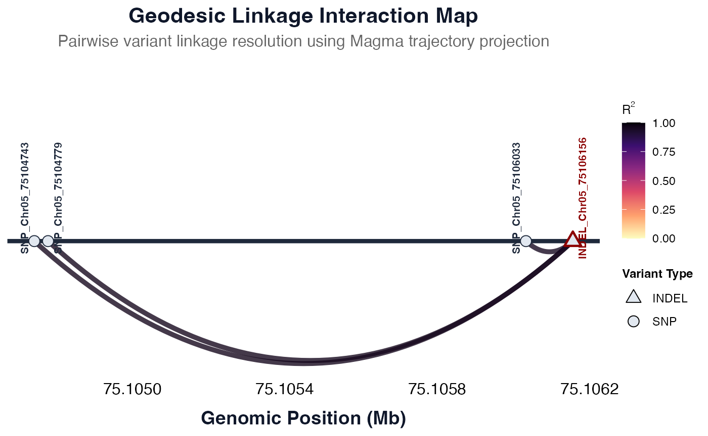

# panGenomeBreedr_Workflows

## Table of contents

- [Variant Discovery](#variant-discovery)
  - [Database Architecture Options](#database-architecture-options)
  - [Example Database: Curated Sorghum Pangenome-Scale Variant
    Resource](#example-database-curated-sorghum-pangenome-scale-variant-resource)
  - [Recommended Schema for the Parquet / DuckDB
    Database](#recommended-schema-for-the-parquet-duckdb-database)
  - [Database Creation](#database-creation)
  - [Database Querying](#database-querying)
  - [Connecting to Online Database with a Custom API
    Endpoint](#connecting-to-online-database-with-a-custom-api-endpoint)
  - [Visualizing Variant Hotspots and Gene Models with
    panGB](#visualizing-variant-hotspots-and-gene-models-with-pangb)
  - [Filter Variants by Allele
    Frequency](#filter-variants-by-allele-frequency)
  - [Summarize SnpEff Annotation and
    Impact](#summarize-snpeff-annotation-and-impact)
  - [Evaluating Linkage Disequilibrium for Marker
    Design](#evaluating-linkage-disequilibrium-for-marker-design)
- [PCIL Selection for Marker
  Validation](#pcil-selection-for-marker-validation)
  - [PCIL Population Structure](#pcil-population-structure)
  - [PCIL Data Structure](#pcil-data-structure)
  - [Identifying Candidate Variants for PCIL
    Screening](#identifying-candidate-variants-for-pcil-screening)
  - [Identifying PCIL Donor Families](#identifying-pcil-donor-families)
  - [Selecting PCIL Positive Lines](#selecting-pcil-positive-lines)
  - [Selecting PCIL Negative
    Controls](#selecting-pcil-negative-controls)
- [PCIL Selection for Marker
  Validation](#pcil-selection-for-marker-validation)
  - [PCIL Population Structure](#pcil-population-structure)
  - [PCIL Data Structure](#pcil-data-structure)
  - [Identifying Candidate Variants for PCIL
    Screening](#identifying-candidate-variants-for-pcil-screening)
  - [Identifying PCIL Donor Families](#identifying-pcil-donor-families)
  - [Selecting PCIL Positive Lines](#selecting-pcil-positive-lines)
  - [Selecting PCIL Negative
    Controls](#selecting-pcil-negative-controls)
- [KASP Marker Design](#kasp-marker-design)
- [KASP Marker Validation](#kasp-marker-validation)
- [Decision Support for Trait Introgression and
  MABC](#decision-support-for-trait-introgression-and-mabc)
  - [Creating Heatmaps with `panGB`](#creating-heatmaps-with-pangb)
  - [Trait Introgression Hypothesis
    Testing](#trait-introgression-hypothesis-testing)
  - [Decision Support for MABC](#decision-support-for-mabc)
  - [Weighted RPP computation in
    panGB](#weighted-rpp-computation-in-pangb)
  - [Decision Support for Foreground
    Selection](#decision-support-for-foreground-selection)

## Variant Discovery

Directly querying raw snpEff-annotated VCF files from R is
computationally expensive and inefficient, especially when scaling up to
pangenome-level datasets. To overcome this bottleneck, the variant
discovery pipeline in `panGenomeBreedr` (`panGB`) relies entirely on an
optimized relational database architecture.

This design guarantees efficient querying and HPC-independent
accessibility, standardizing and accelerating the path from raw variant
files to functional marker development.

### Database Architecture Options

To handle massive datasets efficiently, `panGB` offers two flexible ways
to access your data:

- **Local Database (Parquet/DuckDB):** Work directly on your local
  machine using an optimized, columnar file format. This option is
  incredibly fast, requires no complex server setup, and is ideal for
  working offline or on standard personal computers.
- **Cloud Database:** Connect to a central database securely hosted on
  the cloud. This allows multiple researchers to simultaneously search
  massive datasets without downloading heavy files or relying on
  expensive local hardware.

### Example Database: Curated Sorghum Pangenome-Scale Variant Resource

The examples used throughout this documentation are based on a curated,
pangenome-scale variant resource for Sorghum. This dataset was derived
from whole-genome resequencing data of **1,676 sorghum lines**. Variant
calling was performed using version **v5.1** of the **BTx623** reference
genome, and the resulting SNP and INDEL variants were functionally
annotated using **snpEff**.

Download the zipped archive of the database below:
[here](https://drive.google.com/file/d/1L97pKk2RZt3CiUkl-8IRwpEIT1rN7YsS/view?usp=sharing).

### Recommended Schema for the Parquet / DuckDB Database

The database contains the following four key tables:

#### `variants`

This table stores core metadata variant information extracted from the
VCF.

| Column         | Description                        |
|----------------|------------------------------------|
| `variant_id`   | Unique variant identifier          |
| `chrom`        | Chromosome name                    |
| `pos`          | Genomic position (1-based)         |
| `ref`          | Reference allele                   |
| `alt`          | Alternate allele                   |
| `variant_type` | Type of variant (e.g., SNP, indel) |

#### `annotations`

This table contains functional annotations from **snpEff**, typically
including predicted effects, gene names, and functional categories.

| Column         | Description                                |
|----------------|--------------------------------------------|
| `variant_id`   | Foreign key linking to `variants`          |
| `gene_name`    | Sorghum gene ID (e.g., “Sobic.005G213600”) |
| `effect`       | Type of effect (e.g., missense_variant)    |
| `impact`       | snpEff predicted impact (e.g., HIGH)       |
| `feature_type` | Type of annotated feature (e.g., exon)     |
| …              | Additional snpEff annotation fields        |

#### `genotypes`

This table stores genotype calls per sample for each variant. To save
space with large pangenomes, genotypes are packed into a single text
array column (`calls`) and organized by chromosomes for fast querying.

| Column | Description |
|----|----|
| `variant_id` | Foreign key linking to `variants` |
| `chrom` | Chromosome name |
| `pos` | Genomic position |
| `calls` | Comma-separated array of all genotype calls (e.g., `{0|0, 1|1}`) |

#### `metadata`

This table stores the essential passport and phenotypic data for the
samples present in the `genotypes` table. To keep the database fast and
compact, genotypes are stored efficiently in a single array format. This
metadata table acts as the bridge to accurately map those genotype calls
back to their specific sample names. While you can include rich
phenotypic or geographic data (like `lat`, `lon`, and `countryorigin`
for interactive maps), only a few base columns are strictly required.

| Column | Description |
|----|----|
| `array_index` | Required. The integer index corresponding to the sample’s position in the `genotypes` array |
| `lib` | Required. The unique library or accession identifier |
| `sample` | Required. The sample name |
| `countryorigin` | Optional. Country of origin for geographic visualizations |
| `lat` / `lon` | Optional. Geographic coordinates for the interactive map |
| `...` | Optional. Any other phenotypic or population data |

> **Note:** We strongly recommend adopting these structured database
> formats across other crop systems to modernize data management and
> accelerate targeted crop improvement.

### Database Creation

We generated the curated database using a custom workflow that:

1.  Parses a multi-sample VCF file annotated by snpEff.
2.  Extracts variant, annotation, and genotype data.
3.  Writes the data into a highly compressed, normalized Parquet file
    tree (`variants.parquet`, `annotations.parquet`,
    `genotypes.parquet`, `metadata.parquet`).

A prebuilt mini example database directory
(`mini_curated_sorghum_variant_resource`) is included in the `extdata/`
folder of the package.

### Database Querying

Efficient querying is one of the main drivers for building a
parquet-backed relational database for the sorghum pangenome-scale
variant resource.

The
[`fetch_table_region()`](https://awkena.github.io/panGenomeBreedr/reference/fetch_table_region.md)
function allows users to query specific tables within a parquet-backed
database for variants, annotations, or genotypes based on chromosome
coordinates or candidate gene IDs. The function can retrieve variants
and their annotations from both **online** and **local** database
sources.

panGB is configured to automatically connect to the public **Curated
Sorghum Pangenome-Scale Variant Resource** out of the box. No special
URL configuration is needed. To query the online database resource,
simply set the `connect_db_mode = 'online'` argument in any of the
data-fetching functions (e.g.,
[`fetch_table_region()`](https://awkena.github.io/panGenomeBreedr/reference/fetch_table_region.md),
[`summarize_variants()`](https://awkena.github.io/panGenomeBreedr/reference/summarize_variants.md)).

When used correctly, the
[`fetch_table_region()`](https://awkena.github.io/panGenomeBreedr/reference/fetch_table_region.md)
function retrieves records from one of the following tables in the
database:

- `variants`: Basic variant information (chromosome, position, REF/ALT
  alleles, etc.)
- `annotations`: Variant effect predictions (e.g., from snpEff)
- `genotypes`: Genotypic data across lines/samples plus the metadata of
  the variants.

Users can specify genomic coordinates (`chrom`, `start`, `end`) or a
candidate gene name (`gene_name`) to extract relevant annotations for
the specified gene.

If used correctly, the
[`fetch_table_region()`](https://awkena.github.io/panGenomeBreedr/reference/fetch_table_region.md)
function returns a data frame containing the filtered records from the
selected table.

[`library`](https://rdrr.io/r/base/library.html)`(`[`panGenomeBreedr`](https://awkena.github.io/panGenomeBreedr/)`)`` `` ``# Locate the package example database folder`` ``mini_folder`` ``<-`` `[`system.file`](https://rdrr.io/r/base/system.file.html)`(``"extdata"``, ``"pangenome_scale_db"``, `` `` package ``=`` ``"panGenomeBreedr"``, `` `` mustWork ``=`` ``TRUE``)`` `` ``# Establish a virtual connection to the offline database engine`` ``con_demo`` ``<-`` `[`connect_local_db`](https://awkena.github.io/panGenomeBreedr/reference/connect_local_db.md)`(``folder_path ``=`` ``mini_folder``)`` ``#> Successfully connected to the local offline database! Pangenome-scale database mounted safely. No folder named pcil.`` `` ``# Query VCF genotypes within the genomic range: Chr05:75,104,537 - 75,106,403`` ``gt_region`` ``<-`` `[`fetch_table_region`](https://awkena.github.io/panGenomeBreedr/reference/fetch_table_region.md)`(``con ``=`` ``con_demo``,`` `` table_name ``=`` ``"genotypes"``,`` `` chrom ``=`` ``"Chr05"``,`` `` start ``=`` ``75104537``,`` `` end ``=`` ``75106403``)`` `` ``# Query snpEff annotations within a candidate locus gene region`` ``annota_region`` ``<-`` `[`fetch_table_region`](https://awkena.github.io/panGenomeBreedr/reference/fetch_table_region.md)`(``con ``=`` ``con_demo``,`` `` table_name ``=`` ``"annotations"``,`` `` chrom ``=`` ``"Chr05"``,`` `` start ``=`` ``75104537``,`` `` end ``=`` ``75106403``,`` `` gene_name ``=`` ``"Sobic.005G213600"``)`` `` ``# Cleanly close the connection and release memory allocations`` `[`disconnect_local_db`](https://awkena.github.io/panGenomeBreedr/reference/disconnect_local_db.md)`(``con_demo``)`` ``#> Successfully disconnected from the local database. Memory cleared.`
[`library`](https://rdrr.io/r/base/library.html)`(`[`panGenomeBreedr`](https://awkena.github.io/panGenomeBreedr/)`)`` `` ``# Locate the package example database folder`` ``mini_folder`` ``<-`` `[`system.file`](https://rdrr.io/r/base/system.file.html)`(``"extdata"``, ``"pangenome_scale_db"``, `` `` package ``=`` ``"panGenomeBreedr"``, `` `` mustWork ``=`` ``TRUE``)`` `` ``# Establish a virtual connection to the offline database engine`` ``con_demo`` ``<-`` `[`connect_local_db`](https://awkena.github.io/panGenomeBreedr/reference/connect_local_db.md)`(``folder_path ``=`` ``mini_folder``)`` ``#> Successfully connected to the local offline database! Pangenome-scale database mounted safely. No folder named pcil.`` `` ``# Query VCF genotypes within the genomic range: Chr05:75,104,537 - 75,106,403`` ``gt_region`` ``<-`` `[`fetch_table_region`](https://awkena.github.io/panGenomeBreedr/reference/fetch_table_region.md)`(``con ``=`` ``con_demo``,`` `` table_name ``=`` ``"genotypes"``,`` `` chrom ``=`` ``"Chr05"``,`` `` start ``=`` ``75104537``,`` `` end ``=`` ``75106403``)`` `` ``# Query snpEff annotations within a candidate locus gene region`` ``annota_region`` ``<-`` `[`fetch_table_region`](https://awkena.github.io/panGenomeBreedr/reference/fetch_table_region.md)`(``con ``=`` ``con_demo``,`` `` table_name ``=`` ``"annotations"``,`` `` chrom ``=`` ``"Chr05"``,`` `` start ``=`` ``75104537``,`` `` end ``=`` ``75106403``,`` `` gene_name ``=`` ``"Sobic.005G213600"``)`` `` ``# Cleanly close the connection and release memory allocations`` `[`disconnect_local_db`](https://awkena.github.io/panGenomeBreedr/reference/disconnect_local_db.md)`(``con_demo``)`` ``#> Successfully disconnected from the local database. Memory cleared.`

| variant_id | chrom | pos | ref | alt | variant_type | major_allele | minor_allele | major_allele_freq | minor_allele_freq | IDMM | ISGC | ISGK | ISHC |
|:---|:---|---:|:---|:---|:---|:---|:---|---:|---:|:---|:---|:---|:---|
| INDEL_Chr05_75104541 | Chr05 | 75104541 | T | TGAC | INDEL | T | TGAC | 0.99881 | 0.00119 | 0\|0 | 0\|0 | 0\|0 | 0\|0 |
| SNP_Chr05_75104557 | Chr05 | 75104557 | C | T | SNP | C | T | 0.89051 | 0.10949 | 0\|0 | 0\|0 | 0\|0 | 0\|0 |
| SNP_Chr05_75104560 | Chr05 | 75104560 | C | T | SNP | C | T | 0.88962 | 0.11038 | 0\|0 | 0\|0 | 0\|0 | 0\|0 |
| INDEL_Chr05_75104564 | Chr05 | 75104564 | C | CA | INDEL | C | CA | 0.88544 | 0.11456 | 0\|0 | 0\|0 | 0\|0 | 0\|0 |
| SNP_Chr05_75104568 | Chr05 | 75104568 | G | T | SNP | G | T | 0.99791 | 0.00209 | 0\|0 | 0\|0 | 0\|0 | 0\|0 |

Table 1: Queried genotypes for variants from the local database.
{.table}

| variant_id | allele | annotation | impact | gene_name | gene_id | feature_type | feature_id | transcript_biotype | rank | hgvs_c | hgvs_p | chrom | pos |
|:---|:---|:---|:---|:---|:---|:---|:---|:---|:---|:---|:---|:---|---:|
| INDEL_Chr05_75104541 | TGAC | 3_prime_UTR_variant | MODIFIER | Sobic.005G213600 | Sobic.005G213600.v5.1 | transcript | Sobic.005G213600.1.v5.1 | protein_coding | 2/2 | c.*322\_*324dupGTC |  | Chr05 | 75104541 |
| SNP_Chr05_75104557 | T | 3_prime_UTR_variant | MODIFIER | Sobic.005G213600 | Sobic.005G213600.v5.1 | transcript | Sobic.005G213600.1.v5.1 | protein_coding | 2/2 | c.\*309G\>A |  | Chr05 | 75104557 |
| SNP_Chr05_75104560 | T | 3_prime_UTR_variant | MODIFIER | Sobic.005G213600 | Sobic.005G213600.v5.1 | transcript | Sobic.005G213600.1.v5.1 | protein_coding | 2/2 | c.\*306G\>A |  | Chr05 | 75104560 |
| INDEL_Chr05_75104564 | CA | 3_prime_UTR_variant | MODIFIER | Sobic.005G213600 | Sobic.005G213600.v5.1 | transcript | Sobic.005G213600.1.v5.1 | protein_coding | 2/2 | c.\*301dupT |  | Chr05 | 75104564 |
| SNP_Chr05_75104568 | T | 3_prime_UTR_variant | MODIFIER | Sobic.005G213600 | Sobic.005G213600.v5.1 | transcript | Sobic.005G213600.1.v5.1 | protein_coding | 2/2 | c.\*298C\>A |  | Chr05 | 75104568 |

Table 2: Queried annotations for variants from the local database.
{.table}

[`library`](https://rdrr.io/r/base/library.html)`(`[`panGenomeBreedr`](https://awkena.github.io/panGenomeBreedr/)`)`` `` ``# Extract genotypes within a genomic range from the online database`` ``test_gt_region`` ``<-`` `[`fetch_table_region`](https://awkena.github.io/panGenomeBreedr/reference/fetch_table_region.md)`(`` `` table_name ``=`` ``"genotypes"``,`` `` chrom ``=`` ``"Chr05"``,`` `` start ``=`` ``75104537``,`` `` end ``=`` ``75106403``,`` `` connect_db_mode ``=``'online'`` ``)`` `` ``# Extract annotations for a specific candidate gene`` ``test_annota_region`` ``<-`` `[`fetch_table_region`](https://awkena.github.io/panGenomeBreedr/reference/fetch_table_region.md)`(`` `` table_name ``=`` ``"annotations"``,`` `` chrom ``=`` ``"Chr05"``,`` `` gene_name ``=`` ``"Sobic.005G213600"``,`` `` connect_db_mode ``=`` ``'online'`` ``)`
[`library`](https://rdrr.io/r/base/library.html)`(`[`panGenomeBreedr`](https://awkena.github.io/panGenomeBreedr/)`)`` `` ``# Extract genotypes within a genomic range from the online database`` ``test_gt_region`` ``<-`` `[`fetch_table_region`](https://awkena.github.io/panGenomeBreedr/reference/fetch_table_region.md)`(`` `` table_name ``=`` ``"genotypes"``,`` `` chrom ``=`` ``"Chr05"``,`` `` start ``=`` ``75104537``,`` `` end ``=`` ``75106403``,`` `` connect_db_mode ``=``'online'`` ``)`` `` ``# Extract annotations for a specific candidate gene`` ``test_annota_region`` ``<-`` `[`fetch_table_region`](https://awkena.github.io/panGenomeBreedr/reference/fetch_table_region.md)`(`` `` table_name ``=`` ``"annotations"``,`` `` chrom ``=`` ``"Chr05"``,`` `` gene_name ``=`` ``"Sobic.005G213600"``,`` `` connect_db_mode ``=`` ``'online'`` ``)`

### Connecting to Online Database with a Custom API Endpoint

For collaborative projects or institutions that host their own genomic
data, panGenomeBreedr can be configured to connect to a custom API
endpoint. Before running any queries, you must direct the package to
your private server using the
[`set_api_url()`](https://awkena.github.io/panGenomeBreedr/reference/set_api_url.md)
function.

*Note:* To ensure full compatibility, your private database must follow
the same schema as the public **Curated Sorghum Pangenome-Scale Variant
Resource**.

[`library`](https://rdrr.io/r/base/library.html)`(`[`panGenomeBreedr`](https://awkena.github.io/panGenomeBreedr/)`)`` `` ``# 1. Point the package to your custom API endpoint`` `[`set_api_url`](https://awkena.github.io/panGenomeBreedr/reference/set_api_url.md)`(``"http://132.145.61.28:8000"``)`` ``#> panGenomeBreedr API endpoint successfully set to: http://132.145.61.28:8000`` ``#> panGenomeBreedr API endpoint successfully set to: http://132.145.61.28:8000`` `` ``# 2. Query your private database exactly as you normally would`` ``test_gt_private`` ``<-`` `[`fetch_table_region`](https://awkena.github.io/panGenomeBreedr/reference/fetch_table_region.md)`(`` `` table_name ``=`` ``"genotypes"``,`` `` chrom ``=`` ``"Chr05"``,`` `` start ``=`` ``75104537``,`` `` end ``=`` ``75106403``,`` `` connect_db_mode ``=`` ``'online'`` `` ``)`
[`library`](https://rdrr.io/r/base/library.html)`(`[`panGenomeBreedr`](https://awkena.github.io/panGenomeBreedr/)`)`` `` ``# 1. Point the package to your custom API endpoint`` `[`set_api_url`](https://awkena.github.io/panGenomeBreedr/reference/set_api_url.md)`(``"http://132.145.61.28:8000"``)`` ``#> panGenomeBreedr API endpoint successfully set to: http://132.145.61.28:8000`` ``#> panGenomeBreedr API endpoint successfully set to: http://132.145.61.28:8000`` `` ``# 2. Query your private database exactly as you normally would`` ``test_gt_private`` ``<-`` `[`fetch_table_region`](https://awkena.github.io/panGenomeBreedr/reference/fetch_table_region.md)`(`` `` table_name ``=`` ``"genotypes"``,`` `` chrom ``=`` ``"Chr05"``,`` `` start ``=`` ``75104537``,`` `` end ``=`` ``75106403``,`` `` connect_db_mode ``=`` ``'online'`` `` ``)`

### Visualizing Variant Hotspots and Gene Models with panGB

panGB allows users to mine the sorghum parquet-backed pangenome-scale
variant database to identify putative causal mutations for candidate
genes annotated in the a GFF3 file for sorghum (V5.1). panGB streamlines
this process by providing seamless integration between genomic
annotations in the GFF3 file, the remote pangenome-scale variant
database, and dynamic visualizations.

For this example, we will interrogate a specific *Sorghum bicolor*
candidate gene (`Sobic.005G213600`).

First, load the package and define the essential inputs. We require a
GFF3 file for the reference genome to map structural features (exons,
introns, UTRs) and the specific candidate gene ID we wish to
investigate.

Before we can query the variant database, we need the exact genomic
bounds of our candidate gene. The
[`gene_coord_gff()`](https://awkena.github.io/panGenomeBreedr/reference/gene_coord_gff.md)
function parses the remote GFF3 file and returns the spatial coordinates
for the specified gene.

With the physical boundaries defined, we can now fetch the underlying
genomic data. panGB interacts directly with remote variant databases.
Using the `connect_db_mode = 'online'` argument allows us to pull slices
of big data into our local R environment without downloading the entire
pangenome dataset.

The final step is to align the queried genetic variation directly
against the physical gene model.

The
[`hotspot_overlay_plot()`](https://awkena.github.io/panGenomeBreedr/reference/hotspot_overlay_plot.md)
function constructs a layered visualization. It maps the gene structure
(drawn directly from the GFF3) and overlays the variant density and
annotations, allowing you to rapidly visually pinpoint regions of high
functional variation within the candidate gene.

[`library`](https://rdrr.io/r/base/library.html)`(`[`panGenomeBreedr`](https://awkena.github.io/panGenomeBreedr/)`)`` `` ``# 1. Define the path to the reference GFF3 file`` ``gff_path`` ``<-`` ``"https://raw.githubusercontent.com/awkena/panGB/main/Sbicolor_730_v5.1.gene.gff3.gz"`` `` ``# Define the candidate gene of interest`` ``cand_gene`` ``<-`` ``"Sobic.005G213600"`` `` ``# 2. Extract the candidate gene coordinates from the GFF3 file`` ``gene_coord`` ``<-`` `[`gene_coord_gff`](https://awkena.github.io/panGenomeBreedr/reference/gene_coord_gff.md)`(``gene_name ``=`` ``cand_gene``, gff_path ``=`` ``gff_path``)`` `` ``# View the extracted boundaries`` `[`head`](https://rdrr.io/r/utils/head.html)`(``gene_coord``)`` ``#> ID Feature Chromosome Start End Strand`` ``#> 1 Sobic.005G213600.1.v5.1 mRNA Chr05 75104537 75106403 -`` ``#> 2 Sobic.005G213600.1.v5.1 three_prime_UTR Chr05 75104537 75104865 -`` ``#> 3 Sobic.005G213600.1.v5.1 CDS Chr05 75104866 75106168 -`` ``#> 4 Sobic.005G213600.1.v5.1 CDS Chr05 75106279 75106334 -`` ``#> 5 Sobic.005G213600.1.v5.1 five_prime_UTR Chr05 75106335 75106403 -`` ``#> 6 Sobic.005G213600.v5.1 gene Chr05 75104537 75106403 -`` `` ``# 3. Fetch variant annotation data for the candidate gene region`` ``ann_df`` ``<-`` `[`fetch_table_region`](https://awkena.github.io/panGenomeBreedr/reference/fetch_table_region.md)`(`` `` table_name ``=`` ``"annotations"``,`` `` chrom ``=`` ``gene_coord``$``Chromosome``[``1``]``,`` `` start ``=`` `[`min`](https://rdrr.io/r/base/Extremes.html)`(``gene_coord``$``Start``)``,`` `` end ``=`` `[`max`](https://rdrr.io/r/base/Extremes.html)`(``gene_coord``$``End``)``,`` `` connect_db_mode ``=`` ``'online'`` ``)`` `` ``# 4. Fetch the genotype calls for the identified variants`` ``geno_df`` ``<-`` `[`fetch_table_region`](https://awkena.github.io/panGenomeBreedr/reference/fetch_table_region.md)`(`` `` table_name ``=`` ``"genotypes"``,`` `` chrom ``=`` ``gene_coord``$``Chromosome``[``1``]``,`` `` start ``=`` `[`min`](https://rdrr.io/r/base/Extremes.html)`(``gene_coord``$``Start``)``,`` `` end ``=`` `[`max`](https://rdrr.io/r/base/Extremes.html)`(``gene_coord``$``End``)``,`` `` connect_db_mode ``=`` ``'online'`` ``)`
[`library`](https://rdrr.io/r/base/library.html)`(`[`panGenomeBreedr`](https://awkena.github.io/panGenomeBreedr/)`)`` `` ``# 1. Define the path to the reference GFF3 file`` ``gff_path`` ``<-`` ``"https://raw.githubusercontent.com/awkena/panGB/main/Sbicolor_730_v5.1.gene.gff3.gz"`` `` ``# Define the candidate gene of interest`` ``cand_gene`` ``<-`` ``"Sobic.005G213600"`` `` ``# 2. Extract the candidate gene coordinates from the GFF3 file`` ``gene_coord`` ``<-`` `[`gene_coord_gff`](https://awkena.github.io/panGenomeBreedr/reference/gene_coord_gff.md)`(``gene_name ``=`` ``cand_gene``, gff_path ``=`` ``gff_path``)`` `` ``# View the extracted boundaries`` `[`head`](https://rdrr.io/r/utils/head.html)`(``gene_coord``)`` ``#> ID Feature Chromosome Start End Strand`` ``#> 1 Sobic.005G213600.1.v5.1 mRNA Chr05 75104537 75106403 -`` ``#> 2 Sobic.005G213600.1.v5.1 three_prime_UTR Chr05 75104537 75104865 -`` ``#> 3 Sobic.005G213600.1.v5.1 CDS Chr05 75104866 75106168 -`` ``#> 4 Sobic.005G213600.1.v5.1 CDS Chr05 75106279 75106334 -`` ``#> 5 Sobic.005G213600.1.v5.1 five_prime_UTR Chr05 75106335 75106403 -`` ``#> 6 Sobic.005G213600.v5.1 gene Chr05 75104537 75106403 -`` `` ``# 3. Fetch variant annotation data for the candidate gene region`` ``ann_df`` ``<-`` `[`fetch_table_region`](https://awkena.github.io/panGenomeBreedr/reference/fetch_table_region.md)`(`` `` table_name ``=`` ``"annotations"``,`` `` chrom ``=`` ``gene_coord``$``Chromosome``[``1``]``,`` `` start ``=`` `[`min`](https://rdrr.io/r/base/Extremes.html)`(``gene_coord``$``Start``)``,`` `` end ``=`` `[`max`](https://rdrr.io/r/base/Extremes.html)`(``gene_coord``$``End``)``,`` `` connect_db_mode ``=`` ``'online'`` ``)`` `` ``# 4. Fetch the genotype calls for the identified variants`` ``geno_df`` ``<-`` `[`fetch_table_region`](https://awkena.github.io/panGenomeBreedr/reference/fetch_table_region.md)`(`` `` table_name ``=`` ``"genotypes"``,`` `` chrom ``=`` ``gene_coord``$``Chromosome``[``1``]``,`` `` start ``=`` `[`min`](https://rdrr.io/r/base/Extremes.html)`(``gene_coord``$``Start``)``,`` `` end ``=`` `[`max`](https://rdrr.io/r/base/Extremes.html)`(``gene_coord``$``End``)``,`` `` connect_db_mode ``=`` ``'online'`` ``)`

` ``# 5. Generate and display a variant hotspot aligned to the gene model`` ``if`` ``(`[`nrow`](https://rdrr.io/r/base/nrow.html)`(``ann_df``)`` ``>`` ``0`` ``&&`` `[`nrow`](https://rdrr.io/r/base/nrow.html)`(``geno_df``)`` ``>`` ``0``)`` ``{`` `` `[`hotspot_overlay_plot`](https://awkena.github.io/panGenomeBreedr/reference/hotspot_overlay_plot.md)`(`` `` gene_name ``=`` ``cand_gene``, `` `` gff_path ``=`` ``gff_path``,`` `` annotations_df ``=`` ``ann_df``, `` `` genotypes_df ``=`` ``geno_df`` `` ``)`` ``}`` ``else`` ``{`` `` `[`message`](https://rdrr.io/r/base/message.html)`(``"Insufficient data retrieved to generate the hotspot plot."``)`` ``}`
` ``# 5. Generate and display a variant hotspot aligned to the gene model`` ``if`` ``(`[`nrow`](https://rdrr.io/r/base/nrow.html)`(``ann_df``)`` ``>`` ``0`` ``&&`` `[`nrow`](https://rdrr.io/r/base/nrow.html)`(``geno_df``)`` ``>`` ``0``)`` ``{`` `` `[`hotspot_overlay_plot`](https://awkena.github.io/panGenomeBreedr/reference/hotspot_overlay_plot.md)`(`` `` gene_name ``=`` ``cand_gene``, `` `` gff_path ``=`` ``gff_path``,`` `` annotations_df ``=`` ``ann_df``, `` `` genotypes_df ``=`` ``geno_df`` `` ``)`` ``}`` ``else`` ``{`` `` `[`message`](https://rdrr.io/r/base/message.html)`(``"Insufficient data retrieved to generate the hotspot plot."``)`` ``}`


Fig. 1. Genomic distribution and functional annotation of candidate
gene, Sobic.005G213600, generated by panGB. The plot visualizes the
snpEff annotations for 102 unique variants (75 SNPs, 27 INDELs) mapped
across the gene model for Sobic.005G213600. Variant shape denotes type
(circles for SNPs, triangles for INDELs), point size reflects Minor
Allele Frequency (MAF), and color indicates the maximum predicted
functional impact relative to the 5’ UTR, coding sequence (CDS), and 3’
UTR regions.

### Summarize SnpEff Annotation and Impact

The
[`summarize_annotations()`](https://awkena.github.io/panGenomeBreedr/reference/summarize_annotations.md)
function provides a convenient way to summarize the distribution of
**SnpEff annotations** and **impact categories** across variant types
(e.g., SNPs, indels) within a defined genomic region.

This function enables users to quickly assess the types and functional
implications of variants located within candidate genes or genomic
intervals of interest.

[`library`](https://rdrr.io/r/base/library.html)`(`[`panGenomeBreedr`](https://awkena.github.io/panGenomeBreedr/)`)`` `` ``# Locate the package example database folder`` ``mini_folder`` ``<-`` `[`system.file`](https://rdrr.io/r/base/system.file.html)`(``"extdata"``, ``"pangenome_scale_db"``, `` `` package ``=`` ``"panGenomeBreedr"``, `` `` mustWork ``=`` ``TRUE``)`` `` ``# Establish a virtual connection to the offline database engine`` ``con_demo`` ``<-`` `[`connect_local_db`](https://awkena.github.io/panGenomeBreedr/reference/connect_local_db.md)`(``folder_path ``=`` ``mini_folder``)`` ``#> Successfully connected to the local offline database! Pangenome-scale database mounted safely. No folder named pcil.`` `` ``# Run functional annotation summary for region Chr05:75,104,537 - 75,106,403`` ``ann_summary`` ``<-`` `[`summarize_annotations`](https://awkena.github.io/panGenomeBreedr/reference/summarize_annotations.md)`(``con ``=`` ``con_demo``,`` `` chrom ``=`` ``"Chr05"``,`` `` start ``=`` ``75104537``,`` `` end ``=`` ``75106403``)`` `` ``# Cleanly close the connection and release memory allocations`` `[`disconnect_local_db`](https://awkena.github.io/panGenomeBreedr/reference/disconnect_local_db.md)`(``con_demo``)`` ``#> Successfully disconnected from the local database. Memory cleared.`
[`library`](https://rdrr.io/r/base/library.html)`(`[`panGenomeBreedr`](https://awkena.github.io/panGenomeBreedr/)`)`` `` ``# Locate the package example database folder`` ``mini_folder`` ``<-`` `[`system.file`](https://rdrr.io/r/base/system.file.html)`(``"extdata"``, ``"pangenome_scale_db"``, `` `` package ``=`` ``"panGenomeBreedr"``, `` `` mustWork ``=`` ``TRUE``)`` `` ``# Establish a virtual connection to the offline database engine`` ``con_demo`` ``<-`` `[`connect_local_db`](https://awkena.github.io/panGenomeBreedr/reference/connect_local_db.md)`(``folder_path ``=`` ``mini_folder``)`` ``#> Successfully connected to the local offline database! Pangenome-scale database mounted safely. No folder named pcil.`` `` ``# Run functional annotation summary for region Chr05:75,104,537 - 75,106,403`` ``ann_summary`` ``<-`` `[`summarize_annotations`](https://awkena.github.io/panGenomeBreedr/reference/summarize_annotations.md)`(``con ``=`` ``con_demo``,`` `` chrom ``=`` ``"Chr05"``,`` `` start ``=`` ``75104537``,`` `` end ``=`` ``75106403``)`` `` ``# Cleanly close the connection and release memory allocations`` `[`disconnect_local_db`](https://awkena.github.io/panGenomeBreedr/reference/disconnect_local_db.md)`(``con_demo``)`` ``#> Successfully disconnected from the local database. Memory cleared.`

| annotation              | variant_type | count |
|:------------------------|:-------------|------:|
| upstream_gene_variant   | SNP          |   149 |
| upstream_gene_variant   | INDEL        |    53 |
| downstream_gene_variant | SNP          |    46 |
| missense_variant        | SNP          |    29 |
| synonymous_variant      | SNP          |    21 |
| 3_prime_UTR_variant     | SNP          |    18 |

Annotation summary for variants within the genomic range. {.table}

| impact   | variant_type | count |
|:---------|:-------------|------:|
| MODIFIER | SNP          |   220 |
| MODIFIER | INDEL        |    82 |
| MODERATE | SNP          |    29 |
| LOW      | SNP          |    21 |
| HIGH     | INDEL        |     6 |
| MODERATE | INDEL        |     5 |

Functional impact summary for variants within the genomic range.
{.table}

The
[`summarize_annotations()`](https://awkena.github.io/panGenomeBreedr/reference/summarize_annotations.md)
function returns a `list` with the following elements:

- `annotation_summary`: Data frame summarizing the count of each SnpEff
  annotation grouped by variant type.

- `impact_summary`: Data frame summarizing the count of each SnpEff
  impact level (e.g., HIGH, MODERATE) grouped by variant type.

- `variant_type_totals`: Total count of variants in the region grouped
  by variant type.

**The annotation summary shows that there are six (6) INDEL variants
with a HIGH impact on protein function.** To see these variants, we need
to use the
[`fetch_variants_by_impact()`](https://awkena.github.io/panGenomeBreedr/reference/fetch_variants_by_impact.md)
function, as shown below:

` `[`library`](https://rdrr.io/r/base/library.html)`(`[`panGenomeBreedr`](https://awkena.github.io/panGenomeBreedr/)`)`` `` ``# Locate the package example database folder`` ``mini_folder`` ``<-`` `[`system.file`](https://rdrr.io/r/base/system.file.html)`(``"extdata"``, ``"pangenome_scale_db"``, `` `` package ``=`` ``"panGenomeBreedr"``, `` `` mustWork ``=`` ``TRUE``)`` `` ``# Establish a virtual connection to the offline database engine`` ``con_demo`` ``<-`` `[`connect_local_db`](https://awkena.github.io/panGenomeBreedr/reference/connect_local_db.md)`(``folder_path ``=`` ``mini_folder``)`` ``#> Successfully connected to the local offline database! Pangenome-scale database mounted safely. No folder named pcil.`` `` ``# Extract HIGH impact functional variants within the target Chr05 window`` ``high_variants`` ``<-`` `[`fetch_variants_by_impact`](https://awkena.github.io/panGenomeBreedr/reference/fetch_variants_by_impact.md)`(``con ``=`` ``con_demo``,`` `` impact_level ``=`` ``"HIGH"``,`` `` chrom ``=`` ``"Chr05"``,`` `` start ``=`` ``75104537``,`` `` end ``=`` ``75106403``)`` `` ``# Cleanly close the connection and release memory allocations`` `[`disconnect_local_db`](https://awkena.github.io/panGenomeBreedr/reference/disconnect_local_db.md)`(``con_demo``)`` ``#> Successfully disconnected from the local database. Memory cleared.`
` `[`library`](https://rdrr.io/r/base/library.html)`(`[`panGenomeBreedr`](https://awkena.github.io/panGenomeBreedr/)`)`` `` ``# Locate the package example database folder`` ``mini_folder`` ``<-`` `[`system.file`](https://rdrr.io/r/base/system.file.html)`(``"extdata"``, ``"pangenome_scale_db"``, `` `` package ``=`` ``"panGenomeBreedr"``, `` `` mustWork ``=`` ``TRUE``)`` `` ``# Establish a virtual connection to the offline database engine`` ``con_demo`` ``<-`` `[`connect_local_db`](https://awkena.github.io/panGenomeBreedr/reference/connect_local_db.md)`(``folder_path ``=`` ``mini_folder``)`` ``#> Successfully connected to the local offline database! Pangenome-scale database mounted safely. No folder named pcil.`` `` ``# Extract HIGH impact functional variants within the target Chr05 window`` ``high_variants`` ``<-`` `[`fetch_variants_by_impact`](https://awkena.github.io/panGenomeBreedr/reference/fetch_variants_by_impact.md)`(``con ``=`` ``con_demo``,`` `` impact_level ``=`` ``"HIGH"``,`` `` chrom ``=`` ``"Chr05"``,`` `` start ``=`` ``75104537``,`` `` end ``=`` ``75106403``)`` `` ``# Cleanly close the connection and release memory allocations`` `[`disconnect_local_db`](https://awkena.github.io/panGenomeBreedr/reference/disconnect_local_db.md)`(``con_demo``)`` ``#> Successfully disconnected from the local database. Memory cleared.`

| variant_id | chrom | pos | ref | alt | qual | filter | variant_type | allele | annotation | impact | gene_name | gene_id | feature_type | feature_id | transcript_biotype | rank | hgvs_c | hgvs_p |
|:---|:---|---:|:---|:---|:---|:---|:---|:---|:---|:---|:---|:---|:---|:---|:---|:---|:---|:---|
| INDEL_Chr05_75104881 | Chr05 | 75104881 | G | GTCGA | . | PASS | INDEL | GTCGA | frameshift_variant | HIGH | Sobic.005G213600 | Sobic.005G213600.v5.1 | transcript | Sobic.005G213600.1.v5.1 | protein_coding | 2/2 | c.1343_1344insTCGA | p.Ser449fs |
| INDEL_Chr05_75105587 | Chr05 | 75105587 | GC | G | . | PASS | INDEL | G | frameshift_variant | HIGH | Sobic.005G213600 | Sobic.005G213600.v5.1 | transcript | Sobic.005G213600.1.v5.1 | protein_coding | 2/2 | c.637delG | p.Ala213fs |
| INDEL_Chr05_75105598 | Chr05 | 75105598 | GT | G | . | PASS | INDEL | G | frameshift_variant | HIGH | Sobic.005G213600 | Sobic.005G213600.v5.1 | transcript | Sobic.005G213600.1.v5.1 | protein_coding | 2/2 | c.626delA | p.Asp209fs |
| INDEL_Chr05_75106156 | Chr05 | 75106156 | CGTAT | C | . | PASS | INDEL | C | frameshift_variant | HIGH | Sobic.005G213600 | Sobic.005G213600.v5.1 | transcript | Sobic.005G213600.1.v5.1 | protein_coding | 2/2 | c.65_68delATAC | p.His22fs |
| INDEL_Chr05_75106295 | Chr05 | 75106295 | A | ATC | . | PASS | INDEL | ATC | frameshift_variant | HIGH | Sobic.005G213600 | Sobic.005G213600.v5.1 | transcript | Sobic.005G213600.1.v5.1 | protein_coding | 1/2 | c.38_39dupGA | p.Ser14fs |
| INDEL_Chr05_75106325 | Chr05 | 75106325 | G | GTA | . | PASS | INDEL | GTA | frameshift_variant | HIGH | Sobic.005G213600 | Sobic.005G213600.v5.1 | transcript | Sobic.005G213600.1.v5.1 | protein_coding | 1/2 | c.8_9dupTA | p.Gln4fs |

HIGH impact variants within a defined genomic range. {.table}

### Filter Variants by Allele Frequency

The
[`fetch_variants_by_allele_frequency()`](https://awkena.github.io/panGenomeBreedr/reference/fetch_variants_by_allele_frequency.md)
and
[`filter_by_allele_frequency()`](https://awkena.github.io/panGenomeBreedr/reference/filter_by_allele_frequency.md)
functions allow users to filter queried variants based on **alternate
allele frequency thresholds** within a specified genomic region.

This is particularly useful for identifying **polymorphic sites** within
candidate gene regions or windows of interest that meet desired minor
allele frequency (MAF) thresholds for marker development.

An example usage for the
[`filter_by_allele_frequency()`](https://awkena.github.io/panGenomeBreedr/reference/filter_by_allele_frequency.md)
function is shown in the code snippet below:

[`library`](https://rdrr.io/r/base/library.html)`(`[`panGenomeBreedr`](https://awkena.github.io/panGenomeBreedr/)`)`` `` ``# Locate the package example database folder`` ``mini_folder`` ``<-`` `[`system.file`](https://rdrr.io/r/base/system.file.html)`(``"extdata"``, ``"pangenome_scale_db"``, `` `` package ``=`` ``"panGenomeBreedr"``, `` `` mustWork ``=`` ``TRUE``)`` `` ``# Establish a virtual connection to the offline database engine`` ``con_demo`` ``<-`` `[`connect_local_db`](https://awkena.github.io/panGenomeBreedr/reference/connect_local_db.md)`(``folder_path ``=`` ``mini_folder``)`` ``#> Successfully connected to the local offline database! Pangenome-scale database mounted safely. No folder named pcil.`` `` ``# Extract genotype data for all HIGH impact variants and filter by alternate allele frequency`` ``geno_high_filtered`` ``<-`` `[`fetch_genotypes_by_id`](https://awkena.github.io/panGenomeBreedr/reference/fetch_genotypes_by_id.md)`(`` `` con ``=`` ``con_demo``,`` `` variant_ids ``=`` ``high_variants``$``variant_id``,`` `` meta_data ``=`` `[`c`](https://rdrr.io/r/base/c.html)`(``"chrom"``, ``"pos"``, ``"ref"``, ``"alt"``, ``"variant_type"``)`` ``)`` ``|>`` `` `[`filter_by_allele_frequency`](https://awkena.github.io/panGenomeBreedr/reference/filter_by_allele_frequency.md)`(``min_af ``=`` ``0.05``)`` `` ``# Cleanly close the connection and release memory allocations`` `[`disconnect_local_db`](https://awkena.github.io/panGenomeBreedr/reference/disconnect_local_db.md)`(``con_demo``)`` ``#> Successfully disconnected from the local database. Memory cleared.`
[`library`](https://rdrr.io/r/base/library.html)`(`[`panGenomeBreedr`](https://awkena.github.io/panGenomeBreedr/)`)`` `` ``# Locate the package example database folder`` ``mini_folder`` ``<-`` `[`system.file`](https://rdrr.io/r/base/system.file.html)`(``"extdata"``, ``"pangenome_scale_db"``, `` `` package ``=`` ``"panGenomeBreedr"``, `` `` mustWork ``=`` ``TRUE``)`` `` ``# Establish a virtual connection to the offline database engine`` ``con_demo`` ``<-`` `[`connect_local_db`](https://awkena.github.io/panGenomeBreedr/reference/connect_local_db.md)`(``folder_path ``=`` ``mini_folder``)`` ``#> Successfully connected to the local offline database! Pangenome-scale database mounted safely. No folder named pcil.`` `` ``# Extract genotype data for all HIGH impact variants and filter by alternate allele frequency`` ``geno_high_filtered`` ``<-`` `[`fetch_genotypes_by_id`](https://awkena.github.io/panGenomeBreedr/reference/fetch_genotypes_by_id.md)`(`` `` con ``=`` ``con_demo``,`` `` variant_ids ``=`` ``high_variants``$``variant_id``,`` `` meta_data ``=`` `[`c`](https://rdrr.io/r/base/c.html)`(``"chrom"``, ``"pos"``, ``"ref"``, ``"alt"``, ``"variant_type"``)`` ``)`` ``|>`` `` `[`filter_by_allele_frequency`](https://awkena.github.io/panGenomeBreedr/reference/filter_by_allele_frequency.md)`(``min_af ``=`` ``0.05``)`` `` ``# Cleanly close the connection and release memory allocations`` `[`disconnect_local_db`](https://awkena.github.io/panGenomeBreedr/reference/disconnect_local_db.md)`(``con_demo``)`` ``#> Successfully disconnected from the local database. Memory cleared.`

|     | variant_id           | chrom |      pos |    ref_af |    alt_af |
|:----|:---------------------|:------|---------:|----------:|----------:|
| 1   | INDEL_Chr05_75104881 | Chr05 | 75104881 | 0.9495823 | 0.0504177 |
| 4   | INDEL_Chr05_75106156 | Chr05 | 75106156 | 0.9474940 | 0.0525060 |
| 5   | INDEL_Chr05_75106295 | Chr05 | 75106295 | 0.9439141 | 0.0560859 |

Table 3: Filtered variants from the local database. {.table}

[`library`](https://rdrr.io/r/base/library.html)`(`[`panGenomeBreedr`](https://awkena.github.io/panGenomeBreedr/)`)`` `` ``# Locate the package example database folder`` ``mini_folder`` ``<-`` `[`system.file`](https://rdrr.io/r/base/system.file.html)`(``"extdata"``, ``"pangenome_scale_db"``, `` `` package ``=`` ``"panGenomeBreedr"``, `` `` mustWork ``=`` ``TRUE``)`` `` `` ``# Establish a virtual connection to the offline database engine`` ``con_demo`` ``<-`` `[`connect_local_db`](https://awkena.github.io/panGenomeBreedr/reference/connect_local_db.md)`(``folder_path ``=`` ``mini_folder``)`` ``#> Successfully connected to the local offline database! Pangenome-scale database mounted safely. No folder named pcil.`` `` ``# Get genotype data for HIGH impact variants that passed allele filter`` ``geno_high_filtered`` ``<-`` `[`fetch_genotypes_by_id`](https://awkena.github.io/panGenomeBreedr/reference/fetch_genotypes_by_id.md)`(``con ``=`` ``con_demo``,`` `` variant_ids ``=`` ``geno_high_filtered``$``variant_id``,`` `` meta_data ``=`` `[`c`](https://rdrr.io/r/base/c.html)`(``"chrom"``, ``"pos"``, ``"ref"``, ``"alt"``, ``"variant_type"``)``)`` `` ``# Cleanly close the connection and release memory allocations`` `[`disconnect_local_db`](https://awkena.github.io/panGenomeBreedr/reference/disconnect_local_db.md)`(``con_demo``)`` ``#> Successfully disconnected from the local database. Memory cleared.`
[`library`](https://rdrr.io/r/base/library.html)`(`[`panGenomeBreedr`](https://awkena.github.io/panGenomeBreedr/)`)`` `` ``# Locate the package example database folder`` ``mini_folder`` ``<-`` `[`system.file`](https://rdrr.io/r/base/system.file.html)`(``"extdata"``, ``"pangenome_scale_db"``, `` `` package ``=`` ``"panGenomeBreedr"``, `` `` mustWork ``=`` ``TRUE``)`` `` `` ``# Establish a virtual connection to the offline database engine`` ``con_demo`` ``<-`` `[`connect_local_db`](https://awkena.github.io/panGenomeBreedr/reference/connect_local_db.md)`(``folder_path ``=`` ``mini_folder``)`` ``#> Successfully connected to the local offline database! Pangenome-scale database mounted safely. No folder named pcil.`` `` ``# Get genotype data for HIGH impact variants that passed allele filter`` ``geno_high_filtered`` ``<-`` `[`fetch_genotypes_by_id`](https://awkena.github.io/panGenomeBreedr/reference/fetch_genotypes_by_id.md)`(``con ``=`` ``con_demo``,`` `` variant_ids ``=`` ``geno_high_filtered``$``variant_id``,`` `` meta_data ``=`` `[`c`](https://rdrr.io/r/base/c.html)`(``"chrom"``, ``"pos"``, ``"ref"``, ``"alt"``, ``"variant_type"``)``)`` `` ``# Cleanly close the connection and release memory allocations`` `[`disconnect_local_db`](https://awkena.github.io/panGenomeBreedr/reference/disconnect_local_db.md)`(``con_demo``)`` ``#> Successfully disconnected from the local database. Memory cleared.`

### Evaluating Linkage Disequilibrium for Marker Design

After identifying the causal variants, the next critical step is to
evaluate their genomic context. Variants rarely exist in isolation; they
are often co-inherited with neighboring variants in segments of the
genome known as **haplotype blocks**, which are regions of high Linkage
Disequilibrium (LD).

Analyzing LD is a vital decision-support tool that helps you:

1.  **Eliminate Redundancy:** If multiple candidate variants fall within
    the same tightly linked haplotype block (i.e., they have a high
    $`R^2`$ value), you only need to design a single KASP assay for one
    of them to effectively “tag” the entire block. This saves time and
    resources.

2.  **Assess Marker-Trait Association:** Visualizing the LD landscape
    helps confirm that your target variants are strongly associated with
    the genomic region of your trait of interest, while also helping you
    avoid regions with high genomic complexity that might complicate
    marker design.

The `panGenomeBreedr` package simplifies this analysis. First, we
compute the pairwise LD metrics for our filtered variants across the
target region:

`# Compute LD around our causal variants`` ``ld_result`` ``<-`` `[`calculate_LD`](https://awkena.github.io/panGenomeBreedr/reference/calculate_LD.md)`(`` `` df ``=`` ``gt_region``,`` `` target_variant_ids ``=`` ``geno_high_filtered``$``variant_id``,`` `` genotype_start_col ``=`` ``11`` ``)`
`# Compute LD around our causal variants`` ``ld_result`` ``<-`` `[`calculate_LD`](https://awkena.github.io/panGenomeBreedr/reference/calculate_LD.md)`(`` `` df ``=`` ``gt_region``,`` `` target_variant_ids ``=`` ``geno_high_filtered``$``variant_id``,`` `` genotype_start_col ``=`` ``11`` ``)`

| variant_1 | position_1 | variant_type_1 | variant_2 | position_2 | variant_type_2 | distance_bp | R2 | D_prime |
|:---|---:|:---|:---|---:|:---|---:|---:|---:|
| INDEL_Chr05_75104881 | 75104881 | INDEL | INDEL_Chr05_75104541 | 75104541 | INDEL | 340 | 0.00006 | 1.00000 |
| INDEL_Chr05_75104881 | 75104881 | INDEL | SNP_Chr05_75104557 | 75104557 | SNP | 324 | 0.33979 | 0.88704 |
| INDEL_Chr05_75104881 | 75104881 | INDEL | SNP_Chr05_75104560 | 75104560 | SNP | 321 | 0.33661 | 0.88693 |
| INDEL_Chr05_75104881 | 75104881 | INDEL | INDEL_Chr05_75104564 | 75104564 | INDEL | 317 | 0.39948 | 0.98663 |
| INDEL_Chr05_75104881 | 75104881 | INDEL | SNP_Chr05_75104568 | 75104568 | SNP | 313 | 0.00011 | 1.00000 |
| INDEL_Chr05_75104881 | 75104881 | INDEL | SNP_Chr05_75104569 | 75104569 | SNP | 312 | 0.00011 | 1.00000 |

Table 4: Pairwise Linkage Disequilibrium (LD) metrics for causal
variants. {.table}

With the LD statistics calculated, we can generate a
`Geodesic Linkage Disequilibrium (LD) Landscape plot`. This function
projects the pairwise $`R^2`$ values as physical trajectories, making it
highly intuitive to spot tightly linked variant clusters.

*Note:* We set `block_threshold = 0.95` below to group variants
exhibiting very strong, but realistic, linkage into our output
haploblock table.

`# Visualize the LD and extract haploblock tables`` ``ld_haplo_plot`` ``<-`` `[`plot_ld_geodesic`](https://awkena.github.io/panGenomeBreedr/reference/plot_ld_geodesic.md)`(`` `` ld_df ``=`` ``ld_result``,`` `` query_db_geno ``=`` ``gt_region``,`` `` query_db_annot ``=`` ``annota_region``,`` `` threshold ``=`` ``0.95``, ``# Minimum R² to draw an arc`` `` block_threshold ``=`` ``0.95``, ``# Minimum R² to define a haploblock in the table`` `` target_variant_ids ``=`` ``geno_high_filtered``$``variant_id`` ``)`` `` ``# Render the plot`` ``ld_haplo_plot``$``plot`
`# Visualize the LD and extract haploblock tables`` ``ld_haplo_plot`` ``<-`` `[`plot_ld_geodesic`](https://awkena.github.io/panGenomeBreedr/reference/plot_ld_geodesic.md)`(`` `` ld_df ``=`` ``ld_result``,`` `` query_db_geno ``=`` ``gt_region``,`` `` query_db_annot ``=`` ``annota_region``,`` `` threshold ``=`` ``0.95``, ``# Minimum R² to draw an arc`` `` block_threshold ``=`` ``0.95``, ``# Minimum R² to define a haploblock in the table`` `` target_variant_ids ``=`` ``geno_high_filtered``$``variant_id`` ``)`` `` ``# Render the plot`` ``ld_haplo_plot``$``plot`



| Block_1 | Block_1_Impact_Level | Block_2 | Block_2_Impact_Level | Block_3 | Block_3_Impact_Level |
|:---|:---|:---|:---|:---|:---|
| INDEL_Chr05_75106156 | HIGH | INDEL_Chr05_75106156 | HIGH | INDEL_Chr05_75106156 | HIGH |
| SNP_Chr05_75104743 | MODIFIER | SNP_Chr05_75104779 | MODIFIER | SNP_Chr05_75106033 | LOW |

Table 5: Haplotype Blocks Identified via LD Mapping {.table}

## PCIL Selection for Marker Validation

Once a putative causal variant has been identified through the variant
discovery pipeline, the next question for a breeder is practical:
**which real breeding lines already carry it, and which genetically
similar lines can serve as controls that lack it?** Rather than mapping
a trait from scratch, `panGB` provides access to a curated library of
Pangenome Characterized Introgression Lines (PCILs) that can be mined
directly for material relevant to a variant of interest.

### PCIL Population Structure

The PCIL panel was built by crossing four recurrent parent (RP)
backgrounds — **Macia**, **Mota Maradi**, **CSM-63**, and **IRAT204** —
to a diverse panel of donor parents (DPs) carrying traits of interest,
followed by backcrossing and selfing to the BC1F3/BC1F4 generation. At
this stage, individual lines are approaching homozygosity across most of
the genome, but the introgressed donor segments remain identifiable,
similar in principle to a Heterogeneous Inbred Family (HIF).

This population structure is intentionally *not* suited for de novo QTL
mapping: it is a fragmented collection of targeted crosses rather than a
large, balanced mapping population. What it is very well suited for is
**validation**. Because the pangenomic variants present in each donor
and recurrent parent are already known, PCILs act as precision test
benches — you can pull lines segregating for a specific locus, with
minimal background noise, to validate a KASP marker or confirm that a
candidate variant behaves as expected.

The hierarchy in the PCIL metadata reflects this design: `clan` (the RP
background) → `family` (a specific RP × DP cross) → `sample_id` (an
individual BC1F3/F4 line). The `pedigree_cn` column documents the full
backcross history as a string (e.g. `(Mota Maradi*2/Tx2911)-B-15`).

### PCIL Data Structure

[`fetch_pcil_data()`](https://awkena.github.io/panGenomeBreedr/reference/fetch_pcil_data.md)
retrieves six related tables in a single call:

| Table | Description |
|----|----|
| `pcil_metadata` | Clan / family / sample_id pedigree hierarchy for every PCIL line |
| `pcil_gene_regions` | Gene models (source, type, start, end, strand, attributes) — used when screening by gene ID |
| `pcil_introgressions` | One row per introgressed donor block per sample (chromosome, block boundaries, mean donor fraction) |
| `pcil_genomewide_introgressions` | Per-sample totals: total introgressed Mb and number of blocks genome-wide |
| `pcil_inbreeding_coefficient` | Per-sample inbreeding coefficient (F) |
| `pcil_IBS_dis` | Pairwise Identity-By-State (IBS) genetic distance between every sample pair |

`panGB` is configured to automatically connect to the same public
**Curated Sorghum Pangenome-Scale Variant Resource** for PCIL data. As
with the variant discovery functions, set `connect_db_mode = 'online'`
to query it directly.

[`library`](https://rdrr.io/r/base/library.html)`(`[`panGenomeBreedr`](https://awkena.github.io/panGenomeBreedr/)`)`` `` ``# Fetch all PCIL data tables from the remote database`` ``pcil_data`` ``<-`` `[`fetch_pcil_data`](https://awkena.github.io/panGenomeBreedr/reference/fetch_pcil_data.md)`(``connect_db_mode ``=`` ``'online'``)`` `` `[`names`](https://rdrr.io/r/base/names.html)`(``pcil_data``)`` ``#> [1] "pcil_metadata" "pcil_gene_regions" `` ``#> [3] "pcil_introgressions" "pcil_genomewide_introgressions"`` ``#> [5] "pcil_inbreeding_coefficient" "pcil_IBS_dis"`

### Identifying Candidate Variants for PCIL Screening

We continue with a new candidate gene, `Sobic.003G421300`, and screen
its annotated variants for HIGH and MODERATE impact effects, exactly as
demonstrated earlier in [Summarize SnpEff Annotation and
Impact](#summarize-snpeff-annotation-and-impact).

[`library`](https://rdrr.io/r/base/library.html)`(`[`panGenomeBreedr`](https://awkena.github.io/panGenomeBreedr/)`)`` `` ``# Fetch annotations for the candidate gene`` ``pg_ann_region`` ``<-`` `[`fetch_table_region`](https://awkena.github.io/panGenomeBreedr/reference/fetch_table_region.md)`(`` `` table_name ``=`` ``"annotations"``,`` `` chrom ``=`` ``'Chr03'``,`` `` gene_name ``=`` ``'Sobic.003G421300'``,`` `` connect_db_mode ``=`` ``'online'`` ``)`` `` ``# Distribution of predicted impacts`` `[`table`](https://rdrr.io/r/base/table.html)`(``pg_ann_region``$``impact``)`` ``#> `` ``#> HIGH LOW MODERATE MODIFIER `` ``#> 1 15 8 1051`` `` ``# Keep HIGH and MODERATE impact annotations only`` ``pg_ann_region_mod`` ``<-`` ``pg_ann_region``[``pg_ann_region``$``impact`` `[`%in%`](https://rdrr.io/r/base/match.html)` `[`c`](https://rdrr.io/r/base/c.html)`(``"HIGH"``, ``"MODERATE"``)``, ``]`` `` ``# Extract genotypes for the selected variants`` ``variant_geno`` ``<-`` `[`fetch_genotypes_by_id`](https://awkena.github.io/panGenomeBreedr/reference/fetch_genotypes_by_id.md)`(`` `` variant_ids ``=`` ``pg_ann_region_mod``$``variant_id``,`` `` connect_db_mode ``=`` ``'online'`` ``)`

| variant_id | annotation | impact | gene_name | hgvs_p |
|:---|:---|:---|:---|:---|
| SNP_Chr03_79038300 | missense_variant | MODERATE | Sobic.003G421300 | p.Ala125Val |
| SNP_Chr03_79038599 | missense_variant | MODERATE | Sobic.003G421300 | p.His225Asp |
| SNP_Chr03_79038668 | missense_variant | MODERATE | Sobic.003G421300 | p.Ser248Arg |
| SNP_Chr03_79037855 | missense_variant | MODERATE | Sobic.003G421300 | p.Pro15Ser |
| SNP_Chr03_79037876 | missense_variant | MODERATE | Sobic.003G421300 | p.Asn22Asp |
| SNP_Chr03_79038300 | missense_variant | MODERATE | Sobic.003G421300 | p.Ala163Val |
| SNP_Chr03_79038599 | missense_variant | MODERATE | Sobic.003G421300 | p.His263Asp |
| SNP_Chr03_79038668 | missense_variant | MODERATE | Sobic.003G421300 | p.Ser286Arg |
| INDEL_Chr03_79037889 | frameshift_variant | HIGH | Sobic.003G421300 | p.Leu26fs |

Table 6: HIGH/MODERATE impact annotations for Sobic.003G421300. {.table}

Of the nine HIGH/MODERATE impact variants annotated for this gene, we
settle on two tightly linked missense variants as our putative causal
variants for KASP marker design:

`# Putative causal variants selected for downstream PCIL screening and KASP design`` ``selection`` ``<-`` `[`c`](https://rdrr.io/r/base/c.html)`(``"INDEL_Chr03_79037889"``, ``"SNP_Chr03_79037855"``)`` `` ``variant_geno_sel`` ``<-`` ``variant_geno``[``variant_geno``$``variant_id`` `[`%in%`](https://rdrr.io/r/base/match.html)` ``selection``, ``]`

### Identifying PCIL Donor Families

[`fetch_pcil_families_by_variant()`](https://awkena.github.io/panGenomeBreedr/reference/fetch_pcil_families_by_variant.md)
compares recurrent parent genotypes against the donor panel to determine
which clans/families actually segregate for the alternate allele at the
selected variant(s), and therefore carry candidate donor material worth
screening.

[`library`](https://rdrr.io/r/base/library.html)`(`[`panGenomeBreedr`](https://awkena.github.io/panGenomeBreedr/)`)`` `` ``# Identify PCIL families acting as putative donors for the selected variants`` ``results`` ``<-`` `[`fetch_pcil_families_by_variant`](https://awkena.github.io/panGenomeBreedr/reference/fetch_pcil_families_by_variant.md)`(`` `` selection ``=`` ``selection``,`` `` pcil_data ``=`` ``pcil_data``,`` `` connect_db_mode ``=`` ``'online'`` ``)`

| clan        | families | lines | rp_genotype | selection            | recurrent_allele |
|:------------|---------:|------:|:------------|:---------------------|:-----------------|
| IRAT204     |        2 |    29 | Reference   | INDEL_Chr03_79037889 | TG               |
| IRAT204     |        2 |    29 | Reference   | SNP_Chr03_79037855   | C                |
| Mota Maradi |        1 |    18 | Reference   | INDEL_Chr03_79037889 | TG               |
| Mota Maradi |        1 |    18 | Reference   | SNP_Chr03_79037855   | C                |

Table 7: PCIL donor family summary for the selected variants. {.table}

Only lines from clans where the recurrent parent is scored `Reference`
at the target locus are informative — a donor must carry the `Alternate`
allele to be detectable as an introgression. In this example, two of the
four RP clans (**IRAT204** and **Mota Maradi**) contain candidate donor
families; **Macia** and **CSM-63** drop out because their recurrent
parents already carry the alternate allele, or no qualifying donor was
found.

### Selecting PCIL Positive Lines

With candidate families identified,
[`fetch_pcil_positive()`](https://awkena.github.io/panGenomeBreedr/reference/fetch_pcil_positive.md)
scans the introgression block table for lines whose introgressed segment
fully spans the target locus, then ranks candidates by mean donor
fraction, introgression block size, and inbreeding coefficient to
surface the cleanest, most informative carriers.

[`library`](https://rdrr.io/r/base/library.html)`(`[`panGenomeBreedr`](https://awkena.github.io/panGenomeBreedr/)`)`` `` ``# Select PCIL positive lines by exact variant position`` ``pcil_pos_pcv`` ``<-`` `[`fetch_pcil_positive`](https://awkena.github.io/panGenomeBreedr/reference/fetch_pcil_positive.md)`(`` `` pcil_data ``=`` ``pcil_data``,`` `` variants_select_geno ``=`` ``variant_geno_sel``,`` `` type ``=`` ``"position"``,`` `` sel ``=`` ``15``,`` `` available_ids ``=`` ``results``$``pcil_summary``[`[`c`](https://rdrr.io/r/base/c.html)`(``"sample_id"``, ``"selection"``)``]``,`` `` result_pcil_families ``=`` ``results``,`` `` window ``=`` ``0`` ``)`` ``#> Using +/- 0 bp window around positions`

| SampleID | Region | Family | mean_donor_frac | total_Mb | total_blocks | F | Rank |
|:---|:---|:---|---:|---:|---:|---:|---:|
| 25ALM_BC1F3s1_2186 | SNP_Chr03_79037855 | Mota Maradi/SC49 | 0.9087747 | 68.25 | 12 | 0.8433 | 1 |
| 25ALM_BC1F3s1_0416 | SNP_Chr03_79037855 | Mota Maradi/SC49 | 0.9929687 | 88.50 | 13 | 0.8250 | 2 |
| 25ALM_BC1F3s1_1552 | SNP_Chr03_79037855 | IRAT204/SC1439 | 0.9712524 | 101.25 | 8 | 0.7697 | 3 |
| GMS_MN2025_114058 | SNP_Chr03_79037855 | Mota Maradi/SC49 | 0.9106486 | 139.50 | 15 | 0.8615 | 4 |
| 25ALM_BC1F3s1_0534 | SNP_Chr03_79037855 | IRAT204/SC1439 | 0.9120370 | 141.75 | 11 | 0.7582 | 5 |
| 25ALM_BC1F3s1_1580 | SNP_Chr03_79037855 | Mota Maradi/SC49 | 0.8922930 | 162.75 | 17 | 0.8516 | 6 |

Table 8: Top-ranked PCIL positive (carrier) lines per target region.
{.table}

`positive_plots`` ``<-`` `[`plot_pcil_positive`](https://awkena.github.io/panGenomeBreedr/reference/plot_pcil_positive.md)`(``pcil_positive_result ``=`` ``pcil_pos_pcv``)`` `[`print`](https://rdrr.io/r/base/print.html)`(``positive_plots``[[``"SNP_Chr03_79037855"``]``]``)`


Fig. 2. Introgression blocks (grey bars) for all PCIL lines carrying the
target region on SNP_Chr03_79037855. The red line marks the exact
variant position.

`best_line_plots`` ``<-`` `[`plot_pcil_best_lines`](https://awkena.github.io/panGenomeBreedr/reference/plot_pcil_best_lines.md)`(``pcil_positive_result ``=`` ``pcil_pos_pcv``, pcil_data ``=`` ``pcil_data``)`` `[`print`](https://rdrr.io/r/base/print.html)`(``best_line_plots``[[``"SNP_Chr03_79037855"``]``]``)`


Fig. 3. Genome-wide introgression pattern for the top-ranked PCIL
positive lines. The rank-1 candidate is highlighted in blue; a clean
background elsewhere in the genome indicates minimal unwanted donor DNA.

### Selecting PCIL Negative Controls

A PCIL positive line is only useful for validation if paired with a
genetically similar line that lacks the introgression.
[`fetch_pcil_negative()`](https://awkena.github.io/panGenomeBreedr/reference/fetch_pcil_negative.md)
pools non-carriers at the same locus, prioritizes same-family
candidates, ranks them by genetic similarity (IBS distance) to the
positive line, and breaks ties using the same genome-wide cleanliness
criteria used for positive selection.

[`library`](https://rdrr.io/r/base/library.html)`(`[`panGenomeBreedr`](https://awkena.github.io/panGenomeBreedr/)`)`` `` ``# Identify the top 10 negative control PCILs for each positive line`` ``pcil_neg_pcv`` ``<-`` `[`fetch_pcil_negative`](https://awkena.github.io/panGenomeBreedr/reference/fetch_pcil_negative.md)`(`` `` n_neg ``=`` ``10``,`` `` pcil_positive_result ``=`` ``pcil_pos_pcv``,`` `` pcil_data ``=`` ``pcil_data``,`` `` result_pcil_families ``=`` ``results`` ``)`

| SampleID_Positive | SampleID_Negative | Region | IBS_dis | total_Mb_neg | F_neg |
|:---|:---|:---|:---|---:|---:|
| 25ALM_BC1F3s1_2186 | GMS_MN2025_132056 | SNP_Chr03_79037855 | 0.0870820 | 69.75 | 0.8332 |
| 25ALM_BC1F3s1_0416 | GMS_MN2025_132056 | SNP_Chr03_79037855 | 0.1251400 | 69.75 | 0.8332 |
| 25ALM_BC1F3s1_1552 | 25ALM_BC1F3s1_0095 | SNP_Chr03_79037855 | 0.0910448 | 42.75 | 0.8706 |
| GMS_MN2025_114058 | GMS_MN2025_132056 | SNP_Chr03_79037855 | 0.0737892 | 69.75 | 0.8332 |
| 25ALM_BC1F3s1_0534 | 25ALM_BC1F3s1_0095 | SNP_Chr03_79037855 | 0.0917089 | 42.75 | 0.8706 |
| 25ALM_BC1F3s1_1580 | GMS_MN2025_132056 | SNP_Chr03_79037855 | 0.0906915 | 69.75 | 0.8332 |

Table 9: Best-matched PCIL negative control for each positive line.
{.table}

`pair_plots`` ``<-`` `[`plot_pcil_pairs`](https://awkena.github.io/panGenomeBreedr/reference/plot_pcil_pairs.md)`(``pcil_neg_results ``=`` ``pcil_neg_pcv``, pcil_data ``=`` ``pcil_data``)`` `[`print`](https://rdrr.io/r/base/print.html)`(``pair_plots``[[``1``]``]``)`


Fig. 4. Genome-wide comparison of a PCIL positive line (magenta) against
its ranked negative controls (blue = best match, black = others). The
two lines are near-identical everywhere except at the target locus on
Chr03, confirming a valid near-isogenic pair.

The resulting positive/negative pairs are near-isogenic at every
position in the genome except the target locus — exactly the material
needed to validate a KASP marker for this variant, as demonstrated in
the next section.

## KASP Marker Design

The
[`kasp_marker_design()`](https://awkena.github.io/panGenomeBreedr/reference/kasp_marker_design.md)
function enables the design of **KASP (Kompetitive Allele Specific
PCR)** markers from identified putative causal variants. It supports
SNP, insertion, and deletion variants using VCF genotype data and a
reference genome to generate Intertek-compatible marker information,
including upstream and downstream polymorphic context.

This function automates the extraction of flanking sequences and
polymorphic variants surrounding a focal variant and generates:

- Intertek-ready marker submission metadata
- DNA sequence alignment for visual inspection of marker context
- An optional publication-ready alignment plot in PDF format

The vcf file must contain the variant ID, Chromosome ID, Position, REF
and ALT alleles, as well as the genotype data for samples, as shown in
Table 10:
Table 10:

| variant_id           | chrom |      pos | ref   | alt   | variant_type | IDMM | ISGC |
|:---------------------|:------|---------:|:------|:------|:-------------|:-----|:-----|
| INDEL_Chr05_75104881 | Chr05 | 75104881 | G     | GTCGA | INDEL        | 0\|0 | 0\|0 |
| INDEL_Chr05_75106156 | Chr05 | 75106156 | CGTAT | C     | INDEL        | 0\|0 | 0\|0 |
| INDEL_Chr05_75106295 | Chr05 | 75106295 | A     | ATC   | INDEL        | 0\|0 | 0\|0 |

Table 10: Filtered HIGH impact variants for marker development. {.table}
Table 10: Filtered HIGH impact variants for marker development. {.table}

`# Example to design a KASP marker on a HIGH impact Deletion variant`` `[`library`](https://rdrr.io/r/base/library.html)`(`[`panGenomeBreedr`](https://awkena.github.io/panGenomeBreedr/)`)`` ``path`` ``<-`` `[`tempdir`](https://rdrr.io/r/base/tempfile.html)`(``)`` ``# (default directory for saving alignment outputs)`` `` ``# Path to import sorghum genome sequence for Chromosome 5`` ``path1`` ``<-`` ``"https://raw.githubusercontent.com/awkena/panGB/main/Chr05.fa.gz"`` `` ``# KASP marker design for variant ID: INDEL_Chr05_75106156 in Table 10`` ``lgs1`` ``<-`` `[`kasp_marker_design`](https://awkena.github.io/panGenomeBreedr/reference/kasp_marker_design.md)`(``gt_df ``=`` ``geno_high_filtered``,`` `` variant_id_col ``=`` ``'variant_id'``,`` `` chrom_col ``=`` ``'chrom'``,`` `` pos_col ``=`` ``'pos'``,`` `` ref_al_col ``=`` ``'ref'``,`` `` alt_al_col ``=`` ``'alt'``,`` `` genome_file ``=`` ``path1``,`` `` geno_start ``=`` ``11``,`` `` marker_ID ``=`` ``"INDEL_Chr05_75106156"``,`` `` chr ``=`` ``"Chr05"``,`` `` save_alignment ``=`` ``TRUE``,`` `` plot_file ``=`` ``path``,`` `` region_name ``=`` ``"lgs1"``)`` `` ``# Create the Intertek-formatted table.`` ``intertek_table`` ``<-`` `[`make_intertek_table`](https://awkena.github.io/panGenomeBreedr/reference/make_intertek_table.md)`(`` `` marker_data ``=`` ``lgs1``,`` `` genome_version ``=`` ``"Sbv5.1"``,`` `` region_name ``=`` ``"lgs1"``,`` `` trait ``=`` ``"Stay-green"``,`` `` owner ``=`` ``"Green Evolution"`` ``)`` `` `` ``# View marker alignment output from temp folder`` ``path3`` ``<-`` `[`file.path`](https://rdrr.io/r/base/file.path.html)`(``path``, `[`list.files`](https://rdrr.io/r/base/list.files.html)`(``path ``=`` ``path``, ``"alignment_"``)``)`` `[`system`](https://rdrr.io/r/base/system.html)`(`[`paste0`](https://rdrr.io/r/base/paste.html)`(``'open "'``, ``path3``, ``'"'``)``)`` ``# Open PDF file from R`` `` `[`on.exit`](https://rdrr.io/r/base/on.exit.html)`(`[`unlink`](https://rdrr.io/r/base/unlink.html)`(``path``)``)`` ``# Clear the temp directory on exit`
`# Example to design a KASP marker on a HIGH impact Deletion variant`` `[`library`](https://rdrr.io/r/base/library.html)`(`[`panGenomeBreedr`](https://awkena.github.io/panGenomeBreedr/)`)`` ``path`` ``<-`` `[`tempdir`](https://rdrr.io/r/base/tempfile.html)`(``)`` ``# (default directory for saving alignment outputs)`` `` ``# Path to import sorghum genome sequence for Chromosome 5`` ``path1`` ``<-`` ``"https://raw.githubusercontent.com/awkena/panGB/main/Chr05.fa.gz"`` `` ``# KASP marker design for variant ID: INDEL_Chr05_75106156 in Table 10`` ``lgs1`` ``<-`` `[`kasp_marker_design`](https://awkena.github.io/panGenomeBreedr/reference/kasp_marker_design.md)`(``gt_df ``=`` ``geno_high_filtered``,`` `` variant_id_col ``=`` ``'variant_id'``,`` `` chrom_col ``=`` ``'chrom'``,`` `` pos_col ``=`` ``'pos'``,`` `` ref_al_col ``=`` ``'ref'``,`` `` alt_al_col ``=`` ``'alt'``,`` `` genome_file ``=`` ``path1``,`` `` geno_start ``=`` ``11``,`` `` marker_ID ``=`` ``"INDEL_Chr05_75106156"``,`` `` chr ``=`` ``"Chr05"``,`` `` save_alignment ``=`` ``TRUE``,`` `` plot_file ``=`` ``path``,`` `` region_name ``=`` ``"lgs1"``)`` `` ``# Create the Intertek-formatted table.`` ``intertek_table`` ``<-`` `[`make_intertek_table`](https://awkena.github.io/panGenomeBreedr/reference/make_intertek_table.md)`(`` `` marker_data ``=`` ``lgs1``,`` `` genome_version ``=`` ``"Sbv5.1"``,`` `` region_name ``=`` ``"lgs1"``,`` `` trait ``=`` ``"Stay-green"``,`` `` owner ``=`` ``"Green Evolution"`` ``)`` `` `` ``# View marker alignment output from temp folder`` ``path3`` ``<-`` `[`file.path`](https://rdrr.io/r/base/file.path.html)`(``path``, `[`list.files`](https://rdrr.io/r/base/list.files.html)`(``path ``=`` ``path``, ``"alignment_"``)``)`` `[`system`](https://rdrr.io/r/base/system.html)`(`[`paste0`](https://rdrr.io/r/base/paste.html)`(``'open "'``, ``path3``, ``'"'``)``)`` ``# Open PDF file from R`` `` `[`on.exit`](https://rdrr.io/r/base/on.exit.html)`(`[`unlink`](https://rdrr.io/r/base/unlink.html)`(``path``)``)`` ``# Clear the temp directory on exit`

The
[`kasp_marker_design()`](https://awkena.github.io/panGenomeBreedr/reference/kasp_marker_design.md)
function returns a list object including a `data.frame` with marker
design metadata:

- `SNP_Name`: Variant ID
- `SNP`: Type of variant (SNP/INDEL)
- `Marker_Name`: Assigned name for the marker
- `Chromosome`: Chromosome name
- `Chromosome_Position`: Variant position
- `Sequence`: Intertek-style polymorphism sequence
- `ReferenceAllele`: Reference allele
- `AlternativeAllele`: Alternate allele

If `save_alignment = TRUE`, a **PDF plot** of sequence alignment will be
saved to `plot_file`.


*Fig. 5.* Alignment of the 100 bp upstream and downstream sequences to
*Fig. 5.* Alignment of the 100 bp upstream and downstream sequences to
the reference genome used for KASP marker design.

The required sequence for submission to Intertek for the designed KASP
marker is shown in Table 11.
marker is shown in Table 11.

[TABLE]

Table 11: Intertek-formatted table for KASP markers. {.table}
Table 11: Intertek-formatted table for KASP markers. {.table}

## KASP Marker Validation

The following example demonstrates how to use the customizable functions
in `panGB` to perform hypothesis testing of allelic discrimination for
KASP marker QC and validation.

`panGB` offers customizable functions for KASP marker validation through
hypothesis testing. These functions allow users to easily perform the
following tasks:\
following tasks:\
- Import raw or polished KASP genotyping results files (.csv) into R.

- Process imported data and assign FAM and HEX fluorescence colors for
  multiple plates.

- Visualize marker QC using FAM and HEX fluorescence scores for each
  sample.

- Validate the effectiveness of trait-predictive or background markers
  using positive controls.

- Visualize plate design and randomization.

### Reading Raw KASP Full Results Files (.csv)

The
[`read_kasp_csv()`](https://awkena.github.io/panGenomeBreedr/reference/read_kasp_csv.md)
function allows users to import raw or polished KASP genotyping full
results file (.csv) into R. The function requires the path of the raw
file and the row tags for the different components of data in the raw
file as arguments.

For polished files, the user must extract the `Data` component of the
full results file and save it as a csv file before import.

By default, a typical unedited raw KASP data file uses the following row
tags for genotyping data: `Statistics`, `DNA`, `SNPs`, `Scaling`,
`Data`.

The raw file is imported as a list object in R. Thus, all components in
the imported data can be extracted using the row tag ID as shown in the
code snippet below:

`# Import raw KASP genotyping file (.csv) using the read_kasp_csv() function`` `[`library`](https://rdrr.io/r/base/library.html)`(`[`panGenomeBreedr`](https://awkena.github.io/panGenomeBreedr/)`)`` `` ``# Set path to the directory where your data is located`` ``# path1 <- "inst/extdata/Genotyping_141.010_01.csv"`` ``path1`` ``<-`` `[`system.file`](https://rdrr.io/r/base/system.file.html)`(``"extdata"``, ``"Genotyping_141.010_01.csv"``,`` `` package ``=`` ``"panGenomeBreedr"``,`` `` mustWork ``=`` ``TRUE``)`` `` ``# Import raw data file`` ``file1`` ``<-`` `[`read_kasp_csv`](https://awkena.github.io/panGenomeBreedr/reference/read_kasp_csv.md)`(``file ``=`` ``path1``, `` `` row_tags ``=`` `[`c`](https://rdrr.io/r/base/c.html)`(``"Statistics"``, ``"DNA"``, ``"SNPs"``, ``"Scaling"``, ``"Data"``)``,`` `` data_type ``=`` ``'raw'``)`` `` ``# Get KASP genotyping data for plotting`` ``kasp_dat`` ``<-`` ``file1``$``Data`
`# Import raw KASP genotyping file (.csv) using the read_kasp_csv() function`` `[`library`](https://rdrr.io/r/base/library.html)`(`[`panGenomeBreedr`](https://awkena.github.io/panGenomeBreedr/)`)`` `` ``# Set path to the directory where your data is located`` ``# path1 <- "inst/extdata/Genotyping_141.010_01.csv"`` ``path1`` ``<-`` `[`system.file`](https://rdrr.io/r/base/system.file.html)`(``"extdata"``, ``"Genotyping_141.010_01.csv"``,`` `` package ``=`` ``"panGenomeBreedr"``,`` `` mustWork ``=`` ``TRUE``)`` `` ``# Import raw data file`` ``file1`` ``<-`` `[`read_kasp_csv`](https://awkena.github.io/panGenomeBreedr/reference/read_kasp_csv.md)`(``file ``=`` ``path1``, `` `` row_tags ``=`` `[`c`](https://rdrr.io/r/base/c.html)`(``"Statistics"``, ``"DNA"``, ``"SNPs"``, ``"Scaling"``, ``"Data"``)``,`` `` data_type ``=`` ``'raw'``)`` `` ``# Get KASP genotyping data for plotting`` ``kasp_dat`` ``<-`` ``file1``$``Data`

### Assigning colors and PCH symbols for KASP cluster plotting

The next step after importing data is to assign FAM and HEX fluorescence
colors to samples based on their observed genotype calls. This step is
accomplished using the
[`kasp_color()`](https://awkena.github.io/panGenomeBreedr/reference/kasp_color.md)
function in `panGB` as shown in the code snippet below:

`# Assign KASP fluorescence colors using the kasp_color() function`` `[`library`](https://rdrr.io/r/base/library.html)`(`[`panGenomeBreedr`](https://awkena.github.io/panGenomeBreedr/)`)`` ``# Create a subet variable called plates: masterplate x snpid`` `` ``kasp_dat``$``plates`` ``<-`` `[`paste0`](https://rdrr.io/r/base/paste.html)`(``kasp_dat``$``MasterPlate``, ``'_'``,`` `` ``kasp_dat``$``SNPID``)`` ``dat1`` ``<-`` `[`kasp_color`](https://awkena.github.io/panGenomeBreedr/reference/kasp_color.md)`(``x ``=`` ``kasp_dat``,`` `` subset ``=`` ``'plates'``,`` `` sep ``=`` ``':'``,`` `` geno_call ``=`` ``'Call'``,`` `` uncallable ``=`` ``'Uncallable'``,`` `` unused ``=`` ``'?'``,`` `` blank ``=`` ``'NTC'``,`` `` assign_cols ``=`` `[`c`](https://rdrr.io/r/base/c.html)`(``FAM ``=`` ``"blue"``, HEX ``=`` ``"gold"`` , `` `` het ``=`` ``"forestgreen"``)``)`
`# Assign KASP fluorescence colors using the kasp_color() function`` `[`library`](https://rdrr.io/r/base/library.html)`(`[`panGenomeBreedr`](https://awkena.github.io/panGenomeBreedr/)`)`` ``# Create a subet variable called plates: masterplate x snpid`` `` ``kasp_dat``$``plates`` ``<-`` `[`paste0`](https://rdrr.io/r/base/paste.html)`(``kasp_dat``$``MasterPlate``, ``'_'``,`` `` ``kasp_dat``$``SNPID``)`` ``dat1`` ``<-`` `[`kasp_color`](https://awkena.github.io/panGenomeBreedr/reference/kasp_color.md)`(``x ``=`` ``kasp_dat``,`` `` subset ``=`` ``'plates'``,`` `` sep ``=`` ``':'``,`` `` geno_call ``=`` ``'Call'``,`` `` uncallable ``=`` ``'Uncallable'``,`` `` unused ``=`` ``'?'``,`` `` blank ``=`` ``'NTC'``,`` `` assign_cols ``=`` `[`c`](https://rdrr.io/r/base/c.html)`(``FAM ``=`` ``"blue"``, HEX ``=`` ``"gold"`` , `` `` het ``=`` ``"forestgreen"``)``)`

The
[`kasp_color()`](https://awkena.github.io/panGenomeBreedr/reference/kasp_color.md)
function requires the KASP genotype call file as a data frame and can do
bulk processing if there are multiple master plates. The default values
for the arguments in the
[`kasp_color()`](https://awkena.github.io/panGenomeBreedr/reference/kasp_color.md)
function are based on KASP annotations.

The
[`kasp_color()`](https://awkena.github.io/panGenomeBreedr/reference/kasp_color.md)
function calls the
[`kasp_pch()`](https://awkena.github.io/panGenomeBreedr/reference/kasp_pch.md)
function to automatically add PCH plotting symbols that can equally be
used to group genotypic clusters on the plot.

When expected genotype calls are available for positive controls in KASP
genotyping samples, we recommend the use of the PCH symbols for grouping
observed genotypes instead of FAM and HEX colors.

The
[`kasp_color()`](https://awkena.github.io/panGenomeBreedr/reference/kasp_color.md)
function expects that genotype calls are for diploid state with alleles
separated by a symbol. By default KASP data are separated by `:`
symbols.

The
[`kasp_color()`](https://awkena.github.io/panGenomeBreedr/reference/kasp_color.md)
function returns a list object with the processed data for each master
plate as the components.

### Cluster plot

To test the hypothesis that the designed KASP marker can accurately
discriminate between homozygotes and heterozygotes (allelic
discrimination), a cluster plot needs to be generated.

The
[`kasp_qc_ggplot()`](https://awkena.github.io/panGenomeBreedr/reference/kasp_qc_ggplot.md)
and
[`kasp_qc_ggplot2()`](https://awkena.github.io/panGenomeBreedr/reference/kasp_qc_ggplot2.md)functions
in `panGB` can be used to make the cluster plots for each plate and KASP
marker as shown below:

`# KASP QC plot for Plate 05`` `[`library`](https://rdrr.io/r/base/library.html)`(`[`panGenomeBreedr`](https://awkena.github.io/panGenomeBreedr/)`)`` `[`kasp_qc_ggplot2`](https://awkena.github.io/panGenomeBreedr/reference/kasp_qc_ggplot2.md)`(``x ``=`` ``dat1``[``5``]``,`` `` pdf ``=`` ``FALSE``,`` `` Group_id ``=`` ``NULL``,`` `` scale ``=`` ``TRUE``,`` `` expand_axis ``=`` ``0.6``,`` `` alpha ``=`` ``0.9``,`` `` legend.pos.x ``=`` ``0.6``,`` `` legend.pos.y ``=`` ``0.75``)`` ``` #> $`SE-24-1088_P01_d1_snpSB00804` ``
`# KASP QC plot for Plate 05`` `[`library`](https://rdrr.io/r/base/library.html)`(`[`panGenomeBreedr`](https://awkena.github.io/panGenomeBreedr/)`)`` `[`kasp_qc_ggplot2`](https://awkena.github.io/panGenomeBreedr/reference/kasp_qc_ggplot2.md)`(``x ``=`` ``dat1``[``5``]``,`` `` pdf ``=`` ``FALSE``,`` `` Group_id ``=`` ``NULL``,`` `` scale ``=`` ``TRUE``,`` `` expand_axis ``=`` ``0.6``,`` `` alpha ``=`` ``0.9``,`` `` legend.pos.x ``=`` ``0.6``,`` `` legend.pos.y ``=`` ``0.75``)`` ``` #> $`SE-24-1088_P01_d1_snpSB00804` ``


Fig. 6. Cluster plot for Plate 5 using FAM and HEX colors for grouping
Fig. 6. Cluster plot for Plate 5 using FAM and HEX colors for grouping
observed genotypes.

`# KASP QC plot for Plate 05`` `[`library`](https://rdrr.io/r/base/library.html)`(`[`panGenomeBreedr`](https://awkena.github.io/panGenomeBreedr/)`)`` `` `[`kasp_qc_ggplot2`](https://awkena.github.io/panGenomeBreedr/reference/kasp_qc_ggplot2.md)`(``x ``=`` ``dat1``[``5``]``,`` `` pdf ``=`` ``FALSE``,`` `` Group_id ``=`` ``'Group'``,`` `` Group_unknown ``=`` ``'?'``,`` `` scale ``=`` ``TRUE``,`` `` pred_cols ``=`` `[`c`](https://rdrr.io/r/base/c.html)`(``'Blank'`` ``=`` ``'black'``, ``'False'`` ``=`` ``'firebrick3'``,`` `` ``'True'`` ``=`` ``'cornflowerblue'``, ``'Unverified'`` ``=`` ``'beige'``)``,`` `` expand_axis ``=`` ``0.6``,`` `` alpha ``=`` ``0.9``,`` `` legend.pos.x ``=`` ``0.6``,`` `` legend.pos.y ``=`` ``0.75``)`` ``` #> $`SE-24-1088_P01_d1_snpSB00804` ``
`# KASP QC plot for Plate 05`` `[`library`](https://rdrr.io/r/base/library.html)`(`[`panGenomeBreedr`](https://awkena.github.io/panGenomeBreedr/)`)`` `` `[`kasp_qc_ggplot2`](https://awkena.github.io/panGenomeBreedr/reference/kasp_qc_ggplot2.md)`(``x ``=`` ``dat1``[``5``]``,`` `` pdf ``=`` ``FALSE``,`` `` Group_id ``=`` ``'Group'``,`` `` Group_unknown ``=`` ``'?'``,`` `` scale ``=`` ``TRUE``,`` `` pred_cols ``=`` `[`c`](https://rdrr.io/r/base/c.html)`(``'Blank'`` ``=`` ``'black'``, ``'False'`` ``=`` ``'firebrick3'``,`` `` ``'True'`` ``=`` ``'cornflowerblue'``, ``'Unverified'`` ``=`` ``'beige'``)``,`` `` expand_axis ``=`` ``0.6``,`` `` alpha ``=`` ``0.9``,`` `` legend.pos.x ``=`` ``0.6``,`` `` legend.pos.y ``=`` ``0.75``)`` ``` #> $`SE-24-1088_P01_d1_snpSB00804` ``


Fig. 7. Cluster plot for Plate 5 with an overlay of predictions for
Fig. 7. Cluster plot for Plate 5 with an overlay of predictions for
positive controls.

Color-blind-friendly color combinations are used to visualize verified
genotype predictions (Figure 6).
genotype predictions (Figure 6).

In Figure 7, the three genotype classes are grouped based on plot PCH
In Figure 7, the three genotype classes are grouped based on plot PCH
symbols using the FAM and HEX scores for observed genotype calls.

To simplify the verified prediction overlay for the expected genotypes
for positive controls, all possible outcomes are divided into three
categories (TRUE, FALSE, and UNVERIFIED) and color-coded to make it
easier to visualize verified predictions.

BLUE (color code for the TRUE category) means genotype prediction
matches the observed genotype call for the sample.

RED (color code for the FALSE category) means genotype prediction does
not match the observed genotype call for the sample.

BEIGE (color code for the UNVERIFIED category) means three things: an
expected genotype call could not be made before KASP genotyping, or an
observed genotype call could not be made to verify the prediction.

Users can set the `pdf = TRUE` argument to save plots as a PDF file in a
directory outside R. The
[`kasp_qc_ggplot()`](https://awkena.github.io/panGenomeBreedr/reference/kasp_qc_ggplot.md)
and
[`kasp_qc_ggplot2()`](https://awkena.github.io/panGenomeBreedr/reference/kasp_qc_ggplot2.md)functions
can generate cluster plots for multiple plates simultaneously.

To visualize predictions for positive controls to validate KASP markers,
the column name containing expected genotype calls must be provided and
passed to the function using the `Group_id = 'Group'` argument as shown
in the code snippets above. If this information is not available, set
the argument `Group_id = NULL`.

### Summary of Prediction Verification in Plates

The
[`pred_summary()`](https://awkena.github.io/panGenomeBreedr/reference/pred_summary.md)
function produces a summary of predicted genotypes for positive controls
in each reaction plate after verification (Table 12), as shown in the
in each reaction plate after verification (Table 12), as shown in the
code snippet below:

`# Get prediction summary for all plates`` `[`library`](https://rdrr.io/r/base/library.html)`(`[`panGenomeBreedr`](https://awkena.github.io/panGenomeBreedr/)`)`` ``my_sum`` ``<-`` `[`pred_summary`](https://awkena.github.io/panGenomeBreedr/reference/pred_summary.md)`(``x ``=`` ``dat1``,`` `` snp_id ``=`` ``'SNPID'``,`` `` Group_id ``=`` ``'Group'``,`` `` Group_unknown ``=`` ``'?'``,`` `` geno_call ``=`` ``'Call'``,`` `` rate_out ``=`` ``TRUE``)`
`# Get prediction summary for all plates`` `[`library`](https://rdrr.io/r/base/library.html)`(`[`panGenomeBreedr`](https://awkena.github.io/panGenomeBreedr/)`)`` ``my_sum`` ``<-`` `[`pred_summary`](https://awkena.github.io/panGenomeBreedr/reference/pred_summary.md)`(``x ``=`` ``dat1``,`` `` snp_id ``=`` ``'SNPID'``,`` `` Group_id ``=`` ``'Group'``,`` `` Group_unknown ``=`` ``'?'``,`` `` geno_call ``=`` ``'Call'``,`` `` rate_out ``=`` ``TRUE``)`

| plate                        | snp_id     | false | true | unverified |
|:-----------------------------|:-----------|------:|-----:|-----------:|
| SE-24-1088_P01_d1_snpSB00800 | snpSB00800 |  0.04 | 0.06 |       0.90 |
| SE-24-1088_P01_d2_snpSB00800 | snpSB00800 |  0.02 | 0.06 |       0.92 |
| SE-24-1088_P01_d1_snpSB00803 | snpSB00803 |  0.00 | 0.34 |       0.66 |
| SE-24-1088_P01_d2_snpSB00803 | snpSB00803 |  0.00 | 0.34 |       0.66 |
| SE-24-1088_P01_d1_snpSB00804 | snpSB00804 |  0.01 | 0.33 |       0.66 |
| SE-24-1088_P01_d2_snpSB00804 | snpSB00804 |  0.01 | 0.33 |       0.66 |
| SE-24-1088_P01_d1_snpSB00805 | snpSB00805 |  0.15 | 0.19 |       0.66 |
| SE-24-1088_P01_d2_snpSB00805 | snpSB00805 |  0.15 | 0.19 |       0.66 |

Table 12: Summary of verified prediction status for samples in plates
Table 12: Summary of verified prediction status for samples in plates
{.table}

The output of the
[`pred_summary()`](https://awkena.github.io/panGenomeBreedr/reference/pred_summary.md)
function can be visualized as bar plots using the
[`pred_summary_plot()`](https://awkena.github.io/panGenomeBreedr/reference/pred_summary_plot.md)
function as shown in the code snippet below:

`# Get prediction summary for snp:snpSB00804`` `[`library`](https://rdrr.io/r/base/library.html)`(`[`panGenomeBreedr`](https://awkena.github.io/panGenomeBreedr/)`)`` ``my_sum`` ``<-`` ``my_sum``$``summ`` ``my_sum`` ``<-`` ``my_sum``[``my_sum``$``snp_id`` ``==`` ``'snpSB00804'``,``]`` `` `` `[`pred_summary_plot`](https://awkena.github.io/panGenomeBreedr/reference/pred_summary_plot.md)`(``x ``=`` ``my_sum``,`` `` pdf ``=`` ``FALSE``,`` `` pred_cols ``=`` `[`c`](https://rdrr.io/r/base/c.html)`(``'false'`` ``=`` ``'firebrick3'``, ``'true'`` ``=`` ``'cornflowerblue'``,`` `` ``'unverified'`` ``=`` ``'beige'``)``,`` `` alpha ``=`` ``1``,`` `` text_size ``=`` ``12``,`` `` width ``=`` ``6``,`` `` height ``=`` ``6``,`` `` angle ``=`` ``45``)`` ``#> $snpSB00804`
`# Get prediction summary for snp:snpSB00804`` `[`library`](https://rdrr.io/r/base/library.html)`(`[`panGenomeBreedr`](https://awkena.github.io/panGenomeBreedr/)`)`` ``my_sum`` ``<-`` ``my_sum``$``summ`` ``my_sum`` ``<-`` ``my_sum``[``my_sum``$``snp_id`` ``==`` ``'snpSB00804'``,``]`` `` `` `[`pred_summary_plot`](https://awkena.github.io/panGenomeBreedr/reference/pred_summary_plot.md)`(``x ``=`` ``my_sum``,`` `` pdf ``=`` ``FALSE``,`` `` pred_cols ``=`` `[`c`](https://rdrr.io/r/base/c.html)`(``'false'`` ``=`` ``'firebrick3'``, ``'true'`` ``=`` ``'cornflowerblue'``,`` `` ``'unverified'`` ``=`` ``'beige'``)``,`` `` alpha ``=`` ``1``,`` `` text_size ``=`` ``12``,`` `` width ``=`` ``6``,`` `` height ``=`` ``6``,`` `` angle ``=`` ``45``)`` ``#> $snpSB00804`


Fig. 8. Match/Mismatch rate of predictions for snp: snpSB00804.
Fig. 8. Match/Mismatch rate of predictions for snp: snpSB00804.

### Plot Plate Design

Users can visualize the observed genotype calls in a plate design format
using the
[`plot_plate()`](https://awkena.github.io/panGenomeBreedr/reference/plot_plate.md)
function as depicted in Figure 9, using the code snippet below:
function as depicted in Figure 9, using the code snippet below:

[`plot_plate`](https://awkena.github.io/panGenomeBreedr/reference/plot_plate.md)`(``dat1``[``5``]``, pdf ``=`` ``FALSE``)`` ``` #> $`SE-24-1088_P01_d1_snpSB00804` ``
[`plot_plate`](https://awkena.github.io/panGenomeBreedr/reference/plot_plate.md)`(``dat1``[``5``]``, pdf ``=`` ``FALSE``)`` ``` #> $`SE-24-1088_P01_d1_snpSB00804` ``


Fig. 9. Observed genotype calls for samples in Plate 5 in a plate design
Fig. 9. Observed genotype calls for samples in Plate 5 in a plate design
format.

## Decision Support for Trait Introgression and MABC

`panGB` provides additional functionalities to test hypotheses on the
success of trait introgression pipelines and crosses.

Users can easily generate heatmaps that compare the genetic background
of parents to progenies to ascertain if a target locus was successfully
introgressed or check for the hybridity of F1s. These plots also allow
users to get a visual insight into the amount of parent germplasm
recovered in progenies.

To produce these plots, users must have either polymorphic low or
mid-density marker data and a map file for the markers. **The map file
must contain the marker IDs, their chromosome numbers and positions**.

`panGB`can handle data from KASP, Agriplex and DArTag service providers.

### Working with Agriplex Mid-Density Marker Data

Agriplex data is structurally different from KASP or DArTag data in
terms of genotype call coding and formatting. Agriplex uses `' / '` as a
separator for genotype calls for heterozygotes, and uses single
nucleotides to represent homozygous SNP calls.

### Creating Heatmaps with panGB

To exemplify the steps for creating heatmap, we will use a mid-density
marker data for three groups of near-isogenic lines (NILs) and their
parents (Table 13). The NILs and their parents were genotyped using the
parents (Table 13). The NILs and their parents were genotyped using the
Agriplex platform. Each NIL group was genotyped using 2421 markers.

The imported data frame has the markers as columns and genotyped samples
as rows. It comes with some meta data about the samples. Marker names
are informative: chromosome number and position coordinates are embedded
in the marker names (`Eg. S1_778962: chr = 1, pos = 779862`).

` ``# Set path to the directory where your data is located`` ``path1`` ``<-`` `[`system.file`](https://rdrr.io/r/base/system.file.html)`(``"extdata"``, ``"agriplex_dat.csv"``,`` `` package ``=`` ``"panGenomeBreedr"``,`` `` mustWork ``=`` ``TRUE``)`` `` ``# Import raw Agriplex data file`` ``geno`` ``<-`` `[`read.csv`](https://rdrr.io/r/utils/read.table.html)`(``file ``=`` ``path1``, header ``=`` ``TRUE``, colClasses ``=`` `[`c`](https://rdrr.io/r/base/c.html)`(``"character"``)``)`` ``# genotype calls`` `` `[`library`](https://rdrr.io/r/base/library.html)`(`[`knitr`](https://yihui.org/knitr/)`)`` ``knitr``::`[`kable`](https://rdrr.io/pkg/knitr/man/kable.html)`(``geno``[``1``:``6``, ``1``:``10``]``, caption ``=`` ``'Table 13: Agriplex data format'``, format ``=`` ``'html'``, booktabs ``=`` ``TRUE``)`
` ``# Set path to the directory where your data is located`` ``path1`` ``<-`` `[`system.file`](https://rdrr.io/r/base/system.file.html)`(``"extdata"``, ``"agriplex_dat.csv"``,`` `` package ``=`` ``"panGenomeBreedr"``,`` `` mustWork ``=`` ``TRUE``)`` `` ``# Import raw Agriplex data file`` ``geno`` ``<-`` `[`read.csv`](https://rdrr.io/r/utils/read.table.html)`(``file ``=`` ``path1``, header ``=`` ``TRUE``, colClasses ``=`` `[`c`](https://rdrr.io/r/base/c.html)`(``"character"``)``)`` ``# genotype calls`` `` `[`library`](https://rdrr.io/r/base/library.html)`(`[`knitr`](https://yihui.org/knitr/)`)`` ``knitr``::`[`kable`](https://rdrr.io/pkg/knitr/man/kable.html)`(``geno``[``1``:``6``, ``1``:``10``]``, caption ``=`` ``'Table 13: Agriplex data format'``, format ``=`` ``'html'``, booktabs ``=`` ``TRUE``)`

| Plate.name | Well | Sample_ID | Batch | Genotype | Status | S1_778962 | S1_1019896 | S1_1613105 | S1_1954298 |
|:---|:---|:---|:---|:---|:---|:---|:---|:---|:---|
| RHODES_PLATE1 | D04 | NIL_1 | 1 | RTx430a | Recurrent parent | A | G | G | A |
| RHODES_PLATE1 | F04 | NIL_2 | 1 | RTx430b | Recurrent parent | A | G | G | A |
| RHODES_PLATE1 | G04 | NIL_3 | 1 | IRAT204a | Donor parent | G | C | G | A |
| RHODES_PLATE1 | A05 | NIL_4 | 1 | IRAT204b | Donor Parent | G | C | G | A |
| RHODES_PLATE1 | D07 | NIL_5 | 1 | RMES1+\|+\_1 | NIL+ | A | G | G | A |
| RHODES_PLATE1 | F08 | NIL_6 | 1 | RMES1+\|+\_2 | NIL+ | A | G | G | A |

Table 13: Agriplex data format {.table}
Table 13: Agriplex data format {.table}

To create a heatmap that compares the genetic background of parents and
NILs across all markers, we need to first process the raw Agriplex data
into a numeric format. The panGB package has customizable data wrangling
functions for KASP, Agriplex, and DArTag data.

The
[`rm_mono()`](https://awkena.github.io/panGenomeBreedr/reference/rm_mono.md)
function can be used to filter out all monomorphic loci from the data.

Since our imported Agriplex data has informative SNP IDs, we can use the
[`parse_marker_ns()`](https://awkena.github.io/panGenomeBreedr/reference/parse_marker_ns.md)
function to generate a map file (Table 14) for the markers. The
generated map file is then passed to the
function to generate a map file (Table 14) for the markers. The
generated map file is then passed to the
[`proc_kasp()`](https://awkena.github.io/panGenomeBreedr/reference/proc_kasp.md)
function to order the SNP markers according to their chromosome numbers
and positions.

The
[`kasp_numeric()`](https://awkena.github.io/panGenomeBreedr/reference/kasp_numeric.md)
function converts the output of the
[`proc_kasp()`](https://awkena.github.io/panGenomeBreedr/reference/proc_kasp.md)
function into a numeric format (Table 15). The re-coding to numeric
function into a numeric format (Table 15). The re-coding to numeric
format is done as follows:

- Homozygous for Parent 1 allele = 1.
- Homozygous for Parent 2 allele = 0.
- Heterozygous = 0.5.
- Monomorphic loci = -1.
- Loci with a suspected genotype error = -2.
- Loci with at least one missing parental or any other genotype = -5.

` ``# Parse snp ids to generate a map file`` `[`library`](https://rdrr.io/r/base/library.html)`(`[`panGenomeBreedr`](https://awkena.github.io/panGenomeBreedr/)`)`` `` ``# Data for stg5 NILs`` ``stg5`` ``<-`` ``geno``[``geno``$``Batch`` ``==`` ``3``, ``-`[`c`](https://rdrr.io/r/base/c.html)`(``1``:``6``)``]`` `` `[`rownames`](https://rdrr.io/r/base/colnames.html)`(``stg5``)`` ``<-`` ``geno``$``Genotype``[``17``:``25``]`` `` ``# Remove monomorphic loci from data`` ``stg5`` ``<-`` `[`rm_mono`](https://awkena.github.io/panGenomeBreedr/reference/rm_mono.md)`(``stg5``)`` `` ``# Parse snp ids to generate a map file`` ``snps`` ``<-`` `[`colnames`](https://rdrr.io/r/base/colnames.html)`(``stg5``)`` ``# Get snp ids`` ``map_file`` ``<-`` `[`parse_marker_ns`](https://awkena.github.io/panGenomeBreedr/reference/parse_marker_ns.md)`(``x ``=`` ``snps``, sep ``=`` ``'_'``, prefix ``=`` ``'S'``)`` `` ``# order markers in map file`` ``map_file`` ``<-`` `[`order_markers`](https://awkena.github.io/panGenomeBreedr/reference/order_markers.md)`(``x ``=`` ``map_file``)`
` ``# Parse snp ids to generate a map file`` `[`library`](https://rdrr.io/r/base/library.html)`(`[`panGenomeBreedr`](https://awkena.github.io/panGenomeBreedr/)`)`` `` ``# Data for stg5 NILs`` ``stg5`` ``<-`` ``geno``[``geno``$``Batch`` ``==`` ``3``, ``-`[`c`](https://rdrr.io/r/base/c.html)`(``1``:``6``)``]`` `` `[`rownames`](https://rdrr.io/r/base/colnames.html)`(``stg5``)`` ``<-`` ``geno``$``Genotype``[``17``:``25``]`` `` ``# Remove monomorphic loci from data`` ``stg5`` ``<-`` `[`rm_mono`](https://awkena.github.io/panGenomeBreedr/reference/rm_mono.md)`(``stg5``)`` `` ``# Parse snp ids to generate a map file`` ``snps`` ``<-`` `[`colnames`](https://rdrr.io/r/base/colnames.html)`(``stg5``)`` ``# Get snp ids`` ``map_file`` ``<-`` `[`parse_marker_ns`](https://awkena.github.io/panGenomeBreedr/reference/parse_marker_ns.md)`(``x ``=`` ``snps``, sep ``=`` ``'_'``, prefix ``=`` ``'S'``)`` `` ``# order markers in map file`` ``map_file`` ``<-`` `[`order_markers`](https://awkena.github.io/panGenomeBreedr/reference/order_markers.md)`(``x ``=`` ``map_file``)`

|       | snpid      | chr |     pos |
|:------|:-----------|----:|--------:|
| 1.317 | S1_402592  |   1 |  402592 |
| 1.1   | S1_778962  |   1 |  778962 |
| 1.633 | S1_825853  |   1 |  825853 |
| 1.318 | S1_1218846 |   1 | 1218846 |
| 1.2   | S1_1613105 |   1 | 1613105 |
| 1.319 | S1_1727150 |   1 | 1727150 |
| 1.3   | S1_1954298 |   1 | 1954298 |
| 1.4   | S1_1985365 |   1 | 1985365 |

Table 14: Map file for the imported Agriplex data. {.table}
Table 14: Map file for the imported Agriplex data. {.table}

`# Process genotype data to re-order SNPs based on chromosome and positions`` ``stg5`` ``<-`` `[`proc_kasp`](https://awkena.github.io/panGenomeBreedr/reference/proc_kasp.md)`(``x ``=`` ``stg5``,`` `` kasp_map ``=`` ``map_file``,`` `` map_snp_id ``=`` ``"snpid"``,`` `` sample_id ``=`` ``"Genotype"``,`` `` marker_start ``=`` ``1``,`` `` chr ``=`` ``'chr'``,`` `` chr_pos ``=`` ``'pos'``)`` `` ``# Convert to numeric format for plotting`` ``num_geno`` ``<-`` `[`kasp_numeric`](https://awkena.github.io/panGenomeBreedr/reference/kasp_numeric.md)`(``x ``=`` ``stg5``,`` `` rp_row ``=`` ``1``,`` `` dp_row ``=`` ``3``,`` `` sep ``=`` ``' / '``,`` `` data_type ``=`` ``'agriplex'``)`
`# Process genotype data to re-order SNPs based on chromosome and positions`` ``stg5`` ``<-`` `[`proc_kasp`](https://awkena.github.io/panGenomeBreedr/reference/proc_kasp.md)`(``x ``=`` ``stg5``,`` `` kasp_map ``=`` ``map_file``,`` `` map_snp_id ``=`` ``"snpid"``,`` `` sample_id ``=`` ``"Genotype"``,`` `` marker_start ``=`` ``1``,`` `` chr ``=`` ``'chr'``,`` `` chr_pos ``=`` ``'pos'``)`` `` ``# Convert to numeric format for plotting`` ``num_geno`` ``<-`` `[`kasp_numeric`](https://awkena.github.io/panGenomeBreedr/reference/kasp_numeric.md)`(``x ``=`` ``stg5``,`` `` rp_row ``=`` ``1``,`` `` dp_row ``=`` ``3``,`` `` sep ``=`` ``' / '``,`` `` data_type ``=`` ``'agriplex'``)`

|  | S1_402592 | S1_778962 | S1_825853 | S1_1218846 | S1_1613105 | S1_1727150 | S1_1954298 | S1_1985365 |
|:---|---:|---:|---:|---:|---:|---:|---:|---:|
| BTx623a | 1 | 1 | 1 | 1 | 1 | 1 | 1 | 1 |
| BTx623b | 1 | 1 | 1 | 1 | 1 | 1 | 1 | 1 |
| BTx642a | 0 | 0 | 0 | 0 | 0 | 0 | 0 | 0 |
| BTx642b | 0 | 0 | 0 | 0 | 0 | 0 | 0 | 0 |
| Stg5+\|+\_1 | 1 | 0 | 0 | 0 | 0 | 0 | 0 | 0 |
| Stg5+\|+\_2 | 0 | 0 | 0 | 0 | 0 | 1 | 1 | 1 |
| Stg5-\|-\_1 | 1 | 1 | 1 | 1 | 1 | 1 | 1 | 1 |
| Stg5-\|-\_2 | 1 | 1 | 1 | 1 | 1 | 1 | 1 | 1 |
| Stg5-\|-\_3 | 1 | 1 | 1 | 1 | 1 | 1 | 1 | 1 |

Table 15: Agriplex data converted to a numeric format. {.table}
Table 15: Agriplex data converted to a numeric format. {.table}

All is now set to generate the heatmap (Figure 10) using the
All is now set to generate the heatmap (Figure 10) using the
[`cross_qc_ggplot()`](https://awkena.github.io/panGenomeBreedr/reference/cross_qc_ggplot.md)
function, as shown in the code snippet below:

` ``# Get prediction summary for snp:snpSB00804`` `[`library`](https://rdrr.io/r/base/library.html)`(`[`panGenomeBreedr`](https://awkena.github.io/panGenomeBreedr/)`)`` ``# Create a heatmap that compares the parents to progenies`` `[`cross_qc_heatmap`](https://awkena.github.io/panGenomeBreedr/reference/cross_qc_heatmap.md)`(``x ``=`` ``num_geno``,`` `` map_file ``=`` ``map_file``,`` `` snp_ids ``=`` ``'snpid'``,`` `` chr ``=`` ``'chr'``,`` `` chr_pos ``=`` ``'pos'``,`` `` parents ``=`` `[`c`](https://rdrr.io/r/base/c.html)`(``"BTx623a"``, ``"BTx642a"``)``,`` `` pdf ``=`` ``FALSE``,`` `` filename ``=`` ``'background_heatmap'``,`` `` legend_title ``=`` ``'stg5_NILs'``,`` `` alpha ``=`` ``0.9``,`` `` text_size ``=`` ``15``)`` ``#> $Batch1`
` ``# Get prediction summary for snp:snpSB00804`` `[`library`](https://rdrr.io/r/base/library.html)`(`[`panGenomeBreedr`](https://awkena.github.io/panGenomeBreedr/)`)`` ``# Create a heatmap that compares the parents to progenies`` `[`cross_qc_heatmap`](https://awkena.github.io/panGenomeBreedr/reference/cross_qc_heatmap.md)`(``x ``=`` ``num_geno``,`` `` map_file ``=`` ``map_file``,`` `` snp_ids ``=`` ``'snpid'``,`` `` chr ``=`` ``'chr'``,`` `` chr_pos ``=`` ``'pos'``,`` `` parents ``=`` `[`c`](https://rdrr.io/r/base/c.html)`(``"BTx623a"``, ``"BTx642a"``)``,`` `` pdf ``=`` ``FALSE``,`` `` filename ``=`` ``'background_heatmap'``,`` `` legend_title ``=`` ``'stg5_NILs'``,`` `` alpha ``=`` ``0.9``,`` `` text_size ``=`` ``15``)`` ``#> $Batch1`


Fig. 10. A heatmap that compares the genetic background of parents and
Fig. 10. A heatmap that compares the genetic background of parents and
stg5 NIL progenies across all markers.

The
[`cross_qc_ggplot()`](https://awkena.github.io/panGenomeBreedr/reference/cross_qc_ggplot.md)
function is a wrapper for functions in the `ggplot2` package.

Users must specify the IDs for the two parents using the `parents`
argument. In the code snippet above, the recurrent parent is `BTx623`
and the donor parent for the *stg5* locus is `BTx642`.

The `group_sz` argument must be specified to plot the heatmap in batches
of progenies to avoid cluttering the plot with many observations.

Users can set the `pdf = TRUE` argument to save plots as a PDF file in a
directory outside R.

### Trait Introgression Hypothesis Testing

To test the hypothesis that the *stg5* NIL development was effective, we
can use the
[`cross_qc_annotate()`](https://awkena.github.io/panGenomeBreedr/reference/cross_qc_annotate.md)
function to generate a heatmap (Figure 11) with an annotation of the
function to generate a heatmap (Figure 11) with an annotation of the
position of the *stg5* locus on Chr 1, as shown below:

` ``###########################################################################`` ``# Subset data for the first 30 markers on Chr 1`` ``stg5_ch1`` ``<-`` ``num_geno``[``, ``map_file``$``chr`` ``==`` ``1``]``[``,``1``:``20``]`` `` `` ``# Get the map file for subset data`` ``stg5_ch1_map`` ``<-`` `[`parse_marker_ns`](https://awkena.github.io/panGenomeBreedr/reference/parse_marker_ns.md)`(`[`colnames`](https://rdrr.io/r/base/colnames.html)`(``stg5_ch1``)``)`` `` ``# Annotate a heatmap to show the stg5 locus on Chr 1`` ``# The locus is between positions 1e6 - 1.4 Mbp on Chr 1`` `[`cross_qc_heatmap`](https://awkena.github.io/panGenomeBreedr/reference/cross_qc_heatmap.md)`(``x ``=`` ``stg5_ch1``,`` `` map_file ``=`` ``stg5_ch1_map``,`` `` snp_ids ``=`` ``'snpid'``,`` `` chr ``=`` ``'chr'``,`` `` chr_pos ``=`` ``'pos'``,`` `` parents ``=`` `[`c`](https://rdrr.io/r/base/c.html)`(``"BTx623a"``, ``"BTx642a"``)``,`` `` trait_pos ``=`` `[`list`](https://rdrr.io/r/base/list.html)`(``stg5 ``=`` `[`c`](https://rdrr.io/r/base/c.html)`(``chr ``=`` ``1``, start ``=`` ``1e6``, end ``=`` ``1.4e6``)``)``,`` `` text_scale_fct ``=`` ``0.18``,`` `` pdf ``=`` ``FALSE``,`` `` legend_title ``=`` ``'Stg5_NILs'``,`` `` alpha ``=`` ``0.9``,`` `` text_size ``=`` ``15``)`` ``#> $Batch1`
` ``###########################################################################`` ``# Subset data for the first 30 markers on Chr 1`` ``stg5_ch1`` ``<-`` ``num_geno``[``, ``map_file``$``chr`` ``==`` ``1``]``[``,``1``:``20``]`` `` `` ``# Get the map file for subset data`` ``stg5_ch1_map`` ``<-`` `[`parse_marker_ns`](https://awkena.github.io/panGenomeBreedr/reference/parse_marker_ns.md)`(`[`colnames`](https://rdrr.io/r/base/colnames.html)`(``stg5_ch1``)``)`` `` ``# Annotate a heatmap to show the stg5 locus on Chr 1`` ``# The locus is between positions 1e6 - 1.4 Mbp on Chr 1`` `[`cross_qc_heatmap`](https://awkena.github.io/panGenomeBreedr/reference/cross_qc_heatmap.md)`(``x ``=`` ``stg5_ch1``,`` `` map_file ``=`` ``stg5_ch1_map``,`` `` snp_ids ``=`` ``'snpid'``,`` `` chr ``=`` ``'chr'``,`` `` chr_pos ``=`` ``'pos'``,`` `` parents ``=`` `[`c`](https://rdrr.io/r/base/c.html)`(``"BTx623a"``, ``"BTx642a"``)``,`` `` trait_pos ``=`` `[`list`](https://rdrr.io/r/base/list.html)`(``stg5 ``=`` `[`c`](https://rdrr.io/r/base/c.html)`(``chr ``=`` ``1``, start ``=`` ``1e6``, end ``=`` ``1.4e6``)``)``,`` `` text_scale_fct ``=`` ``0.18``,`` `` pdf ``=`` ``FALSE``,`` `` legend_title ``=`` ``'Stg5_NILs'``,`` `` alpha ``=`` ``0.9``,`` `` text_size ``=`` ``15``)`` ``#> $Batch1`


Fig. 11. Heatmap annotation of the stg5 locus on Chr 1.
Fig. 11. Heatmap annotation of the stg5 locus on Chr 1.

In the code snippet above, the numeric matrix of genotype calls and its
associated map file are required.

The recurrent and donor parents must be specified using the `parents`
argument.

The `snp_ids, chr, and chr_pos` arguments can be used to specify the
column names for marker IDs, chromosome number and positions in the
attached map file.\
attached map file.\
The `trait_pos` argument was used to specify the position of the target
locus (*stg5*) on chromosome one. Users can specify the positions of
multiple target loci as components of a list object for annotation.

In Figure 11, the color intensity correlates positively with the marker
In Figure 11, the color intensity correlates positively with the marker
density or coverage. Thus, areas with no color (white vertical gaps)
depicts gaps in the marker coverage in the data.

### Decision Support for MABC

Users can use the
[`calc_rpp_bc()`](https://awkena.github.io/panGenomeBreedr/reference/calc_rpp_bc.md)
function in `panGB` to calculate the proportion of recurrent parent
background (RPP) fully recovered in backcross progenies.

It also returns the rpp value for each chromosome.

In the computation, partially regions are ignored, hence, heterozygous
scores are not used.

The output for he
[`calc_rpp_bc()`](https://awkena.github.io/panGenomeBreedr/reference/calc_rpp_bc.md)
function can be passed to the
[`rpp_barplot()`](https://awkena.github.io/panGenomeBreedr/reference/rpp_barplot.md)
function to visualize the computed RPP values for progenies as a bar
plot. Users can specify an RPP threshold to easily identify lines that
have RPP values above or equal to the defined RPP threshold on the bar
plot.

We can compute and visualize the observed RPP values for the *stg5* NILs
across all polymorphic loci as shown in the code snippet below:

` ``# Calculate weighted RPP`` ``rpp`` ``<-`` `[`calc_rpp_bc`](https://awkena.github.io/panGenomeBreedr/reference/calc_rpp_bc.md)`(``x ``=`` ``num_geno``,`` `` map_file ``=`` ``map_file``,`` `` map_chr ``=`` ``'chr'``,`` `` map_pos ``=`` ``'pos'``,`` `` map_snp_ids ``=`` ``'snpid'``,`` `` rp ``=`` ``1``,`` `` rp_num_code ``=`` ``1``,`` `` na_code ``=`` ``-``5``,`` `` weighted ``=`` ``TRUE``)`` `` ``# Generate bar plot for RPP values`` `[`rpp_barplot`](https://awkena.github.io/panGenomeBreedr/reference/rpp_barplot.md)`(``rpp_df ``=`` ``rpp``,`` `` rpp_threshold ``=`` ``0.93``,`` `` text_size ``=`` ``18``,`` `` text_scale_fct ``=`` ``0.1``,`` `` alpha ``=`` ``0.9``,`` `` bar_width ``=`` ``0.5``,`` `` aspect_ratio ``=`` ``0.5``,`` `` pdf ``=`` ``FALSE``)`
` ``# Calculate weighted RPP`` ``rpp`` ``<-`` `[`calc_rpp_bc`](https://awkena.github.io/panGenomeBreedr/reference/calc_rpp_bc.md)`(``x ``=`` ``num_geno``,`` `` map_file ``=`` ``map_file``,`` `` map_chr ``=`` ``'chr'``,`` `` map_pos ``=`` ``'pos'``,`` `` map_snp_ids ``=`` ``'snpid'``,`` `` rp ``=`` ``1``,`` `` rp_num_code ``=`` ``1``,`` `` na_code ``=`` ``-``5``,`` `` weighted ``=`` ``TRUE``)`` `` ``# Generate bar plot for RPP values`` `[`rpp_barplot`](https://awkena.github.io/panGenomeBreedr/reference/rpp_barplot.md)`(``rpp_df ``=`` ``rpp``,`` `` rpp_threshold ``=`` ``0.93``,`` `` text_size ``=`` ``18``,`` `` text_scale_fct ``=`` ``0.1``,`` `` alpha ``=`` ``0.9``,`` `` bar_width ``=`` ``0.5``,`` `` aspect_ratio ``=`` ``0.5``,`` `` pdf ``=`` ``FALSE``)`


Fig. 12. Computed RPP values for the stg5 NILs.
Fig. 12. Computed RPP values for the stg5 NILs.

|  | sample_id | chr_1 | chr_2 | chr_3 | chr_4 | chr_5 | chr_6 | chr_7 | chr_8 | chr_9 | chr_10 | total_rpp |
|:---|:---|---:|---:|---:|---:|---:|---:|---:|---:|---:|---:|---:|
| BTx623a | BTx623a | 1.000 | 1.000 | 1.000 | 1.000 | 1 | 1.000 | 1 | 1.000 | 1 | 1.000 | 1.000 |
| BTx623b | BTx623b | 1.000 | 1.000 | 1.000 | 1.000 | 1 | 1.000 | 1 | 1.000 | 1 | 1.000 | 1.000 |
| BTx642a | BTx642a | 0.000 | 0.000 | 0.000 | 0.000 | 0 | 0.000 | 0 | 0.000 | 0 | 0.000 | 0.000 |
| BTx642b | BTx642b | 0.000 | 0.000 | 0.000 | 0.000 | 0 | 0.000 | 0 | 0.000 | 0 | 0.000 | 0.000 |
| Stg5+\|+\_1 | Stg5+\|+\_1 | 0.880 | 0.997 | 0.931 | 0.995 | 1 | 1.000 | 1 | 0.949 | 1 | 0.840 | 0.959 |
| Stg5+\|+\_2 | Stg5+\|+\_2 | 0.924 | 0.997 | 0.939 | 0.987 | 1 | 1.000 | 1 | 0.949 | 1 | 0.796 | 0.959 |
| Stg5-\|-\_1 | Stg5-\|-\_1 | 0.982 | 1.000 | 0.455 | 0.984 | 1 | 0.759 | 1 | 0.949 | 1 | 0.796 | 0.892 |
| Stg5-\|-\_2 | Stg5-\|-\_2 | 0.991 | 1.000 | 0.286 | 0.987 | 1 | 0.995 | 1 | 0.949 | 1 | 0.845 | 0.905 |
| Stg5-\|-\_3 | Stg5-\|-\_3 | 0.991 | 1.000 | 0.278 | 0.987 | 1 | 0.931 | 1 | 0.949 | 1 | 0.845 | 0.898 |

Table 16: RPP computation across and for each chromosome. {.table}
Table 16: RPP computation across and for each chromosome. {.table}

The
[`calc_rpp_bc()`](https://awkena.github.io/panGenomeBreedr/reference/calc_rpp_bc.md)
function in `panGB` provides two algorithms for computing the observed
RPP values: weighted and unweighted RPP values. We recommend the use of
the weighted algorithm to account for differences in the marker coverage
across the genome.

The algorithm for the weighted RPP values is explained below.

#### Weighted RPP Computation in panGB

Let $`w_i`$ represent the weight for marker $`i`$, based on the relative
distances to its adjacent markers.

For a set of markers with positions $`p_1, p_2, \ldots, p_n`$, where
$`d_i = p_{i+1} - p_i`$ represents the distance between adjacent
markers, the weights can be calculated as follows:

1.  **For the first marker** $`i = 1`$:

    ``` math
    w_1 = \frac{d_1}{2 \sum_{i=1}^{n-1} d_i}
    ```

2.  **For a middle marker** $`1 < i < n`$:

    ``` math
    w_i = \frac{d_{i-1} + d_i}{2 \sum_{i=1}^{n-1} d_i}
    ```

3.  **For the last marker** $`i = n`$:

    ``` math
    w_n = \frac{d_{n-1}}{2 \sum_{i=1}^{n-1} d_i}
    ```

where:

- $`d_i`$ is the distance between marker $`i`$ and marker $`i+1`$,
- $`sum_{i=1}^{n-1} d_i`$ is the total distance across all segments,
  used for normalization.

Let $`RPP`$ represent the Recurrent Parent Proportion based on relative
distance weighting. If $`w_i`$ is the weight for each marker $`i`$, and
$`m_i`$ represents whether marker $`i`$ matches the recurrent parent
$`m_i = 1`$ if it matches, $`m_i = 0`$ otherwise), then the weighted RPP
is calculated as:

``` math
RPP_{weighted} = \sum_{i=1}^n w_i\cdot m_i
```

The unweighted RPP is calculated without the use of the weights as
follows:

``` math
RPP_{unweighted} = \frac{\sum_{i=1}^n m_i} n
```

where:

- $`w_i`$ is the weight of marker $`i`$, calculated based on the
  relative distance it covers,
- $`m_i`$ is the match indicator for marker $`i`$ (1 if matching the
  recurrent parent, 0 otherwise),
- $`n`$ is the total number of markers.

This formula provides the sum of the weighted contributions from each
marker, representing the proportion of the recurrent parent genome in
the individual.

### Decision Support for Foreground Selection

The
[`foreground_select()`](https://awkena.github.io/panGenomeBreedr/reference/foreground_select.md)
and
[`find_lines()`](https://awkena.github.io/panGenomeBreedr/reference/find_lines.md)
functions are designed to help breeders identify lines that carry
**favorable alleles at target loci** using trait-predictive markers.
This process supports **foreground selection** in marker-assisted
selection pipelines.

#### Generate a Binary Matrix: `foreground_select()` function

The
[`foreground_select()`](https://awkena.github.io/panGenomeBreedr/reference/foreground_select.md)
function score Lines for presence of favorable alleles by converting raw
marker genotype data into a binary matrix (1 = favorable allele present,
0 = absent) based on a set of trait-predictive markers. The
[`foreground_select()`](https://awkena.github.io/panGenomeBreedr/reference/foreground_select.md)
function is shown in the code snippet below:

[`library`](https://rdrr.io/r/base/library.html)`(`[`panGenomeBreedr`](https://awkena.github.io/panGenomeBreedr/)`)`` `` ``# Marker genotype data`` ``geno`` ``<-`` `[`data.frame`](https://rdrr.io/r/base/data.frame.html)`(``SNP1 ``=`` `[`c`](https://rdrr.io/r/base/c.html)`(``"A:A"``, ``"A:G"``, ``"G:G"``, ``"A:A"``)``,`` `` SNP2 ``=`` `[`c`](https://rdrr.io/r/base/c.html)`(``"C:C"``, ``"C:T"``, ``"T:T"``, ``"C:T"``)``,`` `` SNP3 ``=`` `[`c`](https://rdrr.io/r/base/c.html)`(``"G:G"``, ``"G:G"``, ``"A:G"``, ``"A:A"``)``,`` `` row.names ``=`` `[`c`](https://rdrr.io/r/base/c.html)`(``"Line1"``, ``"Line2"``, ``"Line3"``, ``"Line4"``)``)`` `` ``# Trait-predictive marker metadata`` ``marker_info`` ``<-`` `[`data.frame`](https://rdrr.io/r/base/data.frame.html)`(``qtl_markers ``=`` `[`paste0`](https://rdrr.io/r/base/paste.html)`(``"SNP"``, ``1``:``3``)``,`` `` locus_name ``=`` `[`paste0`](https://rdrr.io/r/base/paste.html)`(``'loc'``, ``1``:``3``)``,`` `` fav_alleles ``=`` `[`c`](https://rdrr.io/r/base/c.html)`(``"A"``, ``"C"``, ``"G"``)``,`` `` `` `` alt_alleles ``=`` `[`c`](https://rdrr.io/r/base/c.html)`(``"G"``, ``"T"``, ``"A"``)``)`` `` ``# Convert raw genotypes to binary (foreground profile)`` ``foreground_matrix`` ``<-`` `[`foreground_select`](https://awkena.github.io/panGenomeBreedr/reference/foreground_select.md)`(``geno_data ``=`` ``geno``,`` `` fore_marker_info ``=`` ``marker_info``,`` `` fore_marker_col ``=`` ``"qtl_markers"``,`` `` fav_allele_col ``=`` ``"fav_alleles"``,`` `` alt_allele_col ``=`` ``"alt_alleles"``,`` `` select_type ``=`` ``"homo"``)`
[`library`](https://rdrr.io/r/base/library.html)`(`[`panGenomeBreedr`](https://awkena.github.io/panGenomeBreedr/)`)`` `` ``# Marker genotype data`` ``geno`` ``<-`` `[`data.frame`](https://rdrr.io/r/base/data.frame.html)`(``SNP1 ``=`` `[`c`](https://rdrr.io/r/base/c.html)`(``"A:A"``, ``"A:G"``, ``"G:G"``, ``"A:A"``)``,`` `` SNP2 ``=`` `[`c`](https://rdrr.io/r/base/c.html)`(``"C:C"``, ``"C:T"``, ``"T:T"``, ``"C:T"``)``,`` `` SNP3 ``=`` `[`c`](https://rdrr.io/r/base/c.html)`(``"G:G"``, ``"G:G"``, ``"A:G"``, ``"A:A"``)``,`` `` row.names ``=`` `[`c`](https://rdrr.io/r/base/c.html)`(``"Line1"``, ``"Line2"``, ``"Line3"``, ``"Line4"``)``)`` `` ``# Trait-predictive marker metadata`` ``marker_info`` ``<-`` `[`data.frame`](https://rdrr.io/r/base/data.frame.html)`(``qtl_markers ``=`` `[`paste0`](https://rdrr.io/r/base/paste.html)`(``"SNP"``, ``1``:``3``)``,`` `` locus_name ``=`` `[`paste0`](https://rdrr.io/r/base/paste.html)`(``'loc'``, ``1``:``3``)``,`` `` fav_alleles ``=`` `[`c`](https://rdrr.io/r/base/c.html)`(``"A"``, ``"C"``, ``"G"``)``,`` `` `` `` alt_alleles ``=`` `[`c`](https://rdrr.io/r/base/c.html)`(``"G"``, ``"T"``, ``"A"``)``)`` `` ``# Convert raw genotypes to binary (foreground profile)`` ``foreground_matrix`` ``<-`` `[`foreground_select`](https://awkena.github.io/panGenomeBreedr/reference/foreground_select.md)`(``geno_data ``=`` ``geno``,`` `` fore_marker_info ``=`` ``marker_info``,`` `` fore_marker_col ``=`` ``"qtl_markers"``,`` `` fav_allele_col ``=`` ``"fav_alleles"``,`` `` alt_allele_col ``=`` ``"alt_alleles"``,`` `` select_type ``=`` ``"homo"``)`

|       | SNP1 | SNP2 | SNP3 |
|:------|-----:|-----:|-----:|
| Line1 |    1 |    1 |    1 |
| Line2 |    0 |    0 |    1 |
| Line3 |    0 |    0 |    0 |
| Line4 |    1 |    0 |    0 |

Table 17: Binary matrix of presence or absence of favorable alleles.
Table 17: Binary matrix of presence or absence of favorable alleles.
{.table}

The
[`foreground_select()`](https://awkena.github.io/panGenomeBreedr/reference/foreground_select.md)
function has the following input parameters:

| Argument | Type | Description |
|----|----|----|
| `geno_data` | `data.frame` | Marker genotype data (lines x markers), e.g., `"A:A"`, `"A:G"` |
| `fore_marker_info` | `data.frame` | Metadata describing trait-predictive markers, including marker names, favorable alleles, and alternate alleles |
| `fore_marker_col` | `character` | Column name in `fore_marker_info` for marker names |
| `fav_allele_col` | `character` | Column name for favorable allele |
| `alt_allele_col` | `character` | Column name for alternate allele |
| `select_type` | `character` | Genotype class to select: `"homo"`, `"hetero"`, or `"both"` |
| `sep` | `character` | Separator used in genotype calls (e.g., `":"`) |

#### Visualize the Binary Data with UpSet Plot

Generate an UpSet plot using the `UpSetR` package to explore the
co-occurrence of favorable alleles across lines. The UpSet plot allows
users to quickly determine:

- Whether any line carries favorable alleles at all target loci.

- How favorable alleles are distributed across lines.

- Which loci are rarely combined.

**How to Interpret the UpSet Plot:**

- **Top bar plot:** shows the number of lines for each unique
  combination (intersection) of target loci with favorable alleles.

- **Bottom matrix of dots and lines:** indicates which loci are involved
  in each combination.

- **Left bar plot:** shows how many lines have the favorable allele for
  each individual target locus.

`# Make an Upset plot and overlay with trait loci names`` ``metadata`` ``<-`` `[`data.frame`](https://rdrr.io/r/base/data.frame.html)`(``sets ``=`` ``marker_info``$``qtl_markers``,`` `` locus ``=`` ``marker_info``$``locus_name``)`` `` ``nl`` ``<-`` `[`ncol`](https://rdrr.io/r/base/nrow.html)`(``foreground_matrix``)`` ``# Number of markers`` `` ``UpSetR``::`[`upset`](https://rdrr.io/pkg/UpSetR/man/upset.html)`(``foreground_matrix``,`` `` nsets ``=`` ``nl``,`` `` mainbar.y.label ``=`` ``"Locus Intersection Size"``,`` `` sets.x.label ``=`` ``"Locus Size"``,`` `` text.scale ``=`` ``1.2``,`` `` set.metadata ``=`` `[`list`](https://rdrr.io/r/base/list.html)`(``data ``=`` ``metadata``,`` `` plots ``=`` `[`list`](https://rdrr.io/r/base/list.html)`(`[`list`](https://rdrr.io/r/base/list.html)`(``type ``=`` ``'text'``, `` `` assign ``=`` ``8``,`` `` column ``=`` ``'locus'``,`` `` colors ``=`` `[`rep`](https://rdrr.io/r/base/rep.html)`(``'firebrick2'``, ``nl``)``)``)``)``)`` ``` #> Warning: `aes_string()` was deprecated in ggplot2 3.0.0. ``` ``#> ``ℹ```  Please use tidy evaluation idioms with `aes()`. ``` ``#> ``ℹ```  See also `vignette("ggplot2-in-packages")` for more information. ``` ``#> ``ℹ`` The deprecated feature was likely used in the ``UpSetR`` package.`` ``#> Please report the issue at ``<https://github.com/hms-dbmi/UpSetR/issues>``.`` ``#> ``This warning is displayed once per session.`` ``#> ``` Call `lifecycle::last_lifecycle_warnings()` to see where this warning was ``` ``#> ``generated.`` ``` #> Warning: Using `size` aesthetic for lines was deprecated in ggplot2 3.4.0. ``` ``#> ``ℹ```  Please use `linewidth` instead. ``` ``#> ``ℹ`` The deprecated feature was likely used in the ``UpSetR`` package.`` ``#> Please report the issue at ``<https://github.com/hms-dbmi/UpSetR/issues>``.`` ``#> ``This warning is displayed once per session.`` ``#> ``` Call `lifecycle::last_lifecycle_warnings()` to see where this warning was ``` ``#> ``generated.`` ``` #> Warning: The `size` argument of `element_line()` is deprecated as of ggplot2 3.4.0. ``` ``#> ``ℹ```  Please use the `linewidth` argument instead. ``` ``#> ``ℹ`` The deprecated feature was likely used in the ``UpSetR`` package.`` ``#> Please report the issue at ``<https://github.com/hms-dbmi/UpSetR/issues>``.`` ``#> ``This warning is displayed once per session.`` ``#> ``` Call `lifecycle::last_lifecycle_warnings()` to see where this warning was ``` ``#> ``generated.`
`# Make an Upset plot and overlay with trait loci names`` ``metadata`` ``<-`` `[`data.frame`](https://rdrr.io/r/base/data.frame.html)`(``sets ``=`` ``marker_info``$``qtl_markers``,`` `` locus ``=`` ``marker_info``$``locus_name``)`` `` ``nl`` ``<-`` `[`ncol`](https://rdrr.io/r/base/nrow.html)`(``foreground_matrix``)`` ``# Number of markers`` `` ``UpSetR``::`[`upset`](https://rdrr.io/pkg/UpSetR/man/upset.html)`(``foreground_matrix``,`` `` nsets ``=`` ``nl``,`` `` mainbar.y.label ``=`` ``"Locus Intersection Size"``,`` `` sets.x.label ``=`` ``"Locus Size"``,`` `` text.scale ``=`` ``1.2``,`` `` set.metadata ``=`` `[`list`](https://rdrr.io/r/base/list.html)`(``data ``=`` ``metadata``,`` `` plots ``=`` `[`list`](https://rdrr.io/r/base/list.html)`(`[`list`](https://rdrr.io/r/base/list.html)`(``type ``=`` ``'text'``, `` `` assign ``=`` ``8``,`` `` column ``=`` ``'locus'``,`` `` colors ``=`` `[`rep`](https://rdrr.io/r/base/rep.html)`(``'firebrick2'``, ``nl``)``)``)``)``)`` ``` #> Warning: `aes_string()` was deprecated in ggplot2 3.0.0. ``` ``#> ``ℹ```  Please use tidy evaluation idioms with `aes()`. ``` ``#> ``ℹ```  See also `vignette("ggplot2-in-packages")` for more information. ``` ``#> ``ℹ`` The deprecated feature was likely used in the ``UpSetR`` package.`` ``#> Please report the issue at ``<https://github.com/hms-dbmi/UpSetR/issues>``.`` ``#> ``This warning is displayed once per session.`` ``#> ``` Call `lifecycle::last_lifecycle_warnings()` to see where this warning was ``` ``#> ``generated.`` ``` #> Warning: Using `size` aesthetic for lines was deprecated in ggplot2 3.4.0. ``` ``#> ``ℹ```  Please use `linewidth` instead. ``` ``#> ``ℹ`` The deprecated feature was likely used in the ``UpSetR`` package.`` ``#> Please report the issue at ``<https://github.com/hms-dbmi/UpSetR/issues>``.`` ``#> ``This warning is displayed once per session.`` ``#> ``` Call `lifecycle::last_lifecycle_warnings()` to see where this warning was ``` ``#> ``generated.`` ``` #> Warning: The `size` argument of `element_line()` is deprecated as of ggplot2 3.4.0. ``` ``#> ``ℹ```  Please use the `linewidth` argument instead. ``` ``#> ``ℹ`` The deprecated feature was likely used in the ``UpSetR`` package.`` ``#> Please report the issue at ``<https://github.com/hms-dbmi/UpSetR/issues>``.`` ``#> ``This warning is displayed once per session.`` ``#> ``` Call `lifecycle::last_lifecycle_warnings()` to see where this warning was ``` ``#> ``generated.`


Fig. 13. Visualizing the co-occurrence of favorable alleles across
Fig. 13. Visualizing the co-occurrence of favorable alleles across
lines.

#### Query Lines by Intersection Category: `find_lines()` function

The
[`find_lines()`](https://awkena.github.io/panGenomeBreedr/reference/find_lines.md)
function identifies lines based on target loci profile by filtering the
binary output of
[`foreground_select()`](https://awkena.github.io/panGenomeBreedr/reference/foreground_select.md)
to return line names that match a desired allele presence/absence
profile across loci. Using the binary matrix, users can extract line IDs
corresponding to any intersection (i.e., specific combinations of
favorable alleles revealed by the UpSet plot).

[`library`](https://rdrr.io/r/base/library.html)`(`[`panGenomeBreedr`](https://awkena.github.io/panGenomeBreedr/)`)`` `` ``# Find lines with favorable alleles at all target loci`` ``selected_lines`` ``<-`` `[`find_lines`](https://awkena.github.io/panGenomeBreedr/reference/find_lines.md)`(``mat ``=`` ``foreground_matrix``,`` `` present ``=`` `[`c`](https://rdrr.io/r/base/c.html)`(``'SNP1'``, ``'SNP2'``, ``'SNP3'``)``)`` `` `[`print`](https://rdrr.io/r/base/print.html)`(``selected_lines``)`` ``#> [1] "Line1"`
[`library`](https://rdrr.io/r/base/library.html)`(`[`panGenomeBreedr`](https://awkena.github.io/panGenomeBreedr/)`)`` `` ``# Find lines with favorable alleles at all target loci`` ``selected_lines`` ``<-`` `[`find_lines`](https://awkena.github.io/panGenomeBreedr/reference/find_lines.md)`(``mat ``=`` ``foreground_matrix``,`` `` present ``=`` `[`c`](https://rdrr.io/r/base/c.html)`(``'SNP1'``, ``'SNP2'``, ``'SNP3'``)``)`` `` `[`print`](https://rdrr.io/r/base/print.html)`(``selected_lines``)`` ``#> [1] "Line1"`

The
[`find_lines()`](https://awkena.github.io/panGenomeBreedr/reference/find_lines.md)
function has the following input parameters:

| Argument  | Type         | Description             |
|-----------|--------------|-------------------------|
| `mat`     | `data.frame` | Binary matrix.          |
| `present` | `character`  | Markers that must be 1. |
| `absent`  | `character`  | Markers that must be 0. |

## Troubleshooting

If the package does not run as expected, check the following:

- Was the package properly installed?

- Do you have the required dependencies installed?

- Were any warnings or error messages returned during package
  installation?

- Are all packages up to date before installing panGB?

## Authors and contributors

- [Alexander Wireko Kena](https://github.com/awkena)

- [Israel Tawiah Tetteh](https://github.com/Israel-Tetteh)

- [Cruet Burgos](https://www.morrislab.org/people/clara-cruet-burgos)

- [Linly Banda](https://www.biofortificationlab.org/people/linly-banda)

- [Jacques
  Faye](https://sites.google.com/site/morrislaboratory/people/jacques-faye)

- [Fanna Maina](https://www.morrislab.org/people/fanna-maina)

- [Terry
  Felderhoff](https://www.agronomy.k-state.edu/about/people/faculty/felderhoff-terry/)

- [Geoffrey Preston
  Morris](https://www.morrislab.org/people/geoff-morris)

## License

[GNU GPLv3](https://choosealicense.com/licenses/gpl-3.0/)

## Support and Feedback

For support and submission of feedback, email the maintainer **Alexander
Kena, PhD** at <alex.kena24@gmail.com>
