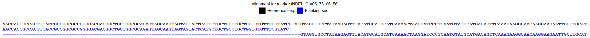

<!-- README.md is generated from README.Rmd. Please edit that file -->

```{r, echo=FALSE}
knitr::opts_chunk$set(
  collapse = TRUE,
  comment = "#>",
  fig.path = "figures/",
  out.width = "100%"
)
```


<!-- badges: start -->
<!-- badges: end -->

# Table of contents

- [Variant Discovery](#variant-discovery)
    - [Curated Sorghum Variant Resource and Database Rationale](#curated-sorghum-variant-resource-and-database-rationale)
    - [Recommended Schema for the Parquet / DuckDB Database](#recommended-schema-for-the-parquet-duckdb-database)
    - [Database Creation](#database-creation)
    - [Query Variant Tables](#query-variant-tables)
    - [Query Online Database ](#query-online-database)
    - [Filter Variants by Allele Frequency](#filter-variants-by-allele-frequency)
    - [Summarize SnpEff Annotation and Impact](#summarize-snpeff-annotation-and-impact)
    - [Filter Variants by Allele Frequency](#filter-variants-by-allele-frequency)
    - [Visualizing Variant Hotspots and Gene Models with panGB](#visualizing-variant-hotspots-and-gene-models-with-pangb)
    - [Evaluating Linkage Disequilibrium for Marker Design](#evaluating-linkage-disequilibrium-for-marker-design)
- [KASP Marker Design](#kasp-marker-design)
- [KASP Marker Validation](#kasp-marker-validation)
- [Decision Support for Trait Introgression and MABC](#decision-support-for-trait-introgression-and-mabc)
    - [Creating Heatmaps with `panGB`](#creating-heatmaps-with-pangb)
    - [Trait Introgression Hypothesis Testing](#trait-introgression-hypothesis-testing)
    - [Decision Support for MABC](#decision-support-for-mabc)
    - [Weighted RPP computation in panGB](#weighted-rpp-computation-in-pangb)
    - [Decision Support for Foreground Selection](#decision-support-for-foreground-selection)

# Variant Discovery 
## Curated Sorghum Variant Resource and Database Rationale
The examples used in this documentation are based on a **Curated Sorghum Variant Resource** derived from whole-genome resequencing data of **1,676 sorghum lines**. Variant calling was performed using version **v5.1** of the **BTx623** reference genome. The resulting **SNP** and **INDEL** variants were functionally annotated using **snpEff**.

Direct querying of raw **snpEff-annotated VCF files** from R is computationally slow and inefficient, especially with large datasets. To handle this efficiently, `panGenomeBreedr` offers two flexible ways to access your data:

1. **Cloud Database:** Connect to a central database securely hosted on the internet. This allows multiple breeders to quickly search massive datasets at the same time, without needing to download massive files or rely on expensive local computer hardware.
2. **Local Database:** Work directly on your own computer using a highly optimized, compact file format (Parquet/DuckDB). This option is incredibly fast, requires no complicated server setup, and is perfect for working offline or on a personal machine. 

**We strongly recommend adopting these structured database formats for other crop systems.** Organizing your data this way standardizes and accelerates the path from raw variant annotated files to precision marker development and targeted crop improvement.

A zipped archive containing the **Curated Sorghum Variant Resource** can be downloaded [here](https://drive.google.com/file/d/1L97pKk2RZt3CiUkl-8IRwpEIT1rN7YsS/view?usp=sharing).

## Recommended Schema for the Parquet / DuckDB Database
The database contains the following four key tables:

### `variants`

This table stores core metadata variant information extracted from the VCF.

| Column        | Description                        |
|---------------|------------------------------------|
| `variant_id`  | Unique variant identifier          |
| `chrom`       | Chromosome name                    |
| `pos`         | Genomic position (1-based)         |
| `ref`         | Reference allele                   |
| `alt`         | Alternate allele                   |
| `variant_type`| Type of variant (e.g., SNP, indel) |

### `annotations`

This table contains functional annotations from **snpEff**, typically including predicted effects, gene names, and functional categories.

| Column         | Description                               |
|----------------|-------------------------------------------|
| `variant_id`   | Foreign key linking to `variants`         |
| `gene_name`    | Sorghum gene ID (e.g., "Sobic.005G213600")|
| `effect`       | Type of effect (e.g., missense_variant)   |
| `impact`       | snpEff predicted impact (e.g., HIGH)      |
| `feature_type` | Type of annotated feature (e.g., exon)    |
| ...            | Additional snpEff annotation fields       |

### `genotypes`

This table stores genotype calls per sample for each variant. To save space with large pangenomes, genotypes are packed into a single text array column (`calls`).

| Column       | Description                                                |
|--------------|------------------------------------------------------------|
| `variant_id` | Foreign key linking to `variants`                          |
| `chrom`      | Chromosome name                                            |
| `pos`        | Genomic position                                           |
| `calls`      | Comma-separated array of all genotype calls (e.g., `{0|0, 1|1}`) |

### `metadata`

This table stores the essential passport and phenotypic data for the samples present in the `genotypes` table. To keep the database fast and compact, genotypes are stored efficiently in a single array format. This metadata table acts as the bridge to accurately map those genotype calls back to their specific sample names. While you can include rich phenotypic or geographic data (like `lat`, `lon`, and `countryorigin` for interactive maps), only a few base columns are strictly required.

| Column          | Description                                                |
|-----------------|------------------------------------------------------------|
| `array_index`   | Required. The integer index corresponding to the sample's position in the `genotypes` array |
| `lib`           | Required. The unique library or accession identifier       |
| `sample`        | Required. The sample name                                  |
| `countryorigin` | Optional. Country of origin for geographic visualizations  |
| `lat` / `lon`   | Optional. Geographic coordinates for the interactive map   |
| `...`           | Optional. Any other phenotypic or population data          |


## Database Creation
We generated the curated database using a custom workflow that:

1. Parses a multi-sample VCF file annotated by snpEff.
2. Extracts variant, annotation, and genotype data.
3. Writes the data into a highly compressed, normalized Parquet file tree (`variants.parquet`, `annotations.parquet`, `genotypes.parquet`, `metadata.parquet`).

A prebuilt mini example database directory (`mini_curated_sorghum_variant_resource`) is included in the `extdata/` folder of the package.

## Query Variant Tables

The `fetch_table_region()` function allows users to query specific tables within a panGenomeBreedr-formatted DuckDB database for variants, annotations, or genotypes based on chromosome coordinates or candidate gene IDs.  

This function retrieves records from one of the following tables in the database:

- `variants`: Basic variant information (chromosome, position, REF/ALT alleles, etc.)
- `annotations`: Variant effect predictions (e.g., from snpEff)
- `genotypes`: Genotypic data across lines/samples plus the metadata of the variants.

Users can specify genomic coordinates (`chrom`, `start`, `end`) or a candidate gene name (`gene_name`) to extract relevant entries.

If used correctly, the `fetch_table_region()` function returns a data frame containing the filtered records from the selected table.

```{r, echo = TRUE}
library(panGenomeBreedr)

# Locate the package example database folder
mini_folder <- system.file("extdata", "pangenome_scale_db", 
                           package = "panGenomeBreedr", 
                           mustWork = TRUE)

# Establish a virtual connection to the offline database engine
con_demo <- connect_local_db(folder_path = mini_folder)

# Query VCF genotypes within the genomic range: Chr05:75,104,537 - 75,106,403
gt_region <- fetch_table_region(con = con_demo,
                      table_name = "genotypes",
                      chrom = "Chr05",
                      start = 75104537,
                      end = 75106403)

#  Query snpEff annotations within a candidate locus gene region
annota_region <- fetch_table_region(con = con_demo,
                          table_name = "annotations",
                          chrom = "Chr05",
                          start = 75104537,
                          end = 75106403,
                          gene_name = "Sobic.005G213600")

# Cleanly close the connection and release memory allocations
disconnect_local_db(con_demo)
```

```{r, echo=FALSE}
knitr::kable(gt_region[1:5, 1:14], 
             caption = 'Table 1: Queried genotypes for variants from the local database.', 
             format = 'html', 
             padding = 0, 
             booktabs = TRUE, 
             escape = FALSE)

knitr::kable(annota_region[1:5,], 
             caption = 'Table 2: Queried annotations for variants from the local database.', 
             format = 'html', 
             padding = 0, 
             booktabs = TRUE, 
             escape = FALSE)
```


### Query Online Database for Sorghum

`panGenomeBreedr` offers the flexibility to connect directly to online databases, allowing you to seamlessly query massive datasets without downloading large files to your local machine. This is ideal for collaborative projects or for users without high-performance computing resources. You can use the default public database or connect to your own private server.

#### Scenario A: Using the Default Public Database

The package is configured to automatically connect to the public **Curated Sorghum Variant Resource** out of the box. No special URL configuration is needed. To query this online resource, simply set the `connect_db_mode = 'online'` argument in any of the data-fetching functions (e.g., `fetch_table_region()`, `summarize_variants()`).

```{r}
library(panGenomeBreedr)

# Extract genotypes within a genomic range from the default public database
test_gt_region <- fetch_table_region(
  table_name = "genotypes",
  chrom = "Chr05",
  start = 75104537,
  end = 75106403,
  connect_db_mode ='online'
)

# Extract annotations for a specific candidate gene
test_annota_region <- fetch_table_region(
  table_name = "annotations",
  chrom = "Chr05",
  gene_name = "Sobic.005G213600",
  connect_db_mode = 'online'
)
```


#### Scenario B: Connecting to a Custom or Private API Endpoint

For collaborative projects or institutions that host their own genomic data, panGenomeBreedr can be configured to connect to a custom API endpoint. Before running any queries, you must direct the package to your private server using the  `set_api_url()` function.

*Note:* To ensure full compatibility, your private database must follow the same schema as the public **Curated Sorghum Variant Resource**.

```{r}
library(panGenomeBreedr)

# 1. Point the package to your custom API endpoint
set_api_url("http://132.145.61.28:8000")
#> panGenomeBreedr API endpoint successfully set to: http://132.145.61.28:8000

# 2. Query your private database exactly as you normally would
test_gt_private <- fetch_table_region(
  table_name = "genotypes",
  chrom = "Chr05",
  start = 75104537,
  end = 75106403,
  connect_db_mode = 'online'

)
```


## Summarize SnpEff Annotation and Impact 

The `summarize_annotations()` function provides a convenient way to summarize the distribution of **SnpEff annotations** and **impact categories** across variant types (e.g., SNPs, indels) within a defined genomic region.

This function enables users to quickly assess the types and functional implications of variants located within candidate genes or genomic intervals of interest.

```{r, echo = TRUE}
library(panGenomeBreedr)

# Locate the package example database folder
mini_folder <- system.file("extdata", "pangenome_scale_db", 
                           package = "panGenomeBreedr", 
                           mustWork = TRUE)

# Establish a virtual connection to the offline database engine
con_demo <- connect_local_db(folder_path = mini_folder)

# Run functional annotation summary for region Chr05:75,104,537 - 75,106,403
ann_summary <- summarize_annotations(con = con_demo,
                                 chrom = "Chr05",
                                 start = 75104537,
                                 end = 75106403)

# Cleanly close the connection and release memory allocations
disconnect_local_db(con_demo)
```

```{r, echo=FALSE}
knitr::kable(head(ann_summary$annotation_summary), 
             caption = 'Annotation summary for variants within the genomic range.', 
             format = 'html', 
             padding = 0, 
             booktabs = TRUE, 
             escape = FALSE)

knitr::kable(head(ann_summary$impact_summary), 
             caption = ' Functional impact summary for variants within the genomic range.', 
             format = 'html', 
             padding = 0, 
             booktabs = TRUE, 
             escape = FALSE)
```


The `summarize_annotations()` function returns a `list` with the following elements:  

- `annotation_summary`: Data frame summarizing the count of each SnpEff annotation grouped by variant type.  

- `impact_summary`: Data frame summarizing the count of each SnpEff impact level (e.g., HIGH, MODERATE) grouped by variant type.  

- `variant_type_totals`: Total count of variants in the region grouped by variant type.

**The annotation summary shows that there are six (6) INDEL variants with a HIGH impact on protein function.** To see these variants, we need to use the `fetch_variants_by_impact()` function, as shown below:

```{r, echo = TRUE}

library(panGenomeBreedr)

# Locate the package example database folder
mini_folder <- system.file("extdata", "pangenome_scale_db", 
                           package = "panGenomeBreedr", 
                           mustWork = TRUE)

# Establish a virtual connection to the offline database engine
con_demo <- connect_local_db(folder_path = mini_folder)

# Extract HIGH impact functional variants within the target Chr05 window
high_variants <- fetch_variants_by_impact(con = con_demo,
                                 impact_level = "HIGH",
                                 chrom = "Chr05",
                                 start = 75104537,
                                 end = 75106403)

# Cleanly close the connection and release memory allocations
disconnect_local_db(con_demo)
```

```{r, echo=FALSE}
# View HIGH impact variants
knitr::kable(head(high_variants), 
             caption = ' HIGH impact variants within a defined genomic range.', 
             format = 'html', 
             padding = 0, 
             booktabs = TRUE, 
             escape = FALSE)
```


## Filter Variants by Allele Frequency

The `fetch_variants_by_allele_frequency()` and `filter_by_allele_frequency()` functions allow users to filter queried variants based on **alternate allele frequency thresholds** within a specified genomic region.

This is particularly useful for identifying **polymorphic sites** within candidate gene regions or windows of interest that meet desired minor allele frequency (MAF) thresholds for marker development.

An example usage for the `filter_by_allele_frequency()` function is shown in the code snippet below:

```{r, echo = TRUE}
library(panGenomeBreedr)

# Locate the package example database folder
mini_folder <- system.file("extdata", "pangenome_scale_db", 
                           package = "panGenomeBreedr", 
                           mustWork = TRUE)

# Establish a virtual connection to the offline database engine
con_demo <- connect_local_db(folder_path = mini_folder)

# Extract genotype data for all HIGH impact variants and filter by alternate allele frequency
geno_high_filtered <- fetch_genotypes_by_id(
  con = con_demo,
  variant_ids = high_variants$variant_id,
  meta_data = c("chrom", "pos", "ref", "alt", "variant_type")
) |>
  filter_by_allele_frequency(min_af = 0.05)

# Cleanly close the connection and release memory allocations
disconnect_local_db(con_demo)
```

```{r, echo = FALSE}
knitr::kable(geno_high_filtered, 
             caption = 'Table 3: Filtered variants from the local database.', 
             format = 'html', 
             padding = 0, 
             booktabs = TRUE, 
             escape = FALSE)
```

```{r, echo=TRUE}
library(panGenomeBreedr)

# Locate the package example database folder
mini_folder <- system.file("extdata", "pangenome_scale_db", 
                           package = "panGenomeBreedr", 
                           mustWork = TRUE)
                           
# Establish a virtual connection to the offline database engine
con_demo <- connect_local_db(folder_path = mini_folder)

# Get genotype data for HIGH impact variants that passed allele filter
geno_high_filtered <- fetch_genotypes_by_id(con = con_demo,
                                      variant_ids = geno_high_filtered$variant_id,
                                      meta_data = c("chrom", "pos", "ref", "alt", "variant_type"))

# Cleanly close the connection and release memory allocations
disconnect_local_db(con_demo)
```

## Visualizing Variant Hotspots and Gene Models with panGB
panGB allows users to mine the sorghum parquet-backed large-scale variant database to identify causal mutations for candidate genes annotated in the a GFF3 file for sorghum (V5.1). panGB streamlines this process by providing seamless integration between genomic annotations in the GFF3 file, the remote pangenome-scale variant database, and dynamic visualizations.

For this example, we will interrogate a specific *Sorghum bicolor* candidate gene (`Sobic.005G213600`).

First, load the package and define the essential inputs. We require a GFF3 file for the reference genome to map structural features (exons, introns, UTRs) and the specific candidate gene ID we wish to investigate.

Before we can query the variant database, we need the exact genomic bounds of our candidate gene. The `gene_coord_gff()` function parses the remote GFF3 file and returns the spatial coordinates for the specified gene.

With the physical boundaries defined, we can now fetch the underlying genomic data. panGB interacts directly with remote variant databases. Using the `connect_db_mode = 'online'` argument allows us to pull slices of big data into our local R environment without downloading the entire pangenome dataset.


The final step is to align the queried genetic variation directly against the physical gene model.

The `hotspot_overlay_plot()` function constructs a layered visualization. It maps the gene structure (drawn directly from the GFF3) and overlays the variant density and annotations, allowing you to rapidly visually pinpoint regions of high functional variation within the candidate gene.

```{r}
library(panGenomeBreedr)

# 1. Define the path to the reference GFF3 file
gff_path <- "https://raw.githubusercontent.com/awkena/panGB/main/Sbicolor_730_v5.1.gene.gff3.gz"

# Define the candidate gene of interest
cand_gene <- "Sobic.005G213600"

# 2. Extract the candidate gene coordinates from the GFF3 file
gene_coord <- gene_coord_gff(gene_name = cand_gene, gff_path = gff_path)

# View the extracted boundaries
head(gene_coord)

# 3. Fetch variant annotation data for the candidate gene region
ann_df <- fetch_table_region(
  table_name = "annotations",
  chrom = gene_coord$Chromosome[1],
  start = min(gene_coord$Start),
  end = max(gene_coord$End),
  connect_db_mode = 'online'
)

# 4. Fetch the genotype calls for the identified variants
geno_df <- fetch_table_region(
  table_name = "genotypes",
  chrom = gene_coord$Chromosome[1],
  start = min(gene_coord$Start),
  end = max(gene_coord$End),
  connect_db_mode = 'online'
)

# 5. Generate and display a variant hotspot aligned to the gene model
if (nrow(ann_df) > 0 && nrow(geno_df) > 0) {
  hotspot_overlay_plot(
    gene_name = cand_gene, 
    gff_path = gff_path,
    annotations_df = ann_df, 
    genotypes_df = geno_df
  )
} else {
  message("Insufficient data retrieved to generate the hotspot plot.")
}
```


## Evaluating Linkage Disequilibrium for Marker Design

After identifying the causal variants, the next critical step is to evaluate their genomic context. Variants rarely exist in isolation; they are often co-inherited with neighboring variants in segments of the genome known as **haplotype blocks**, which are regions of high Linkage Disequilibrium (LD).

Analyzing LD is a vital decision-support tool that helps you:

1.  **Eliminate Redundancy:** If multiple candidate variants fall within the same tightly linked haplotype block (i.e., they have a high $R^2$ value), you only need to design a single KASP assay for one of them to effectively "tag" the entire block. This saves time and resources.

2.  **Assess Marker-Trait Association:** Visualizing the LD landscape helps confirm that your target variants are strongly associated with the genomic region of your trait of interest, while also helping you avoid regions with high genomic complexity that might complicate marker design.

The `panGenomeBreedr` package simplifies this analysis. First, we compute the pairwise LD metrics for our filtered variants across the target region:

```{r}
# Compute LD around our causal variants
ld_result <- calculate_LD(
  df = gt_region,
  target_variant_ids = geno_high_filtered$variant_id,
  genotype_start_col = 11
)
```

```{r, echo = FALSE}
knitr::kable(
  head(ld_result),
  caption = "Table 4: Pairwise Linkage Disequilibrium (LD) metrics for causal variants.",
  format = 'html',
  padding = 0,
  booktabs = TRUE,
  escape = FALSE
)
```


With the LD statistics calculated, we can generate a `Geodesic Linkage Disequilibrium (LD) Landscape plot`. This function projects the pairwise $R^2$ values as physical trajectories, making it highly intuitive to spot tightly linked variant clusters.

*Note:* We set `block_threshold = 0.95` below to group variants exhibiting very strong, but realistic, linkage into our output haploblock table.

```{r ld_plot, fig.width=12, fig.height=6, out.width="100%", fig.align="center", dpi=300}
# Visualize the LD and extract haploblock tables
ld_haplo_plot <- plot_ld_geodesic(
  ld_df = ld_result,
  query_db_geno = gt_region,
  query_db_annot = annota_region,
  threshold = 0.95, # Minimum R² to draw an arc
  block_threshold = 0.95, # Minimum R² to define a haploblock in the table
  target_variant_ids = geno_high_filtered$variant_id
)

# Render the plot
ld_haplo_plot$plot
```

```{r, echo = FALSE}
knitr::kable(
  head(ld_haplo_plot$table),
  caption = "Table 4: Haplotype Blocks Identified via LD Mapping",
  format = 'html',
  padding = 0,
  booktabs = TRUE,
  escape = FALSE
)
```


# KASP Marker Design
The `kasp_marker_design()` function enables the design of **KASP (Kompetitive Allele Specific PCR)** markers from identified putative causal variants. It supports SNP, insertion, and deletion variants using VCF genotype data and a reference genome to generate Intertek-compatible marker information, including upstream and downstream polymorphic context.

This function automates the extraction of flanking sequences and polymorphic variants surrounding a focal variant and generates:

- Intertek-ready marker submission metadata
- DNA sequence alignment for visual inspection of marker context
- An optional publication-ready alignment plot in PDF format

The vcf file must contain the variant ID, Chromosome ID, Position, REF and ALT alleles, as well as the genotype data for samples, as shown in Table 4:

```{r, echo = FALSE}
# View summaries
knitr::kable(geno_high_filtered[, 1:8], 
             caption = 'Table 5: Filtered HIGH impact variants for marker development.',
             format = 'html', 
             padding = 0, 
             booktabs = TRUE, 
             escape = FALSE)
```

```{r, echo = TRUE}
# Example to design a KASP marker on a HIGH impact Deletion variant
library(panGenomeBreedr)
path <- tempdir() # (default directory for saving alignment outputs)

# Path to import sorghum genome sequence for Chromosome 5
path1 <- "https://raw.githubusercontent.com/awkena/panGB/main/Chr05.fa.gz"

# KASP marker design for variant ID: INDEL_Chr05_75106156 in Table 4
lgs1 <- kasp_marker_design(gt_df = geno_high_filtered,
                           variant_id_col = 'variant_id',
                           chrom_col = 'chrom',
                           pos_col = 'pos',
                           ref_al_col = 'ref',
                           alt_al_col = 'alt',
                           genome_file = path1,
                           geno_start = 11,
                           marker_ID = "INDEL_Chr05_75106156",
                           chr = "Chr05",
                           save_alignment = TRUE,
                           plot_file = path,
                           region_name = "lgs1")

# Create the Intertek-formatted table.
intertek_table <- make_intertek_table(
  marker_data = lgs1,
  genome_version = "Sbv5.1",
  region_name = "lgs1",
  trait = "Stay-green",
  owner = "Green Evolution"
)


# View marker alignment output from temp folder
path3 <- file.path(path, list.files(path = path, "alignment_"))
system(paste0('open "', path3, '"')) # Open PDF file from R

on.exit(unlink(path)) # Clear the temp directory on exit
```


The `kasp_marker_design()` function returns a list object including a `data.frame` with marker design metadata:

- `SNP_Name`: Variant ID
- `SNP`: Type of variant (SNP/INDEL)
- `Marker_Name`: Assigned name for the marker
- `Chromosome`: Chromosome name
- `Chromosome_Position`: Variant position
- `Sequence`: Intertek-style polymorphism sequence
- `ReferenceAllele`: Reference allele
- `AlternativeAllele`: Alternate allele

If `save_alignment = TRUE`, a **PDF plot** of sequence alignment will be saved to `plot_file`.

<figure style="text-align: center;">
  
  <figcaption><em>Fig. 2.</em> Alignment of the 100 bp upstream and downstream sequences to the reference genome used for KASP marker design.</figcaption>
</figure>


The required sequence for submission to Intertek for the designed KASP marker is shown in Table 5.

```{r, echo = FALSE}
library(knitr)
knitr::kable(intertek_table, 
             caption = 'Table 6: Intertek-formatted table for KASP markers.', 
             format = 'html', 
             padding = 0, 
             booktabs = TRUE, 
             escape = FALSE)
 
```


# KASP Marker Validation

The following example demonstrates how to use the customizable functions in `panGB` to perform hypothesis testing of allelic discrimination for KASP marker QC and validation.

`panGB` offers customizable functions for KASP marker validation through hypothesis testing. These functions allow users to easily perform the following tasks:  
-   Import raw or polished KASP genotyping results files (.csv) into R.   

-   Process imported data and assign FAM and HEX fluorescence colors for multiple     plates.  

-   Visualize marker QC using FAM and HEX fluorescence scores for each sample.  

-   Validate the effectiveness of trait-predictive or background markers using       positive controls.  

-   Visualize plate design and randomization.  


## Reading Raw KASP Full Results Files (.csv)
The `read_kasp_csv()` function allows users to import raw or polished KASP genotyping full results file (.csv) into R. The function requires the path of the raw file and the row tags for the different components of data in the raw file as arguments. 

For polished files, the user must extract the `Data` component of the full results file and save it as a csv file before import.

By default, a typical unedited raw KASP data file uses the following row tags for genotyping data: `Statistics`, `DNA`, `SNPs`, `Scaling`, `Data`.  

The raw file is imported as a list object in R. Thus, all components in the imported data can be extracted using the row tag ID as shown in the code snippet below:  

```{r}
# Import raw KASP genotyping file (.csv) using the read_kasp_csv() function
library(panGenomeBreedr)

# Set path to the directory where your data is located
# path1 <-  "inst/extdata/Genotyping_141.010_01.csv"
path1 <-  system.file("extdata", "Genotyping_141.010_01.csv",
                       package = "panGenomeBreedr",
                      mustWork = TRUE)

# Import raw data file
file1 <- read_kasp_csv(file = path1, 
                       row_tags = c("Statistics", "DNA", "SNPs", "Scaling", "Data"),
                       data_type = 'raw')

# Get KASP genotyping data for plotting
kasp_dat <- file1$Data
```


## Assigning colors and PCH symbols for KASP cluster plotting
The next step after importing data is to assign FAM and HEX fluorescence colors to samples based on their observed genotype calls. This step is accomplished using the `kasp_color()` function in `panGB` as shown in the code snippet below:  

```{r}
# Assign KASP fluorescence colors using the kasp_color() function
library(panGenomeBreedr)
# Create a subet variable called plates: masterplate x snpid
  kasp_dat$plates <- paste0(kasp_dat$MasterPlate, '_',
                                 kasp_dat$SNPID)
dat1 <- kasp_color(x = kasp_dat,
                    subset = 'plates',
                    sep = ':',
                    geno_call = 'Call',
                    uncallable = 'Uncallable',
                    unused = '?',
                    blank = 'NTC',
                   assign_cols = c(FAM = "blue", HEX = "gold" , 
                                   het = "forestgreen"))
```


The `kasp_color()` function requires the KASP genotype call file as a data frame and can do bulk processing if there are multiple master plates. The default values for the arguments in the `kasp_color()` function are based on KASP annotations. 

The `kasp_color()` function calls the `kasp_pch()` function to automatically add PCH plotting symbols that can equally be used to group genotypic clusters on the plot. 

When expected genotype calls are available for positive controls in KASP genotyping samples, we recommend the use of the PCH symbols for grouping observed genotypes instead of FAM and HEX colors.

The `kasp_color()` function expects that genotype calls are for diploid state with alleles separated by a symbol. By default KASP data are separated by `:` symbols.

The `kasp_color()` function returns a list object with the processed data for each master plate as the components.  

## Cluster plot
To test the hypothesis that the designed KASP marker can accurately discriminate between homozygotes and heterozygotes (allelic discrimination), a cluster plot needs to be generated.  

The `kasp_qc_ggplot()` and `kasp_qc_ggplot2()`functions in `panGB` can be used to make the cluster plots for each plate and KASP marker as shown below:   

```{r plate_05_qc_1, fig.cap = "Fig. 3. Cluster plot for Plate 5 using FAM and HEX colors for grouping observed genotypes."}
# KASP QC plot for Plate 05
library(panGenomeBreedr)
kasp_qc_ggplot2(x = dat1[5],
                    pdf = FALSE,
                    Group_id = NULL,
                    scale = TRUE,
                    expand_axis = 0.6,
                    alpha = 0.9,
                    legend.pos.x = 0.6,
                    legend.pos.y = 0.75)
```

```{r plate_05_qc_2, fig.cap = "Fig. 4. Cluster plot for Plate 5 with an overlay of predictions for positive controls.", eval=TRUE}
# KASP QC plot for Plate 05
library(panGenomeBreedr)
 kasp_qc_ggplot2(x = dat1[5],
                  pdf = FALSE,
                  Group_id = 'Group',
                  Group_unknown = '?',
                  scale = TRUE,
                  pred_cols = c('Blank' = 'black', 'False' = 'firebrick3',
                              'True' = 'cornflowerblue', 'Unverified' = 'beige'),
                  expand_axis = 0.6,
                  alpha = 0.9,
                  legend.pos.x = 0.6,
                  legend.pos.y = 0.75)
```


Color-blind-friendly color combinations are used to visualize verified genotype predictions (Figure 3).

In Figure 4, the three genotype classes are grouped based on plot PCH symbols using the FAM and HEX scores for observed genotype calls.

To simplify the verified prediction overlay for the expected genotypes for positive controls, all possible outcomes are divided into three categories (TRUE, FALSE, and UNVERIFIED) and color-coded to make it easier to visualize verified predictions.

BLUE (color code for the TRUE category) means genotype prediction matches the observed genotype call for the sample. 

RED (color code for the FALSE category) means genotype prediction does not match the observed genotype call for the sample. 

BEIGE (color code for the UNVERIFIED category) means three things: an expected genotype call could not be made before KASP genotyping, or an observed genotype call could not be made to verify the prediction. 

Users can set the `pdf = TRUE` argument to save plots as a PDF file in a directory outside R. The `kasp_qc_ggplot()` and `kasp_qc_ggplot2()`functions can generate cluster plots for multiple plates simultaneously.  

To visualize predictions for positive controls to validate KASP markers, the column name containing expected genotype calls must be provided and passed to the function using the `Group_id = 'Group'` argument as shown in the code snippets above. If this information is not available, set the argument `Group_id = NULL`. 

## Summary of Prediction Verification in Plates
The `pred_summary()` function produces a summary of predicted genotypes for positive controls in each reaction plate after verification (Table 6), as shown in the code snippet below:

```{r, eval=TRUE}
# Get prediction summary for all plates
library(panGenomeBreedr)
my_sum <- pred_summary(x = dat1,
                       snp_id = 'SNPID',
                       Group_id = 'Group',
                       Group_unknown = '?',
                       geno_call = 'Call',
                       rate_out = TRUE)
```

```{r, echo = FALSE}
library(knitr)
knitr::kable(my_sum$summ, caption = 'Table 7: Summary of verified prediction status for samples in plates', format = 'html', booktabs = TRUE)
 
```


The output of the `pred_summary()` function can be visualized as bar plots using the `pred_summary_plot()` function as shown in the code snippet below:

```{r barplot, fig.cap = "Fig. 5. Match/Mismatch rate of predictions for snp: snpSB00804.", eval=TRUE}
# Get prediction summary for snp:snpSB00804
library(panGenomeBreedr)
my_sum <- my_sum$summ
my_sum <- my_sum[my_sum$snp_id == 'snpSB00804',]

 pred_summary_plot(x = my_sum,
                    pdf = FALSE,
                    pred_cols = c('false' = 'firebrick3', 'true' = 'cornflowerblue',
                                  'unverified' = 'beige'),
                    alpha = 1,
                    text_size = 12,
                    width = 6,
                    height = 6,
                    angle = 45)
```


## Plot Plate Design
Users can visualize the observed genotype calls in a plate design format using the `plot_plate()` function as depicted in Figure 6, using the code snippet below:  

```{r plate_05_design, fig.cap = "Fig. 6. Observed genotype calls for samples in Plate 5 in a plate design format.", eval=TRUE}
plot_plate(dat1[5], pdf = FALSE)
```


# Decision Support for Trait Introgression and MABC
`panGB` provides additional functionalities to test hypotheses on the success of trait introgression pipelines and crosses. 

Users can easily generate heatmaps that compare the genetic background of parents to progenies to ascertain if a target locus was successfully introgressed or check for the hybridity of F1s. These plots also allow users to get a visual insight into the amount of parent germplasm recovered in progenies.  

To produce these plots, users must have either polymorphic low or mid-density marker data and a map file for the markers. **The map file must contain the marker IDs, their chromosome numbers and positions**.  

`panGB`can handle data from KASP, Agriplex and DArTag service providers.  


## Working with Agriplex Mid-Density Marker Data
Agriplex data is structurally different from KASP or DArTag data in terms of genotype call coding and formatting. Agriplex uses `' / '` as a separator for genotype calls for heterozygotes, and uses single nucleotides to represent homozygous SNP calls.

## Creating Heatmaps with panGB
To exemplify the steps for creating heatmap, we will use a mid-density marker data for three groups of near-isogenic lines (NILs) and their parents (Table 7). The NILs and their parents were genotyped using the Agriplex platform. Each NIL group was genotyped using 2421 markers.  

The imported data frame has the markers as columns and genotyped samples as rows. It comes with some meta data about the samples. Marker names are informative: chromosome number and position coordinates are embedded in the marker names (`Eg. S1_778962: chr = 1, pos = 779862`).  

```{r}

# Set path to the directory where your data is located
path1 <-  system.file("extdata", "agriplex_dat.csv",
                       package = "panGenomeBreedr",
                      mustWork = TRUE)

# Import raw Agriplex data file
geno <- read.csv(file = path1, header = TRUE, colClasses = c("character")) # genotype calls

library(knitr)
knitr::kable(geno[1:6, 1:10], caption = 'Table 7: Agriplex data format', format = 'html', booktabs = TRUE)
```


To create a heatmap that compares the genetic background of parents and NILs across all markers, we need to first process the raw Agriplex data into a numeric format. The panGB package has customizable data wrangling functions for KASP, Agriplex, and DArTag data.  

The `rm_mono()` function can be used to filter out all monomorphic loci from the data.  

Since our imported Agriplex data has informative SNP IDs, we can use the `parse_marker_ns()` function to generate a map file (Table 8) for the markers.    
The generated map file is then passed to the `proc_kasp()` function to order the SNP markers according to their chromosome numbers and positions. 

The `kasp_numeric()` function converts the output of the `proc_kasp()` function into a numeric format (Table 9).  The re-coding to numeric format is done as follows:  

* Homozygous for Parent 1 allele = 1. 
* Homozygous for Parent 2 allele = 0. 
* Heterozygous = 0.5. 
* Monomorphic loci = -1. 
* Loci with a suspected genotype error = -2. 
* Loci with at least one missing parental or any other genotype = -5. 

```{r}

# Parse snp ids to generate a map file
library(panGenomeBreedr)

# Data for stg5 NILs
stg5 <- geno[geno$Batch == 3, -c(1:6)] 
rownames(stg5) <- geno$Genotype[17:25]

# Remove monomorphic loci from data
stg5 <- rm_mono(stg5)

# Parse snp ids to generate a map file
snps <- colnames(stg5) # Get snp ids
map_file <- parse_marker_ns(x = snps, sep = '_', prefix = 'S')

# order markers in map file
map_file <- order_markers(x = map_file)
```

```{r, echo=FALSE}
library(knitr)
knitr::kable(map_file[1:8,], caption = 'Table 8: Map file for the imported Agriplex data.', format = 'html', booktabs = TRUE)
```

```{r}
# Process genotype data to re-order SNPs based on chromosome and positions
stg5 <- proc_kasp(x = stg5,
                  kasp_map = map_file,
                  map_snp_id = "snpid",
                  sample_id = "Genotype",
                  marker_start = 1,
                  chr = 'chr',
                  chr_pos = 'pos')

# Convert to numeric format for plotting
num_geno <- kasp_numeric(x = stg5,
                         rp_row = 1,
                         dp_row = 3,
                         sep = ' / ',
                         data_type = 'agriplex')
```

```{r, echo=FALSE}
library(knitr)
knitr::kable(num_geno[, 1:8], caption = 'Table 9: Agriplex data converted to a numeric format.', format = 'html', booktabs = TRUE)
```


All is now set to generate the heatmap (Figure 7) using the `cross_qc_ggplot()` function, as shown in the code snippet below:  

```{r heatmap1, fig.cap = "Fig. 7. A heatmap that compares the genetic background of parents and stg5 NIL progenies across all markers.", fig.width=12.5, fig.height=8.5, eval=TRUE}

# Get prediction summary for snp:snpSB00804
library(panGenomeBreedr)
# Create a heatmap that compares the parents to progenies
cross_qc_heatmap(x = num_geno,
                map_file = map_file,
                snp_ids = 'snpid',
                chr = 'chr',
                chr_pos = 'pos',
                parents = c("BTx623a", "BTx642a"),
                pdf = FALSE,
                filename = 'background_heatmap',
                legend_title = 'stg5_NILs',
                alpha = 0.9,
                text_size = 15)
```


The `cross_qc_ggplot()` function is a wrapper for functions in the `ggplot2` package.

Users must specify the IDs for the two parents using the `parents` argument. In the code snippet above, the recurrent parent is `BTx623` and the donor parent for the *stg5* locus is `BTx642`. 

The `group_sz` argument must be specified to plot the heatmap in batches of progenies to avoid cluttering the plot with many observations.  

Users can set the `pdf = TRUE` argument to save plots as a PDF file in a directory outside R.

## Trait Introgression Hypothesis Testing
To test the hypothesis that the *stg5* NIL development was effective, we can use the `cross_qc_annotate()`  function to generate a heatmap (Figure 8) with an annotation of the position of the *stg5* locus on Chr 1, as shown below:  

```{r heatmap2, fig.cap = "Fig. 8. Heatmap annotation of the stg5 locus on Chr 1.", fig.width=12.5, fig.height=6.5, eval=TRUE}

###########################################################################
# Subset data for the first 30 markers on Chr 1
stg5_ch1 <- num_geno[, map_file$chr == 1][,1:20] 

# Get the map file for subset data
stg5_ch1_map <- parse_marker_ns(colnames(stg5_ch1))

# Annotate a heatmap to show the stg5 locus on Chr 1
# The locus is between positions 1e6 - 1.4 Mbp on Chr 1
cross_qc_heatmap(x = stg5_ch1,
                  map_file = stg5_ch1_map,
                  snp_ids = 'snpid',
                  chr = 'chr',
                  chr_pos = 'pos',
                  parents = c("BTx623a", "BTx642a"),
                  trait_pos = list(stg5 = c(chr = 1, start = 1e6, end = 1.4e6)),
                  text_scale_fct = 0.18,
                  pdf = FALSE,
                  legend_title = 'Stg5_NILs',
                  alpha = 0.9,
                  text_size = 15)
```


In the code snippet above, the numeric matrix of genotype calls and its associated map file are required. 

The recurrent and donor parents must be specified using the `parents` argument.

The `snp_ids, chr, and chr_pos` arguments can be used to specify the column names for marker IDs, chromosome number and positions in the attached map file.  
The `trait_pos` argument was used to specify the position of the target locus (*stg5*) on chromosome one. Users can specify the positions of multiple target loci as components of a list object for annotation.  

In Figure 8, the color intensity correlates positively with the marker density or coverage. Thus, areas with no color (white vertical gaps) depicts gaps in the marker coverage in the data.  


## Decision Support for MABC
Users can use the `calc_rpp_bc()` function in `panGB` to calculate the proportion of recurrent parent background (RPP) fully recovered in backcross progenies. 

It also returns the rpp value for each chromosome.

In the computation, partially regions are ignored, hence, heterozygous scores are not used.  

The output for he `calc_rpp_bc()` function can be passed to the `rpp_barplot()` function to visualize the computed RPP values for progenies as a bar plot. Users can specify an RPP threshold to easily identify lines that have RPP values above or equal to the defined RPP threshold on the bar plot.  

We can compute and visualize the observed RPP values for the *stg5* NILs across all polymorphic loci as shown in the code snippet below:  

```{r barplot_rpp1, fig.cap = "Fig. 9. Computed RPP values for the stg5 NILs.", fig.width=10.5, fig.height=6.5, eval=TRUE}

# Calculate weighted RPP
rpp <- calc_rpp_bc(x = num_geno,
                   map_file = map_file,
                   map_chr = 'chr',
                   map_pos = 'pos',
                   map_snp_ids = 'snpid',
                   rp = 1,
                   rp_num_code = 1,
                   na_code = -5,
                   weighted = TRUE)

# Generate bar plot for RPP values
rpp_barplot(rpp_df = rpp,
            rpp_threshold = 0.93,
            text_size = 18,
            text_scale_fct = 0.1,
            alpha = 0.9,
            bar_width = 0.5,
            aspect_ratio = 0.5,
            pdf = FALSE)
```

```{r, echo=FALSE}
library(knitr)
knitr::kable(rpp, caption = 'Table 10: RPP computation across and for each chromosome.', 
             format = 'html', 
             booktabs = TRUE)
```


The `calc_rpp_bc()` function in `panGB` provides two algorithms for computing the observed RPP values: weighted and unweighted RPP values. We recommend the use of the weighted algorithm to account for differences in the marker coverage across the genome. 

The algorithm for the weighted RPP values is explained below.


### Weighted RPP Computation in panGB
Let $w_i$ represent the weight for marker $i$, based on the relative distances to its adjacent markers. 

For a set of markers with positions $p_1, p_2, \ldots, p_n$, where $d_i = p_{i+1} - p_i$ represents the distance between adjacent markers, the weights can be calculated as follows:

1. **For the first marker** $i = 1$:  

   $$w_1 = \frac{d_1}{2 \sum_{i=1}^{n-1} d_i}$$

2. **For a middle marker** $1 < i < n$:  

   $$w_i = \frac{d_{i-1} + d_i}{2 \sum_{i=1}^{n-1} d_i}$$

3. **For the last marker** $i = n$:  

   $$w_n = \frac{d_{n-1}}{2 \sum_{i=1}^{n-1} d_i}$$

where:  

- $d_i$ is the distance between marker $i$ and marker $i+1$,
- $sum_{i=1}^{n-1} d_i$ is the total distance across all segments, used for normalization.  


Let $RPP$ represent the Recurrent Parent Proportion based on relative distance weighting. If $w_i$ is the weight for each marker $i$, and $m_i$ represents whether marker $i$ matches the recurrent parent $m_i = 1$ if it matches, $m_i = 0$ otherwise), then the weighted RPP is calculated as:  

$$RPP_{weighted} = \sum_{i=1}^n w_i\cdot m_i$$

The unweighted RPP is calculated without the use of the weights as follows:    

$$RPP_{unweighted} = \frac{\sum_{i=1}^n m_i} n$$

where:  

- $w_i$ is the weight of marker $i$, calculated based on the relative distance it covers,
- $m_i$ is the match indicator for marker $i$ (1 if matching the recurrent parent, 0 otherwise),
- $n$ is the total number of markers.

This formula provides the sum of the weighted contributions from each marker, representing the proportion of the recurrent parent genome in the individual.


## Decision Support for Foreground Selection

The `foreground_select()` and `find_lines()` functions are designed to help breeders identify lines that carry **favorable alleles at target loci** using trait-predictive markers. This process supports **foreground selection** in marker-assisted selection pipelines.

### Generate a Binary Matrix: `foreground_select()` function
The `foreground_select()` function score Lines for presence of favorable alleles by converting raw marker genotype data into a binary matrix (1 = favorable allele present, 0 = absent) based on a set of trait-predictive markers. The `foreground_select()` function is shown in the code snippet below:

```{r, echo=TRUE}
library(panGenomeBreedr)

# Marker genotype data
geno <- data.frame(SNP1 = c("A:A", "A:G", "G:G", "A:A"),
                   SNP2 = c("C:C", "C:T", "T:T", "C:T"),
                   SNP3 = c("G:G", "G:G", "A:G", "A:A"),
                   row.names = c("Line1", "Line2", "Line3", "Line4"))

# Trait-predictive marker metadata
marker_info <- data.frame(qtl_markers = paste0("SNP", 1:3),
                           locus_name = paste0('loc', 1:3),
                          fav_alleles = c("A", "C", "G"),
                         
                          alt_alleles = c("G", "T", "A"))

# Convert raw genotypes to binary (foreground profile)
foreground_matrix <- foreground_select(geno_data = geno,
                                       fore_marker_info = marker_info,
                                       fore_marker_col = "qtl_markers",
                                       fav_allele_col = "fav_alleles",
                                       alt_allele_col = "alt_alleles",
                                       select_type = "homo")
```

```{r, echo=FALSE}
library(knitr)
knitr::kable(foreground_matrix, 
             caption = 'Table 11: Binary matrix of presence or absence of favorable alleles.', 
             format = 'html', 
             booktabs = TRUE)
```


The `foreground_select()` function has the following input parameters:

| Argument            | Type         | Description |
|---------------------|--------------|-------------|
| `geno_data`         | `data.frame` | Marker genotype data (lines x markers), e.g., `"A:A"`, `"A:G"` |
| `fore_marker_info`  | `data.frame` | Metadata describing trait-predictive markers, including marker names, favorable alleles, and alternate alleles |
| `fore_marker_col`   | `character`  | Column name in `fore_marker_info` for marker names |
| `fav_allele_col`    | `character`  | Column name for favorable allele |
| `alt_allele_col`    | `character`  | Column name for alternate allele |
| `select_type`       | `character`  | Genotype class to select: `"homo"`, `"hetero"`, or `"both"` |
| `sep`               | `character`  | Separator used in genotype calls (e.g., `":"`) |


### Visualize the Binary Data with UpSet Plot

Generate an UpSet plot using the `UpSetR` package to explore the co-occurrence of favorable alleles across lines.  The UpSet plot allows users to quickly determine:  

- Whether any line carries favorable alleles at all target loci. 

- How favorable alleles are distributed across lines. 

- Which loci are rarely combined. 

**How to Interpret the UpSet Plot:** 

- **Top bar plot:** shows the number of lines for each unique combination (intersection) of target loci with favorable alleles.  

- **Bottom matrix of dots and lines:** indicates which loci are involved in each combination.  

- **Left bar plot:** shows how many lines have the favorable allele for each individual target locus.

```{r upset_plot1, fig.cap = "Fig. 10. Visualizing the co-occurrence of favorable alleles across lines.", fig.width=10.5, fig.height=6.5, eval=TRUE}
# Make an Upset plot and overlay with trait loci names
metadata <- data.frame(sets = marker_info$qtl_markers,
                      locus = marker_info$locus_name)

nl <- ncol(foreground_matrix) # Number of markers

UpSetR::upset(foreground_matrix,
              nsets = nl,
              mainbar.y.label = "Locus Intersection Size",
              sets.x.label = "Locus Size",
              text.scale = 1.2,
              set.metadata = list(data = metadata,
                          plots = list(list(type = 'text', 
                                            assign = 8,
                                            column = 'locus',
                                            colors = rep('firebrick2', nl)))))
```


###  Query Lines by Intersection Category: `find_lines()` function
The `find_lines()` function identifies lines based on target loci profile by filtering the binary output of `foreground_select()` to return line names that match a desired allele presence/absence profile across loci. Using the binary matrix, users can extract line IDs corresponding to any intersection (i.e., specific combinations of favorable alleles revealed by the UpSet plot).

```{r, echo=TRUE}
library(panGenomeBreedr)

# Find lines with favorable alleles at all target loci
selected_lines <- find_lines(mat = foreground_matrix,
                             present = c('SNP1', 'SNP2', 'SNP3'))

print(selected_lines)
```


The `find_lines()` function has the following input parameters:  

| Argument   | Type           | Description |
|------------|----------------|-------------|
| `mat`      | `data.frame`   | Binary matrix. |
| `present`  | `character`  | Markers that must be 1. |
| `absent`   | `character`  | Markers that must be 0. |


# Troubleshooting

If the package does not run as expected, check the following:

-   Was the package properly installed?

-   Do you have the required dependencies installed?

-   Were any warnings or error messages returned during package
    installation?

-   Are all packages up to date before installing panGB?


# Authors and contributors

-   [Alexander Wireko Kena](https://github.com/awkena)

-   [Israel Tawiah Tetteh](https://github.com/Israel-Tetteh)

-   [Cruet Burgos](https://www.morrislab.org/people/clara-cruet-burgos)

-   [Linly Banda](https://www.biofortificationlab.org/people/linly-banda)

-   [Jacques Faye](https://sites.google.com/site/morrislaboratory/people/jacques-faye)

-   [Fanna Maina](https://www.morrislab.org/people/fanna-maina)

-   [Terry Felderhoff](https://www.agronomy.k-state.edu/about/people/faculty/felderhoff-terry/)

-   [Geoffrey Preston    Morris](https://www.morrislab.org/people/geoff-morris)


# License

[GNU GPLv3](https://choosealicense.com/licenses/gpl-3.0/)


# Support and Feedback

For support and submission of feedback, email the maintainer **Alexander Kena, PhD** at [alex.kena24@gmail.com](mailto:alex.kena24@gmail.com){.email}
